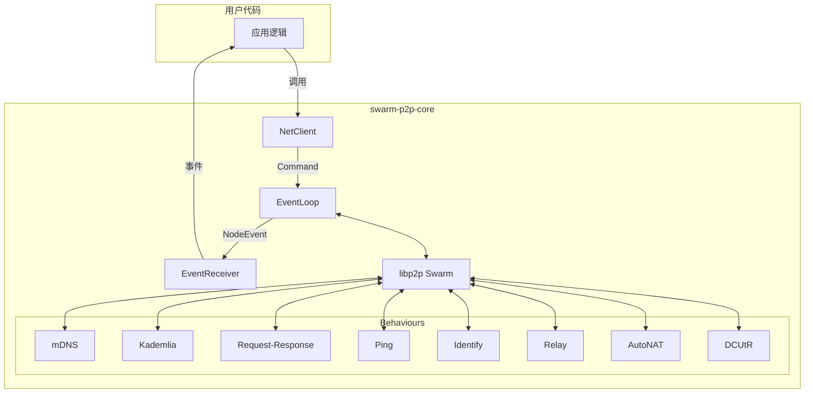

# swarm-p2p

基于 libp2p 的 P2P 网络库，为去中心化应用提供开箱即用的设备发现、NAT 穿透、DHT 存储和请求-响应通信能力。

## 特性

- **局域网发现** — mDNS 自动发现同一网络内的设备，无需配置
- **跨网络发现** — Kademlia DHT 实现跨网络节点查找和数据存储
- **NAT 穿透** — AutoNAT 检测 + DCUtR 打洞 + Relay 兜底，覆盖各种网络环境
- **请求-响应** — 基于 CBOR 编码的类型安全请求-响应协议
- **泛型协议** — 用户自定义请求/响应类型，只需 `#[derive(Serialize, Deserialize)]`
- **异步 API** — 所有操作皆可 `await`，基于 tokio 运行时

## 快速开始

### 依赖

```toml
[dependencies]
swarm-p2p-core = { git = "https://github.com/yexiyue/swarm-p2p" }
tokio = { version = "1", features = ["full"] }
serde = { version = "1", features = ["derive"] }
```

### 定义消息类型

```rust
use serde::{Deserialize, Serialize};

#[derive(Debug, Clone, Serialize, Deserialize)]
struct FileRequest {
    file_name: String,
}

#[derive(Debug, Clone, Serialize, Deserialize)]
struct FileResponse {
    data: Vec<u8>,
}
```

### 启动节点

```rust
use swarm_p2p_core::{NodeConfig, start, NetClient, EventReceiver, NodeEvent};

#[tokio::main]
async fn main() -> anyhow::Result<()> {
    // 生成密钥对
    let keypair = swarm_p2p_core::libp2p::identity::Keypair::generate_ed25519();

    // 配置节点
    let config = NodeConfig::new("/myapp/1.0.0", "MyApp/1.0.0")
        .with_mdns(true)
        .with_relay_client(true);

    // 启动 — 返回客户端和事件接收器
    let (client, mut events) = start::<FileRequest, FileResponse>(keypair, config)?;

    // 在另一个 task 中处理事件
    tokio::spawn(async move {
        while let Some(event) = events.recv().await {
            match event {
                NodeEvent::PeerConnected { peer_id } => {
                    println!("Peer connected: {peer_id}");
                }
                NodeEvent::PeersDiscovered { peers } => {
                    println!("Discovered {} peers via mDNS", peers.len());
                }
                NodeEvent::InboundRequest { peer_id, pending_id, request } => {
                    println!("Request from {peer_id}: {:?}", request);
                    // 回复请求
                    let response = FileResponse { data: vec![1, 2, 3] };
                    let _ = client.send_response(pending_id, response).await;
                }
                _ => {}
            }
        }
    });

    Ok(())
}
```

### 发送请求

```rust
// 连接并发送请求
client.dial(peer_id).await?;
let response = client.send_request(peer_id, FileRequest {
    file_name: "hello.txt".into(),
}).await?;
```

### 使用 DHT

```rust
use swarm_p2p_core::libp2p::kad::RecordKey;

// 加入 DHT 网络
client.bootstrap().await?;

// 宣布在线
let key = RecordKey::new(&peer_id.to_bytes());
client.start_provide(key).await?;

// 查找在线节点
let result = client.get_providers(key).await?;
for provider in result.providers {
    client.dial(provider).await?;
}
```

## API 概览

### NetClient

| 方法 | 说明 |
|------|------|
| `dial(peer_id)` | 连接到指定节点 |
| `send_request(peer_id, req)` | 发送请求并等待响应 |
| `send_response(pending_id, resp)` | 回复一个 inbound request |
| `bootstrap()` | 加入 DHT 网络 |
| `start_provide(key)` | 宣布自己是 key 的 Provider |
| `stop_provide(key)` | 停止 Provide |
| `get_providers(key)` | 查找 key 的 Providers |
| `put_record(record)` | 存储键值对到 DHT |
| `get_record(key)` | 从 DHT 获取键值对 |
| `remove_record(key)` | 删除本地记录 |
| `get_closest_peers(key)` | 查找距离 key 最近的节点 |

### NodeEvent

| 事件 | 说明 |
|------|------|
| `Listening { addr }` | 开始监听地址 |
| `PeersDiscovered { peers }` | mDNS 发现局域网设备 |
| `PeerConnected { peer_id }` | 节点已连接 |
| `PeerDisconnected { peer_id }` | 节点已断开 |
| `IdentifyReceived { peer_id, agent_version, .. }` | 收到对方身份信息 |
| `PingSuccess { peer_id, rtt_ms }` | Ping 成功 |
| `NatStatusChanged { status, public_addr }` | NAT 状态变化 |
| `HolePunchSucceeded { peer_id }` | 打洞成功 |
| `HolePunchFailed { peer_id, error }` | 打洞失败 |
| `InboundRequest { peer_id, pending_id, request }` | 收到请求 |

### NodeConfig

```rust
NodeConfig::new(protocol_version, agent_version)
    .with_listen_addrs(addrs)       // 监听地址（默认 0.0.0.0:随机端口）
    .with_bootstrap_peers(peers)    // DHT 引导节点
    .with_mdns(true)                // 局域网发现（默认开启）
    .with_relay_client(true)        // Relay 中继（默认开启）
    .with_dcutr(true)               // 打洞（默认开启）
    .with_autonat(true)             // NAT 检测（默认开启）
```

## 架构



核心设计：

- **命令模式** — 每个网络操作封装为独立的 `CommandHandler`，通过 `run()` 发起、`on_event()` 接收结果
- **责任链** — SwarmEvent 在活跃命令链中传递，命令可消费或放行事件
- **CommandFuture** — 自定义 Future 实现，让任意命令可被 `.await`

详细设计文档见 [docs/00-design-patterns-and-highlights.md](docs/00-design-patterns-and-highlights.md)。

## 文档

| 文档 | 内容 |
|------|------|
| [00-design-patterns-and-highlights.md](docs/00-design-patterns-and-highlights.md) | 设计模式与架构亮点 |
| [01-command-pattern-architecture.md](docs/01-command-pattern-architecture.md) | 命令模式架构详解 |
| [02-request-response-protocol.md](docs/02-request-response-protocol.md) | Request-Response 协议 |
| [03-kademlia-dht-commands.md](docs/03-kademlia-dht-commands.md) | Kademlia DHT 命令 |

## 网络协议栈

| 层 | 协议 | 说明 |
|----|------|------|
| 传输 | TCP + Noise + Yamux | 加密多路复用连接 |
| 传输 | QUIC | 内置 TLS 1.3，NAT 穿透更优 |
| 传输 | Relay | 无法直连时的中继兜底 |
| 发现 | mDNS | 局域网零配置发现 |
| 发现 | Kademlia DHT | 跨网络节点查找与数据存储 |
| 穿透 | AutoNAT | NAT 类型自动检测 |
| 穿透 | DCUtR | 通过 Relay 协调打洞 |
| 应用 | Request-Response (CBOR) | 类型安全的请求-响应 |
| 辅助 | Identify | 节点身份交换 |
| 辅助 | Ping | 心跳与延迟检测 |

## 仓库结构

```
swarm-p2p/
├── core/        # swarm-p2p-core 库
└── bootstrap/   # swarm-bootstrap 引导+中继节点
```

`bootstrap/` 是配套的公网节点，负责 DHT 引导和 Relay 中继。详见 [bootstrap/README.md](bootstrap/README.md)。

## 构建

```bash
cargo build          # 构建
cargo test           # 测试
cargo clippy         # Lint
cargo fmt            # 格式化
```

Rust edition: **2024**

## License

MIT
