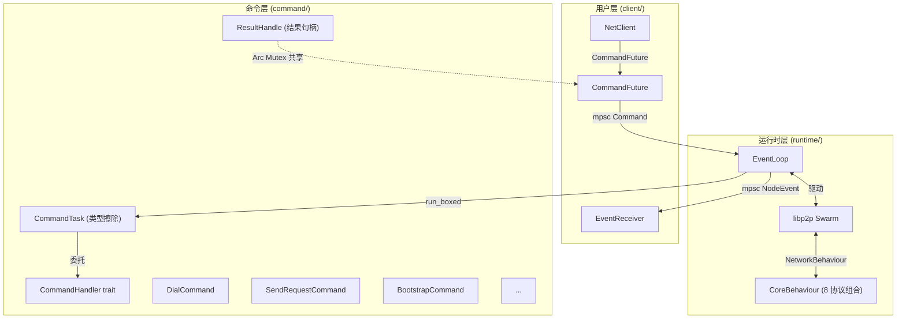
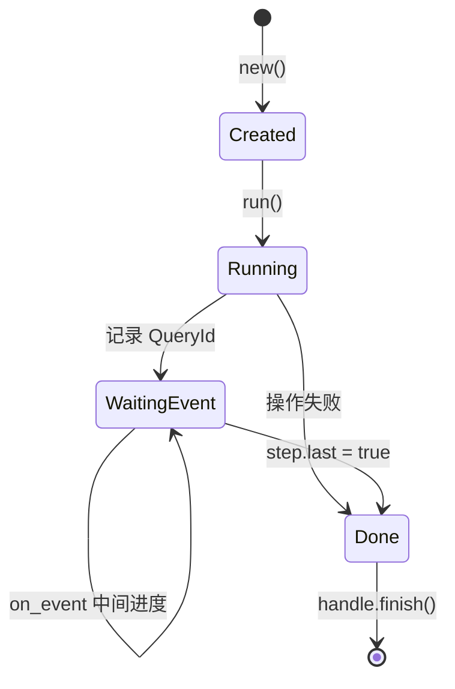
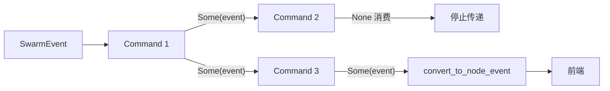
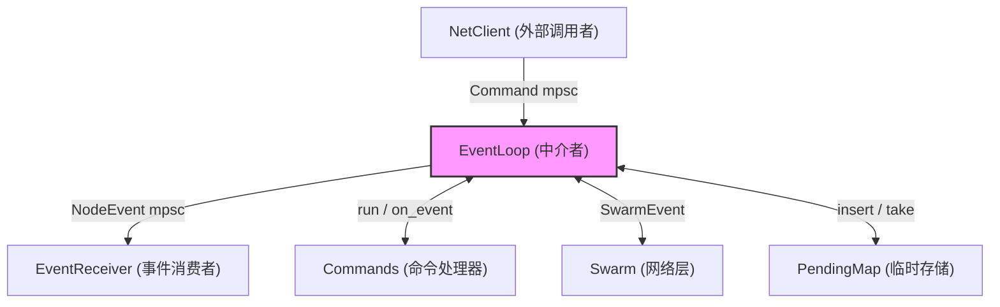
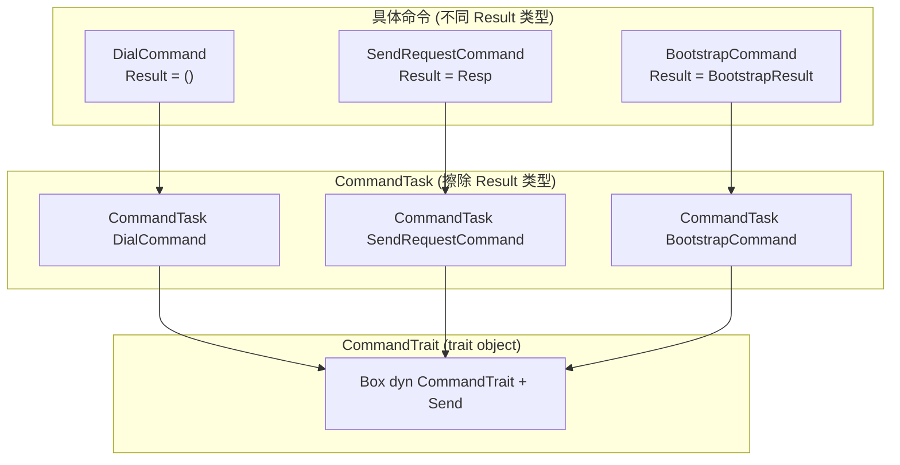
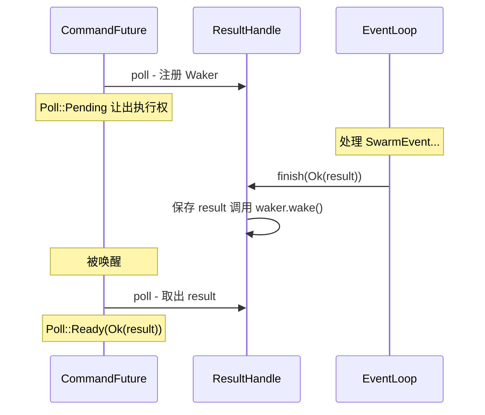
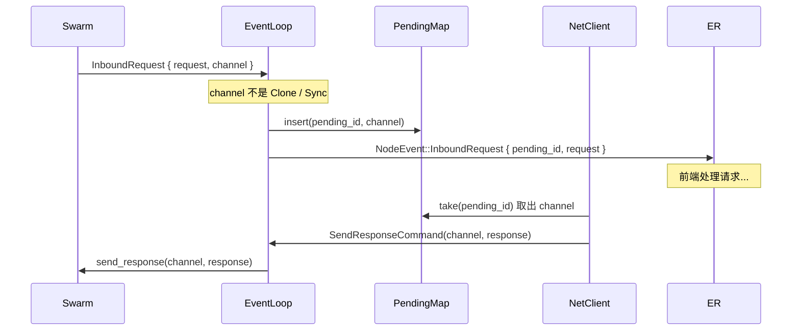
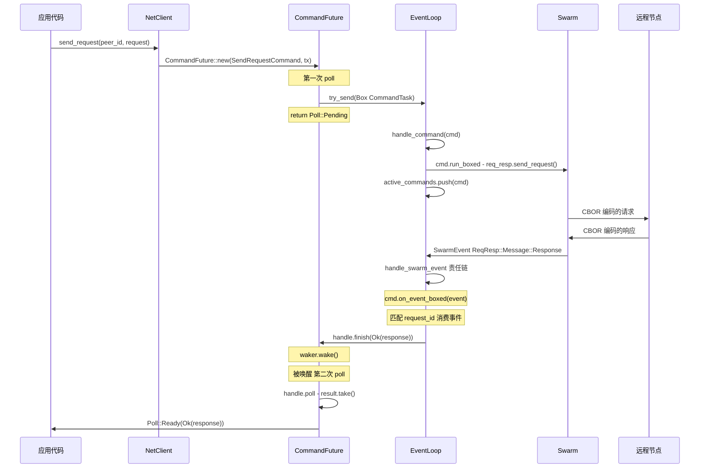

# swarm-p2p-core 设计模式与架构亮点

本文档全面剖析 swarm-p2p-core 库的架构设计，包括使用的设计模式、Rust 语言特性的巧妙运用、以及值得关注的工程亮点。

## 目录

- [架构总览](#架构总览)
- [设计模式](#设计模式)
  - [1. 命令模式 (Command Pattern)](#1-命令模式-command-pattern)
  - [2. 责任链模式 (Chain of Responsibility)](#2-责任链模式-chain-of-responsibility)
  - [3. 中介者模式 (Mediator Pattern)](#3-中介者模式-mediator-pattern)
  - [4. 类型擦除与策略模式 (Type Erasure + Strategy)](#4-类型擦除与策略模式-type-erasure--strategy)
  - [5. 组合模式 (Composite Pattern)](#5-组合模式-composite-pattern)
  - [6. 构建者模式 (Builder Pattern)](#6-构建者模式-builder-pattern)
  - [7. 观察者模式 (Observer Pattern)](#7-观察者模式-observer-pattern)
- [Rust 语言亮点](#rust-语言亮点)
  - [1. 自定义 Future 实现 — CommandFuture](#1-自定义-future-实现--commandfuture)
  - [2. ResultHandle — 手写 Waker 协调](#2-resulthandle--手写-waker-协调)
  - [3. 泛型协议抽象 — CborMessage](#3-泛型协议抽象--cbormessage)
  - [4. PhantomData 零成本类型标记](#4-phantomdata-零成本类型标记)
  - [5. PendingMap — 务实的并发设计](#5-pendingmap--务实的并发设计)
- [工程亮点](#工程亮点)
  - [1. 三行代码的异步 API](#1-三行代码的异步-api)
  - [2. 事件消费语义](#2-事件消费语义)
  - [3. InboundRequest 的所有权转移](#3-inboundrequest-的所有权转移)
  - [4. 连接级别 vs Peer 级别事件聚合](#4-连接级别-vs-peer-级别事件聚合)
  - [5. 协议版本隔离](#5-协议版本隔离)
- [完整数据流](#完整数据流)

## 架构总览

```
libs/core/src/
├── lib.rs                    # 公开 API 导出
├── error.rs                  # thiserror 错误定义
├── event.rs                  # NodeEvent — 面向前端的事件
├── config.rs                 # NodeConfig — Builder 配置
├── util.rs                   # QueryStatsInfo 辅助
├── pending_map.rs            # TTL 并发 Map
├── client/                   # 面向用户的异步 API
│   ├── mod.rs                #   NetClient + EventReceiver
│   ├── future.rs             #   CommandFuture（自定义 Future）
│   ├── req_resp.rs           #   send_request / send_response
│   └── kad.rs                #   bootstrap / get_record / ...
├── command/                  # 命令实现（核心逻辑）
│   ├── handler.rs            #   CommandHandler trait + ResultHandle
│   ├── dial.rs               #   DialCommand
│   ├── kad/                  #   8 个 Kad 命令
│   └── req_resp/             #   SendRequest + SendResponse
└── runtime/                  # 运行时
    ├── behaviour.rs          #   CoreBehaviour（8 协议组合）
    ├── event_loop.rs         #   EventLoop（事件循环）
    └── node.rs               #   start() 启动函数
```

整体架构由三层组成：



## 设计模式

### 1. 命令模式 (Command Pattern)

> 将请求封装为对象，使得可以用不同的请求参数化客户端，将请求排队或记录，以及支持可撤销操作。

这是整个库最核心的设计模式。每个网络操作（Dial、Bootstrap、SendRequest、PutRecord…）都被封装为实现了 `CommandHandler` trait 的独立结构体：

```rust
#[async_trait]
pub trait CommandHandler<Req, Resp>: Send + 'static {
    type Result: Send + 'static;

    /// 初始化阶段：直接操作 Swarm
    async fn run(&mut self, swarm: &mut CoreSwarm<Req, Resp>, handle: &ResultHandle<Self::Result>);

    /// 事件响应阶段：根据 Swarm 事件推进状态
    async fn on_event(
        &mut self,
        event: SwarmEvent<CoreBehaviourEvent<Req, Resp>>,
        handle: &ResultHandle<Self::Result>,
    ) -> OnEventResult<Req, Resp>;
}
```

**为什么用命令模式？**

libp2p 的 Swarm API 是**异步事件驱动**的——你调用 `swarm.dial()` 后，结果不会立即返回，而是在未来某个时间通过 `SwarmEvent::ConnectionEstablished` 或 `SwarmEvent::OutgoingConnectionError` 事件告知。这就产生了一个核心问题：**如何将"发起操作"和"接收结果"这两个时间点绑定在一起？**

命令模式完美解决了这个问题：

1. `run()` — 发起操作，记录 `QueryId`/`RequestId` 等标识
2. `on_event()` — 通过标识匹配属于自己的事件，推进状态机
3. `ResultHandle` — 在操作完成时将结果传递回调用者

每个命令都是一个**微型有限状态机**：



**命令一览：**

| 命令 | 类型 | 等待事件 | 消费事件 |
|------|------|----------|----------|
| `DialCommand` | 同步发起 + 事件完成 | `ConnectionEstablished` | 否（前端需要 `PeerConnected`） |
| `SendRequestCommand` | 同步发起 + 事件完成 | `ReqResp::Message::Response` | 是 |
| `BootstrapCommand` | 同步发起 + 多步事件 | `Kad::Bootstrap` × N | 是 |
| `StartProvideCommand` | 同步发起 + 多步事件 | `Kad::StartProviding` × N | 是 |
| `GetProvidersCommand` | 同步发起 + 多步事件 | `Kad::GetProviders` × N | 是 |
| `PutRecordCommand` | 同步发起 + 多步事件 | `Kad::PutRecord` × N | 是 |
| `GetRecordCommand` | 同步发起 + 多步事件 | `Kad::GetRecord` × N | 是 |
| `GetClosestPeersCommand` | 同步发起 + 多步事件 | `Kad::GetClosestPeers` × N | 是 |
| `SendResponseCommand` | 纯同步 | 无（run 中直接完成） | — |
| `StopProvideCommand` | 纯同步 | 无 | — |
| `RemoveRecordCommand` | 纯同步 | 无 | — |

### 2. 责任链模式 (Chain of Responsibility)

> 将请求的发送者和接收者解耦，让多个对象都有机会处理请求。将这些对象连成一条链，沿着链传递请求直到有对象处理它为止。

EventLoop 中事件处理采用责任链模式——每个 Swarm 事件在活跃命令列表中依次传递，命令可以选择**消费**或**放行**：

```rust
async fn handle_swarm_event(&mut self, event: SwarmEvent<CoreBehaviourEvent<Req, Resp>>) {
    let mut remaining = Some(event);
    let mut i = 0;
    while i < self.active_commands.len() {
        let Some(event) = remaining.take() else { break };
        let (keep, returned) = self.active_commands[i].on_event_boxed(event).await;
        remaining = returned;
        if keep { i += 1; } else { self.active_commands.swap_remove(i); }
    }

    // 未被任何命令消费的事件 → 转换为前端事件
    let Some(event) = remaining else { return };
    if let Some(evt) = self.convert_to_node_event(event) {
        let _ = self.event_tx.send(evt).await;
    }
}
```



**返回值语义：**

```rust
pub type OnEventResult<Req, Resp> = (bool, Option<SwarmEvent<...>>);
//                                   ^^^^  ^^^^^^^^^^^^^^^^^^^^^^^
//                               命令是否继续存活    事件是否被消费
```

| 返回值 | 含义 |
|--------|------|
| `(true, Some(event))` | 命令继续存活，事件未消费（放行） |
| `(true, None)` | 命令继续存活，事件已消费（多步 Kad 查询的中间步骤） |
| `(false, None)` | 命令完成，事件已消费 |
| `(false, Some(event))` | 命令完成，事件未消费（DialCommand 的做法） |

**亮点**：`DialCommand` 匹配到 `ConnectionEstablished` 后返回 `(false, Some(event))`——自己标记完成，但将事件放行给 `convert_to_node_event` 生成 `PeerConnected` 事件通知前端。这体现了责任链中"处理但不消费"的灵活性。

### 3. 中介者模式 (Mediator Pattern)

> 用一个中介对象来封装一组对象的交互，使得对象之间不需要相互引用，从而松耦合。

`EventLoop` 扮演中介者角色，协调三方通信：



- **NetClient** 不直接接触 Swarm，只通过 mpsc channel 发送命令
- **Commands** 不知道前端的存在，只通过 ResultHandle 返回结果
- **Swarm** 不知道有哪些活跃命令，只产生事件
- **EventLoop** 把这些全部串联起来

这种设计保证了 **Swarm 的单线程访问**（Swarm 不是 Send + Sync 的），同时让 NetClient 可以安全地 Clone 和跨线程使用。

### 4. 类型擦除与策略模式 (Type Erasure + Strategy)

命令系统需要将**不同类型、不同返回值**的命令存储在同一个 `Vec` 中。这通过两层 trait + trait object 实现：



关键代码：

```rust
// 第一层：命令 trait（关联类型 Result）
pub trait CommandHandler<Req, Resp> {
    type Result: Send + 'static;
    async fn run(...);
    async fn on_event(...) -> OnEventResult<Req, Resp>;
}

// 第二层：类型擦除 trait（无关联类型）
pub trait CommandTrait<Req, Resp>: Send {
    async fn run_boxed(&mut self, swarm: &mut CoreSwarm<Req, Resp>);
    async fn on_event_boxed(&mut self, event: SwarmEvent<...>) -> OnEventResult<Req, Resp>;
}

// 桥接：CommandTask 内部持有 handler + ResultHandle
pub struct CommandTask<T, Req, Resp> {
    handler: T,                              // 具体命令
    handle: ResultHandle<T::Result>,         // 结果句柄
    _phantom: PhantomData<(Req, Resp)>,
}

// 存储：类型擦除后统一存放
active_commands: Vec<Box<dyn CommandTrait<Req, Resp> + Send>>
```

`CommandTask` 的作用是**在 Box 内部封闭 `T::Result` 的类型信息**——外部只看到统一的 `CommandTrait`，而 `ResultHandle<T::Result>` 的具体类型被封装在 `CommandTask` 内部，由具体命令通过 `handle.finish()` 写入。

### 5. 组合模式 (Composite Pattern)

> 将对象组合成树形结构以表示"部分-整体"层次结构。

libp2p 的 `#[derive(NetworkBehaviour)]` 宏将 8 个独立协议组合为统一的 `CoreBehaviour`：

```rust
#[derive(NetworkBehaviour)]
pub struct CoreBehaviour<Req, Resp> {
    pub ping: ping::Behaviour,                                    // 心跳检测
    pub identify: identify::Behaviour,                            // 身份交换
    pub kad: kad::Behaviour<kad::store::MemoryStore>,            // DHT
    pub req_resp: request_response::cbor::Behaviour<Req, Resp>,  // 请求-响应
    pub mdns: mdns::tokio::Behaviour,                            // 局域网发现
    pub relay_client: relay::client::Behaviour,                  // 中继客户端
    pub autonat: autonat::Behaviour,                             // NAT 检测
    pub dcutr: dcutr::Behaviour,                                 // 打洞
}
```

每个 behaviour 独立处理自己的协议逻辑，宏自动生成的代码将所有事件聚合为 `CoreBehaviourEvent` 枚举，EventLoop 通过 pattern matching 分发处理。

### 6. 构建者模式 (Builder Pattern)

`NodeConfig` 使用经典的 Rust builder 风格（consuming self）：

```rust
let config = NodeConfig::new("/swarmdrop/1.0.0", "SwarmDrop/1.0.0")
    .with_listen_addrs(vec!["/ip4/0.0.0.0/tcp/0".parse().unwrap()])
    .with_bootstrap_peers(vec![(peer_id, addr)])
    .with_mdns(true)
    .with_relay_client(true);
```

配合 `Default` trait 提供合理的默认值，用户只需覆盖关心的配置项。

### 7. 观察者模式 (Observer Pattern)

> 定义对象间一对多的依赖关系，当一个对象状态改变时，所有依赖它的对象都会得到通知。

`EventReceiver` 通过 mpsc channel 接收事件通知：

```rust
let mut events = event_receiver;
while let Some(event) = events.recv().await {
    match event {
        NodeEvent::PeerConnected { peer_id } => { ... }
        NodeEvent::PeersDiscovered { peers } => { ... }
        NodeEvent::InboundRequest { peer_id, pending_id, request } => { ... }
        _ => {}
    }
}
```

`NodeEvent` 枚举定义了面向前端的**精简事件集**（10 种），将底层 Swarm 的数十种事件过滤、聚合后暴露给上层。

## Rust 语言亮点

### 1. 自定义 Future 实现 — CommandFuture

这是整个库中最精妙的设计。`CommandFuture` 手动实现 `std::future::Future` trait，在两次 `poll` 中完成不同的工作：

```rust
impl<T, Req, Resp> Future for CommandFuture<T, Req, Resp> {
    type Output = Result<T::Result>;

    fn poll(self: Pin<&mut Self>, cx: &mut Context<'_>) -> Poll<Self::Output> {
        let this = self.get_mut();

        // 第一次 poll：发送命令到 EventLoop
        if let Some(handler) = this.handler.take() {
            let task = CommandTask::new(handler, this.handle.clone());
            match this.sender.try_send(Box::new(task)) {
                Ok(_) => return Poll::Pending,
                Err(_) => return Poll::Ready(Err(Error::Behaviour("channel closed".into()))),
            }
        }

        // 后续 poll：检查 ResultHandle
        this.handle.poll(cx)
    }
}
```

**为什么不在 `new()` 时就发送命令？**

因为 `new()` 不是 async 的，不能直接 `.await` channel 的 send。使用 `try_send` 在第一次 poll 时非阻塞发送，巧妙地利用了 Future 的惰性求值特性——命令只有在被 `.await` 时才会真正提交。

**带来的效果**——每个客户端方法只需三行代码：

```rust
pub async fn bootstrap(&self) -> Result<BootstrapResult> {
    let cmd = BootstrapCommand::new();
    CommandFuture::new(cmd, self.command_tx.clone()).await
}
```

### 2. ResultHandle — 手写 Waker 协调

`ResultHandle` 是 `CommandFuture` 和 `EventLoop` 之间的桥梁，通过 `Arc<Mutex<ResultState>>` 实现跨 task 通信：

```rust
pub struct ResultHandle<T>(Arc<Mutex<ResultState<T>>>);

struct ResultState<T> {
    result: Option<Result<T>>,
    waker: Option<Waker>,
}
```

**数据流：**



这本质上是一个**手工实现的 oneshot channel**，但直接集成到 Future 的 poll 机制中，避免了额外的类型转换和 channel 开销。

### 3. 泛型协议抽象 — CborMessage

通过 blanket implementation 让任何满足约束的类型自动实现 `CborMessage`：

```rust
pub trait CborMessage:
    Debug + Clone + Serialize + Send + Sync + for<'a> Deserialize<'a> + 'static
{}

// blanket impl：满足约束的类型自动获得 CborMessage
impl<T> CborMessage for T where
    T: Debug + Clone + Serialize + Send + Sync + for<'a> Deserialize<'a> + 'static
{}
```

**`for<'a> Deserialize<'a>`** 是高阶 trait bound (HRTB)——确保类型对**任意**生命周期都能反序列化，这是 serde 的标准要求。

这意味着用户定义的请求/响应类型只需加上 derive 宏就能直接使用：

```rust
#[derive(Debug, Clone, Serialize, Deserialize)]
struct MyRequest { file_name: String }

#[derive(Debug, Clone, Serialize, Deserialize)]
struct MyResponse { data: Vec<u8> }

// 自动满足 CborMessage，无需手动 impl
let (client, events) = start::<MyRequest, MyResponse>(keypair, config)?;
```

### 4. PhantomData 零成本类型标记

```rust
pub struct CommandTask<T, Req, Resp> {
    handler: T,
    handle: ResultHandle<T::Result>,
    _phantom: PhantomData<(Req, Resp)>,  // 零大小，编译期存在
}
```

`CommandTask` 的字段中实际上不包含 `Req`/`Resp` 类型的值，但它需要这些类型参数来正确实现 `CommandTrait<Req, Resp>`。`PhantomData` 告诉编译器"这个结构体在逻辑上与这些类型相关"，而**不占用任何运行时空间**。

### 5. PendingMap — 务实的并发设计

```rust
pub struct PendingMap<K, V> {
    inner: Arc<Mutex<HashMap<K, PendingEntry<V>>>>,
}
```

**为什么不用 `DashMap`？**

注释中明确解释了：

```rust
/// 使用 `Mutex<HashMap>` 而非 DashMap，因为 value 类型（如 `ResponseChannel`）
/// 可能不满足 `Sync` 约束。对于低竞争场景完全够用。
```

`ResponseChannel` 不是 `Sync` 的（它内部包含 oneshot sender），所以要求 `V: Sync` 的 `DashMap` 无法使用。这是一个务实的工程决策——在低竞争场景下，`Mutex<HashMap>` 的性能完全足够，同时支持更宽松的类型约束。

**TTL 自动清理**——构造时启动后台 tokio task，每 10 秒清理过期条目：

```rust
pub fn new(ttl: Duration) -> Self {
    let map = Arc::new(Mutex::new(HashMap::new()));
    let map_clone = Arc::clone(&map);

    tokio::spawn(async move {
        let mut interval = time::interval(Duration::from_secs(10));
        loop {
            interval.tick().await;
            let now = Instant::now();
            map_clone.lock().retain(|_, v| now.duration_since(v.created_at) < ttl);
        }
    });

    Self { inner: map }
}
```

## 工程亮点

### 1. 三行代码的异步 API

得益于 `CommandFuture` 的设计，每个客户端方法的实现极其简洁：

```rust
pub async fn send_request(&self, peer_id: PeerId, request: Req) -> Result<Resp> {
    let cmd = SendRequestCommand::new(peer_id, request);
    CommandFuture::new(cmd, self.command_tx.clone()).await
}

pub async fn bootstrap(&self) -> Result<BootstrapResult> {
    let cmd = BootstrapCommand::new();
    CommandFuture::new(cmd, self.command_tx.clone()).await
}

pub async fn get_providers(&self, key: RecordKey) -> Result<GetProvidersResult> {
    let cmd = GetProvidersCommand::new(key);
    CommandFuture::new(cmd, self.command_tx.clone()).await
}
```

**模式完全统一**：构造命令 → 创建 Future → await。添加新命令时只需实现 `CommandHandler` trait，客户端方法自动获得统一的三行实现。

### 2. 事件消费语义

`on_event` 使用 owned `SwarmEvent` 而非 `&SwarmEvent`，配合 `Option<SwarmEvent>` 返回值实现了精确的事件消费控制。

**为什么不用 `&SwarmEvent` + `bool`？**

如果使用借用，每个命令都能"看到"事件，但无法阻止后续命令重复处理。而 owned + Option 语义确保：

- 一个 Kad `GetProviders` 事件只会被发起该查询的命令处理
- 不会有两个命令同时对同一个事件做出反应
- `convert_to_node_event` 只处理"无人认领"的事件

同时，`match &event` 模式允许命令以借用方式检查事件内容，决定匹配后再选择是消费（`None`）还是放行（`Some(event)`）。

### 3. InboundRequest 的所有权转移

`ResponseChannel` 是 libp2p 中不可 Clone、不可 Sync 的类型。处理它需要特殊设计：



`PendingMap` 充当 `ResponseChannel` 的临时保管箱：
1. EventLoop 收到 inbound request 时，生成 `pending_id`，将 `channel` 存入 PendingMap
2. 前端收到 `NodeEvent::InboundRequest` 并携带 `pending_id`
3. 前端调用 `client.send_response(pending_id, response)` 时，从 PendingMap 取出 channel
4. 通过 `SendResponseCommand` 将 channel 传入 EventLoop 完成回复

这解决了 `ResponseChannel` 既不能 Clone（无法在事件中传递给前端）也不能直接跨线程（不是 Sync）的问题。

### 4. 连接级别 vs Peer 级别事件聚合

libp2p 的一个 peer 可能同时有多个连接（TCP + QUIC），但上层应用通常只关心 peer 级别的连接状态：

```rust
// 只在第一个连接建立时通知
SwarmEvent::ConnectionEstablished { peer_id, num_established, .. }
    if num_established.get() == 1 => Some(NodeEvent::PeerConnected { peer_id }),

// 只在最后一个连接关闭时通知
SwarmEvent::ConnectionClosed { peer_id, num_established, .. }
    if num_established == 0 => Some(NodeEvent::PeerDisconnected { peer_id }),
```

这样前端收到的是清晰的 peer 上线/下线事件，而不是底层的连接建立/关闭噪音。

### 5. 协议版本隔离

通过 Identify 协议的 `protocol_version` 字段实现不同应用间的 DHT 网络隔离：

```rust
// EventLoop::convert_to_node_event
SwarmEvent::Behaviour(CoreBehaviourEvent::Identify(
    identify::Event::Received { peer_id, info, .. },
)) => {
    // 只有协议版本匹配的节点才加入 Kad 路由表
    if info.protocol_version == self.protocol_version {
        for addr in &info.listen_addrs {
            self.swarm.behaviour_mut().kad.add_address(&peer_id, addr.clone());
        }
    }
    // 无论是否匹配，都通知前端（前端可展示附近设备）
    Some(NodeEvent::IdentifyReceived { peer_id, agent_version, protocol_version })
}
```

这意味着使用不同 `protocol_version` 的应用（如 SwarmDrop 和 SwarmNote）即使在同一物理网络中，也拥有完全隔离的 DHT 网络。

## 完整数据流

以 `client.send_request(peer_id, request)` 为例，展示从用户调用到收到响应的完整路径：



## 模式总结

| 设计模式 | 在代码中的体现 | 解决的问题 |
|----------|---------------|------------|
| **命令模式** | `CommandHandler` trait + 11 个命令实现 | 异步操作的发起与完成分离 |
| **责任链** | `handle_swarm_event` 中的事件链传递 | 多命令并行时的事件路由 |
| **中介者** | `EventLoop` 协调 Client/Commands/Swarm | 组件解耦，Swarm 单线程安全 |
| **类型擦除** | `CommandTask` → `Box<dyn CommandTrait>` | 不同返回类型的命令统一存储 |
| **组合** | `#[derive(NetworkBehaviour)]` 组合 8 协议 | 多协议统一管理 |
| **构建者** | `NodeConfig::new().with_*()` | 灵活配置，合理默认值 |
| **观察者** | `EventReceiver` + `NodeEvent` | 网络事件异步通知上层 |

| Rust 亮点 | 体现 | 收益 |
|-----------|------|------|
| **自定义 Future** | `CommandFuture` | 三行代码的统一 API |
| **手写 Waker** | `ResultHandle` | 跨 task 零开销结果传递 |
| **blanket impl** | `CborMessage` | 零样板的泛型约束 |
| **PhantomData** | `CommandTask._phantom` | 编译期类型安全，零运行时开销 |
| **HRTB** | `for<'a> Deserialize<'a>` | 正确处理 serde 生命周期 |
| **务实的 Mutex** | `PendingMap` | 支持非 Sync 类型的并发存储 |
