# 深入理解 libp2p 事件驱动架构中的命令模式

在构建 P2P 网络应用时，我们面临一个核心挑战：**如何优雅地在异步事件循环中执行请求-响应式操作？**

本文将详细介绍 `swarm-p2p` 项目中采用的命令模式架构，这是一种将命令执行与事件响应完美结合的设计。

## 问题背景

### libp2p 的事件驱动模型

libp2p 的 Swarm 是一个事件驱动系统，典型的使用方式是：

```rust
loop {
    let event = swarm.select_next_some().await;
    match event {
        SwarmEvent::ConnectionEstablished { .. } => { ... }
        SwarmEvent::ConnectionClosed { .. } => { ... }
        SwarmEvent::Behaviour(event) => { ... }
    }
}
```

### 典型需求：Dial 一个 Peer

当我们想连接到某个 Peer 时，期望的 API 是：

```rust
// 期望：简单的 async 调用
client.dial(peer_id).await?;
```

但 libp2p 的实际流程是：

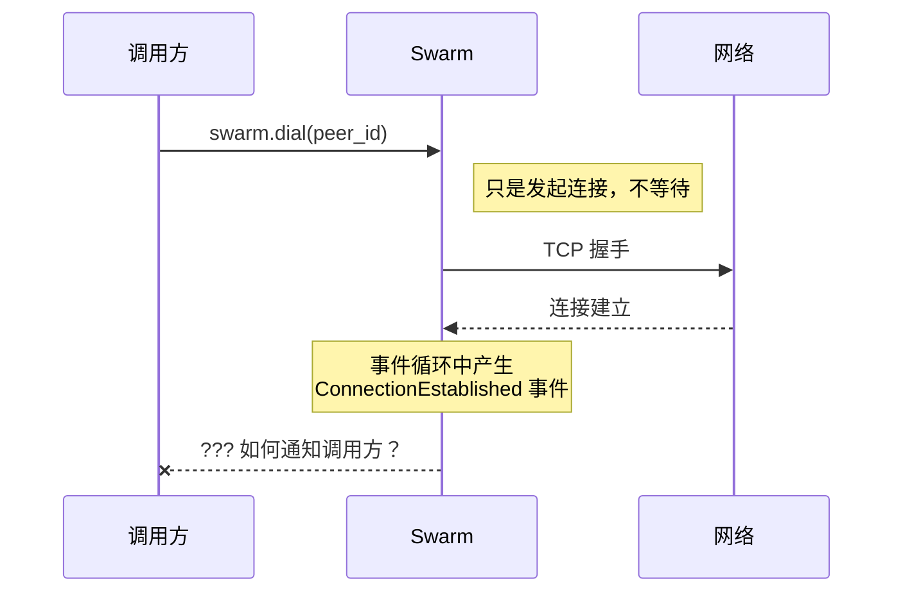

**问题：** `swarm.dial()` 只是发起连接，不会等待结果。结果以事件形式在事件循环中返回。

## 解决方案：命令模式

### 核心思想

将"发起操作"和"等待结果"封装成一个可 await 的命令：

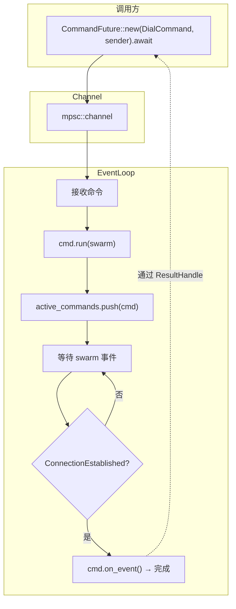

### 架构分层

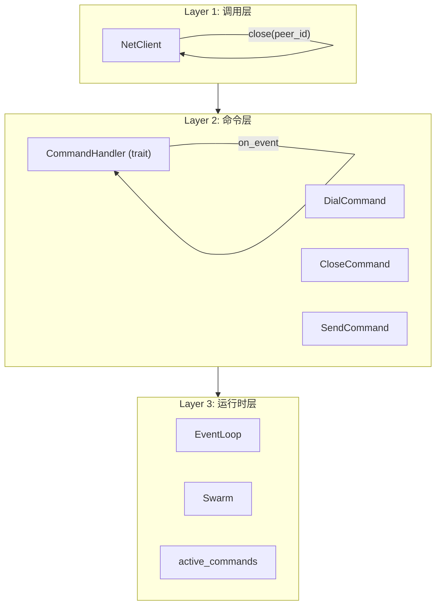

## 核心组件详解

### 1. ResultHandle - 结果句柄

`ResultHandle` 是命令与调用方之间的桥梁，负责传递执行结果：

```rust
pub struct ResultHandle<T>(Arc<Mutex<ResultState<T>>>);

struct ResultState<T> {
    result: Option<Result<T>>,  // 存储结果
    waker: Option<Waker>,       // 用于唤醒 Future
}
```

**工作流程：**

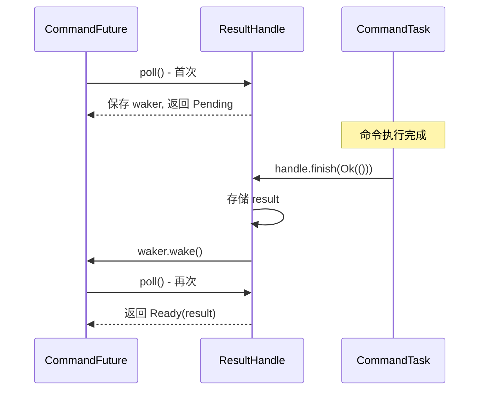

### 2. CommandHandler - 命令处理器 Trait

每个命令需要实现的接口：

```rust
#[async_trait]
pub trait CommandHandler: Send + 'static {
    type Result: Send + 'static;

    /// 执行命令（如：调用 swarm.dial）
    async fn run(&mut self, swarm: &mut CoreSwarm, handle: &ResultHandle<Self::Result>);

    /// 处理 swarm 事件，返回 true 继续等待，false 完成
    async fn on_event(
        &mut self,
        event: &SwarmEvent<CoreBehaviourEvent>,
        handle: &ResultHandle<Self::Result>,
    ) -> bool {
        false  // 默认不等待事件
    }
}
```

### 3. DialCommand 示例

```rust
pub struct DialCommand {
    peer_id: PeerId,
}

#[async_trait]
impl CommandHandler for DialCommand {
    type Result = ();

    async fn run(&mut self, swarm: &mut CoreSwarm, handle: &ResultHandle<()>) {
        if let Err(e) = swarm.dial(self.peer_id) {
            handle.finish(Err(Error::Dial(...))).await;
        }
    }

    async fn on_event(&mut self, event: &SwarmEvent<...>, handle: &ResultHandle<()>) -> bool {
        match event {
            SwarmEvent::ConnectionEstablished { peer_id, .. }
                if *peer_id == self.peer_id => {
                handle.finish(Ok(())).await;
                false  // 完成
            }
            SwarmEvent::OutgoingConnectionError { peer_id, error, .. }
                if peer_id == Some(self.peer_id) => {
                handle.finish(Err(Error::Dial(...))).await;
                false  // 完成
            }
            _ => true  // 继续等待
        }
    }
}
```

**DialCommand 时序图：**

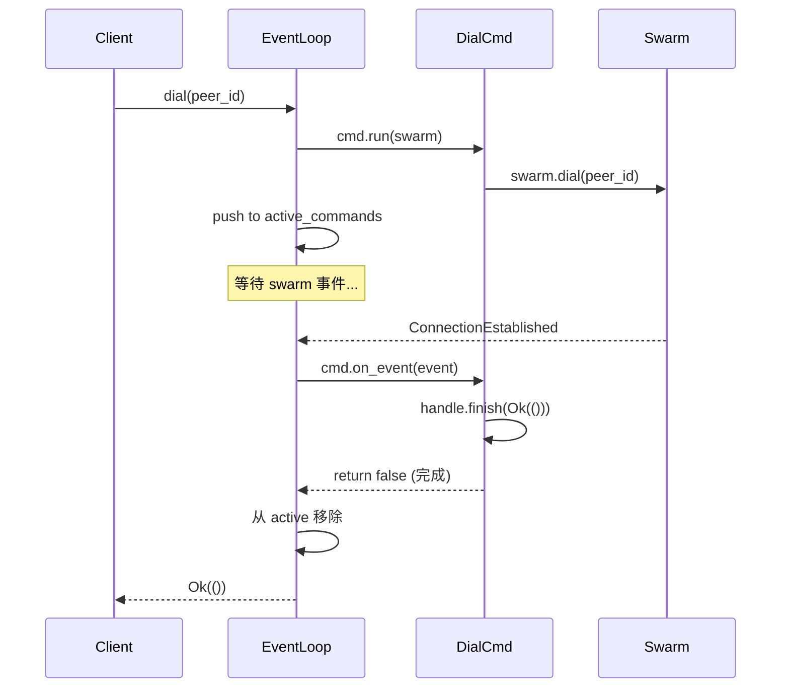

### 4. CommandFuture - 让命令可 await

```rust
impl<T: CommandHandler> Future for CommandFuture<T> {
    type Output = Result<T::Result>;

    fn poll(self: Pin<&mut Self>, cx: &mut Context<'_>) -> Poll<Self::Output> {
        let this = self.get_mut();

        // 首次 poll：发送命令到 EventLoop
        if let Some(handler) = this.handler.take() {
            let task = CommandTask::new(handler, this.handle.clone());
            this.sender.try_send(Box::new(task))?;
            return Poll::Pending;
        }

        // 后续 poll：检查结果
        this.handle.poll(cx)
    }
}
```

**状态转换：**

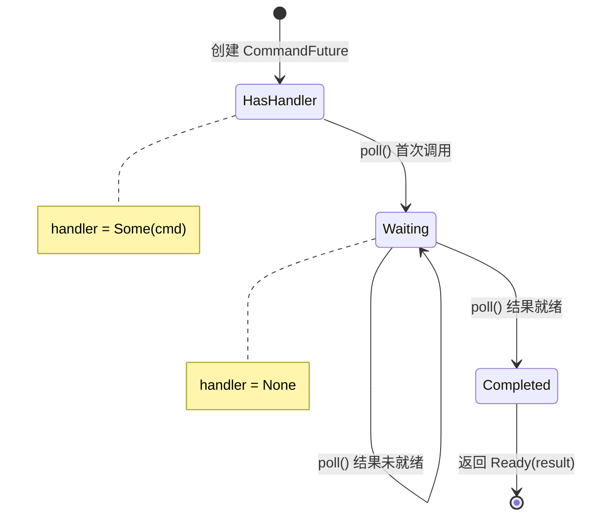

### 5. EventLoop - 事件循环

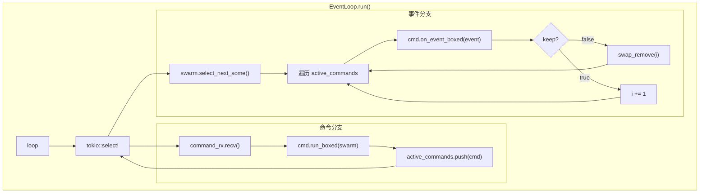

## 数据流全景

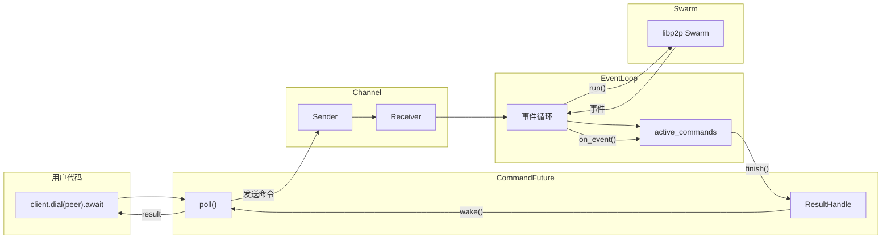

## 优点分析

### 1. 简洁的调用 API

```rust
let result = client.dial(peer_id).await?;
```

### 2. 命令可组合、可扩展

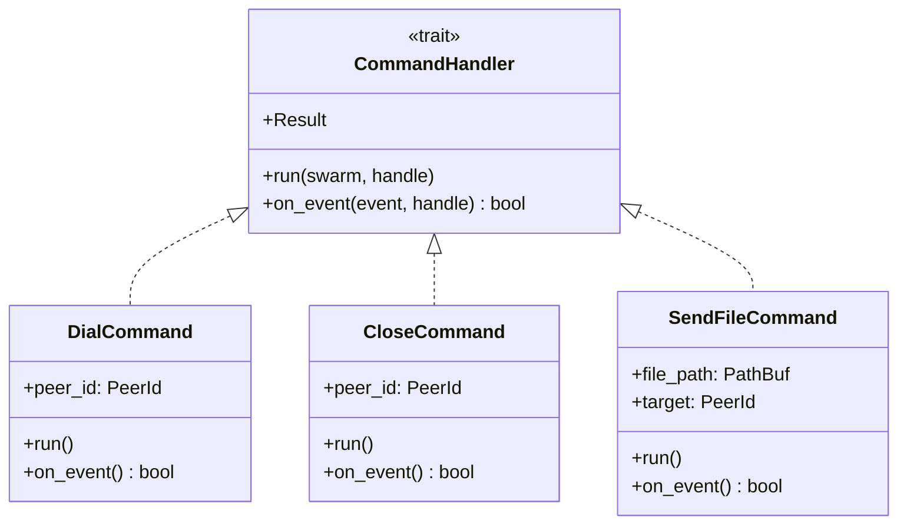

### 3. 类型安全

每个命令有自己的 `Result` 类型：

```rust
impl CommandHandler for DialCommand {
    type Result = ();
}

impl CommandHandler for GetPeersCommand {
    type Result = Vec<PeerInfo>;
}
```

### 4. 生命周期清晰

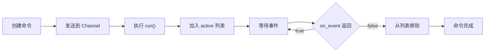

## 对比其他方案

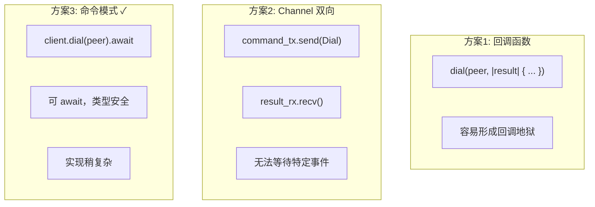

| 方案 | 优点 | 缺点 |
|------|------|------|
| **回调函数** | 简单 | 回调地狱，难以组合 |
| **Channel 双向** | 解耦 | 无法等待特定事件 |
| **本文方案** | 可 await，类型安全 | 实现稍复杂 |

## 总结

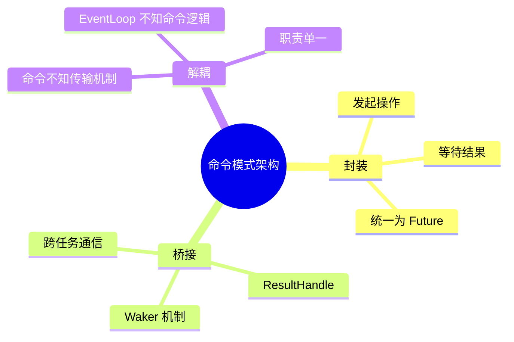

这种命令模式架构的核心思想是：

1. **封装**：将"发起操作"和"等待结果"封装成一个 Future
2. **桥接**：使用 `ResultHandle` 在事件循环和调用方之间传递结果
3. **解耦**：命令不知道传输机制，事件循环不知道具体命令逻辑

这使得我们可以在事件驱动的 libp2p 之上，构建出优雅的请求-响应式 API。

---

*本文档属于 swarm-p2p 项目，用于解释 `command/handler.rs` 的设计理念。*
