# Request-Response 协议：双向请求的完整实现

在 [上一篇文章](./01-command-pattern-architecture.md) 中，我们介绍了命令模式如何将 libp2p 的事件驱动模型封装为可 `await` 的 API。本文将深入讲解 **Request-Response 协议**的完整实现——这是 P2P 文件传输的核心通信机制。

## 概览

Request-Response 协议涉及**两个方向**的数据流：

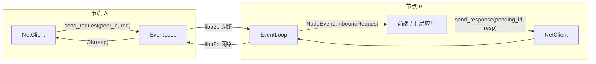

- **出站请求（Outbound）**：`NetClient::send_request()` → 发送请求 → 等待远端响应
- **入站请求（Inbound）**：收到远端请求 → 通知上层 → 上层调用 `NetClient::send_response()` 回复

关键挑战在于：**入站请求**需要将 libp2p 的 `ResponseChannel`（一次性、不可 Clone）安全地暂存，等待上层处理后取回使用。

## libp2p Request-Response 基础

### CBOR 编码

我们使用 libp2p 内置的 CBOR 编解码器，请求和响应类型需要满足 `CborMessage` trait：

```rust
pub trait CborMessage:
    Debug + Clone + Serialize + Send + Sync + for<'a> Deserialize<'a> + 'static
{
}
```

### Behaviour 配置

```rust
let req_resp = request_response::cbor::Behaviour::new(
    [(
        StreamProtocol::new("/swarmdrop/1.0.0"),
        request_response::ProtocolSupport::Full,  // 双向支持
    )],
    request_response::Config::default(),
);
```

`ProtocolSupport::Full` 表示每个节点既可以发送请求也可以接收请求。

### libp2p 产生的事件

libp2p 的 request-response 模块会产生以下几种关键事件：

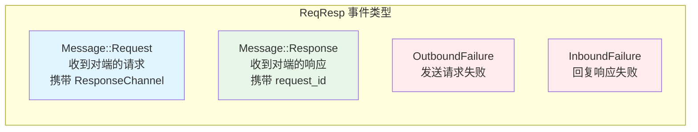

其中 `Message::Request` 是最特殊的——它携带了一个 **`ResponseChannel`**，这是一个一次性的回复通道，**必须被消费才能回复请求**。

## 出站请求：SendRequestCommand

出站方向的实现相对直观，遵循标准的命令模式。

### 流程

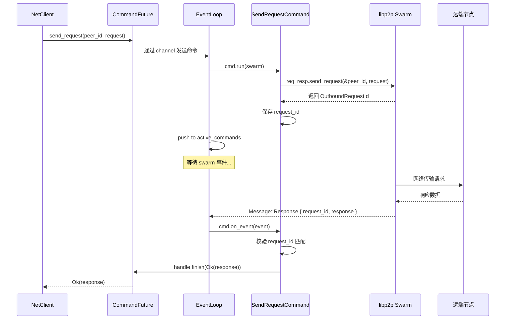

### 代码实现

```rust
// client/req_resp.rs
pub async fn send_request(&self, peer_id: PeerId, request: Req) -> Result<Resp>
where
    Req: Unpin,
{
    let cmd = SendRequestCommand::new(peer_id, request);
    CommandFuture::new(cmd, self.command_tx.clone()).await
}
```

`SendRequestCommand` 的 `on_event` 接收 owned event，匹配两种事件并**消费**它们（返回 `None`）：

```rust
async fn on_event(
    &mut self,
    event: SwarmEvent<CoreBehaviourEvent<Req, Resp>>,
    handle: &ResultHandle<Resp>,
) -> OnEventResult<Req, Resp> {
    match &event {
        // 成功收到响应
        SwarmEvent::Behaviour(CoreBehaviourEvent::ReqResp(Event::Message {
            peer,
            message: Message::Response { request_id, response },
            ..
        })) if self.request_id.as_ref() == Some(request_id)
            && *peer == self.peer_id =>
        {
            handle.finish(Ok(response.clone()));
            (false, None)  // 消费事件，命令完成
        }
        // 发送失败
        SwarmEvent::Behaviour(CoreBehaviourEvent::ReqResp(Event::OutboundFailure {
            peer, request_id, error, ..
        })) if self.request_id.as_ref() == Some(request_id)
            && *peer == self.peer_id =>
        {
            handle.finish(Err(Error::Behaviour(...)));
            (false, None)  // 消费事件，命令完成
        }
        _ => (true, Some(event))  // 继续等待，不消费
    }
}
```

注意 `request_id` 的校验——同一时刻可能有多个 `SendRequestCommand` 在等待响应，每个只关心自己的 `request_id`。匹配到的事件会被消费（`None`），不会传递给其他命令或前端。

## 入站请求：核心设计挑战

入站方向的复杂度远高于出站，因为它涉及**跨组件的所有权转移**。

### 问题分析

当 libp2p 收到远端请求时，产生的事件包含：

```rust
SwarmEvent::Behaviour(CoreBehaviourEvent::ReqResp(Event::Message {
    peer,
    message: Message::Request {
        request,           // 请求内容（可 Clone）
        channel,           // ResponseChannel（不可 Clone，不可 Sync）
        ..
    },
}))
```

`ResponseChannel` 的特性决定了整个设计：

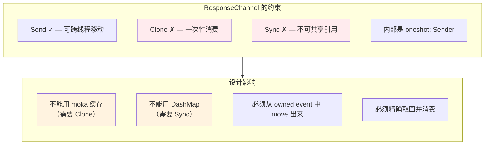

### 设计方案

我们需要解决的核心问题是：**EventLoop 收到 `ResponseChannel` 后，如何让 `NetClient` 在稍后取回并使用它？**

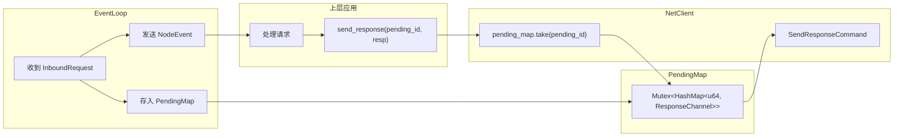

关键设计决策：

1. **`PendingMap`** — 使用 `Mutex<HashMap>` 而非 `DashMap`（因为 `ResponseChannel` 不是 `Sync`）
2. **`pending_id`** — 单调递增的 u64 标识，连接 EventLoop（存入）和 NetClient（取出）
3. **共享所有权** — `PendingMap` 通过 `Arc` 在 EventLoop 和 NetClient 之间共享

## PendingMap：带 TTL 的暂存容器

### 为什么不用现有方案？

| 方案 | 问题 |
|------|------|
| `moka` 缓存 | 要求 value 实现 `Clone`，`ResponseChannel` 不满足 |
| `DashMap` | 要求 value 实现 `Sync`，`ResponseChannel` 不满足 |
| 普通 `HashMap` | 没有自动过期，不可跨线程共享 |

### 实现

```rust
pub struct PendingMap<K, V> {
    inner: Arc<Mutex<HashMap<K, PendingEntry<V>>>>,
}

struct PendingEntry<V> {
    value: V,
    created_at: Instant,
}
```

内部启动一个 tokio 定时任务，周期性清理过期条目：

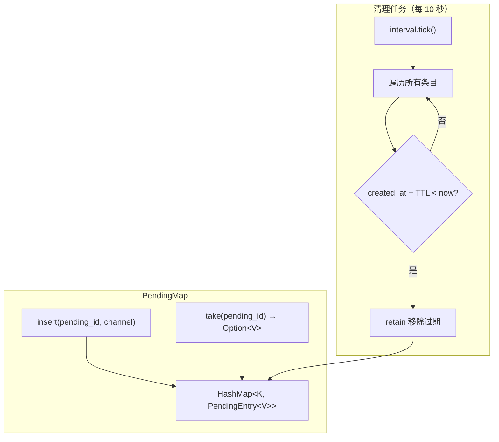

TTL 机制确保即使上层忘记回复，`ResponseChannel` 也不会永远占用内存。默认 TTL 为 60 秒。

```rust
impl<K, V> PendingMap<K, V>
where
    K: Eq + Hash + Send + 'static,
    V: Send + 'static,
{
    pub fn new(ttl: Duration) -> Self {
        let map = Arc::new(Mutex::new(HashMap::new()));
        let map_clone = Arc::clone(&map);

        // 启动清理任务
        tokio::spawn(async move {
            let mut interval = time::interval(Duration::from_secs(10));
            loop {
                interval.tick().await;
                let now = Instant::now();
                map_clone
                    .lock()
                    .retain(|_, v| now.duration_since(v.created_at) < ttl);
            }
        });

        Self { inner: map }
    }
}
```

> **设计取舍**：使用 `Mutex` 而非 `RwLock`，因为 `insert` 和 `take` 都是写操作，读写锁没有优势。`parking_lot::Mutex` 在无竞争时开销极低。

## 入站请求的完整流程

### 第一阶段：EventLoop 接收并暂存

事件流经**责任链**——先通过 `active_commands`，未被消费的事件再进入 `convert_to_node_event`：

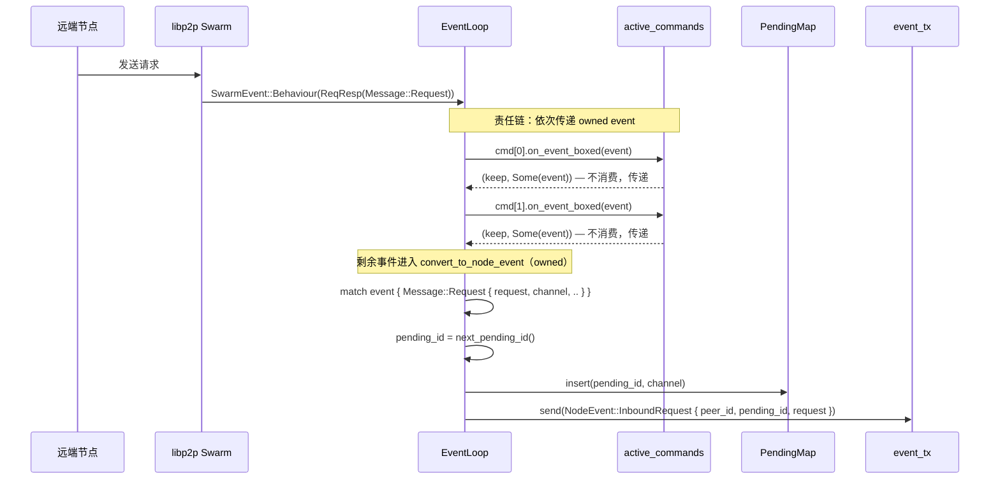

关键实现：

```rust
async fn handle_swarm_event(&mut self, event: SwarmEvent<CoreBehaviourEvent<Req, Resp>>) {
    // 责任链：依次传递 owned event，命令可选择消费或传递
    let mut remaining = Some(event);
    let mut i = 0;
    while i < self.active_commands.len() {
        let Some(event) = remaining.take() else {
            break; // 事件已被消费，停止传递
        };
        let (keep, returned) = self.active_commands[i].on_event_boxed(event).await;
        remaining = returned;
        if keep { i += 1; } else { self.active_commands.swap_remove(i); }
    }

    // 未被命令消费的事件，转换为前端事件
    let Some(event) = remaining else { return; };
    if let Some(evt) = self.convert_to_node_event(event) {
        let _ = self.event_tx.send(evt).await;
    }
}
```

`convert_to_node_event` 同样接收 owned event，直接在内部处理 InboundRequest：

```rust
fn convert_to_node_event(&mut self, event: SwarmEvent<...>) -> Option<NodeEvent<Req>> {
    match event {
        // ... 其他事件（ConnectionEstablished, Ping, Identify 等）...
        SwarmEvent::Behaviour(CoreBehaviourEvent::ReqResp(ReqRespEvent::Message {
            peer,
            message: Message::Request { request, channel, .. },
            ..
        })) => {
            let pending_id = self.next_pending_id();
            self.pending_channels.insert(pending_id, channel);  // 直接 move
            Some(NodeEvent::InboundRequest { peer_id: peer, pending_id, request })
        }
        // ...
    }
}
```

**事件传递流程：**

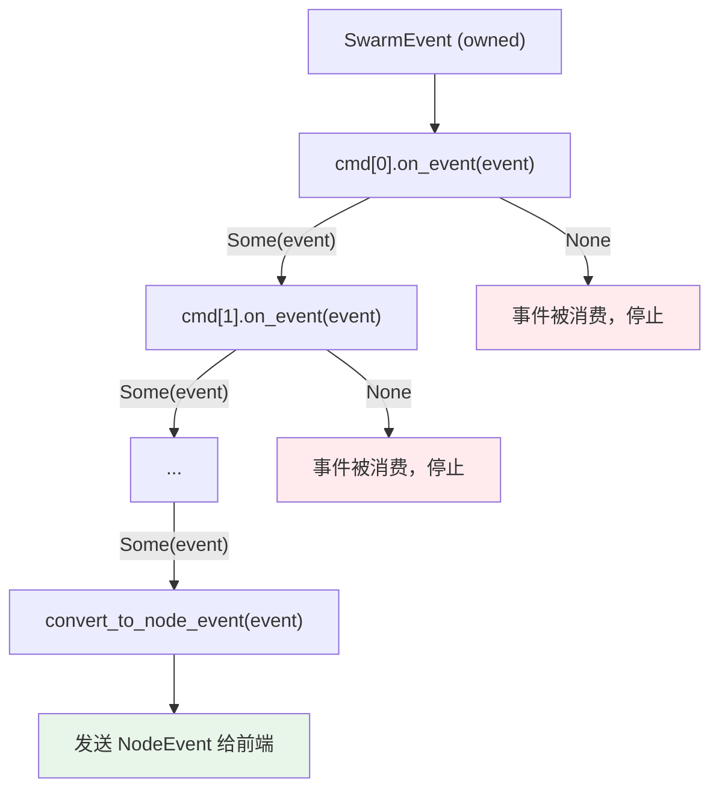

整个流程全程使用 owned event，无需借用与所有权分离的两步操作。`ResponseChannel`（不可 Clone）在 `convert_to_node_event` 中直接从 owned event move 出来，存入 `PendingMap`。

### 第二阶段：上层处理并回复

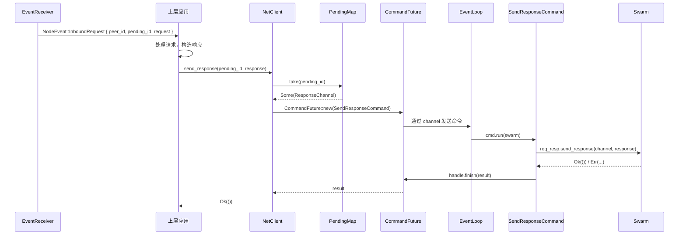

`NetClient::send_response` 的实现：

```rust
pub async fn send_response(&self, pending_id: u64, response: Resp) -> Result<()>
where
    Resp: Unpin,
{
    // 从 PendingMap 取出 ResponseChannel
    let channel = self.pending_channels.take(&pending_id)
        .ok_or_else(|| Error::Behaviour(
            format!("No pending channel for pending_id={} (expired or already responded)", pending_id),
        ))?;
    // 复用现有的 SendResponseCommand
    let cmd = SendResponseCommand::new(channel, response);
    CommandFuture::new(cmd, self.command_tx.clone()).await
}
```

注意 `take` 的语义——取出后 PendingMap 中不再有该条目，保证**一个请求只能被回复一次**。

## 完整生命周期

以下是一个完整的请求-响应交互的全景图：

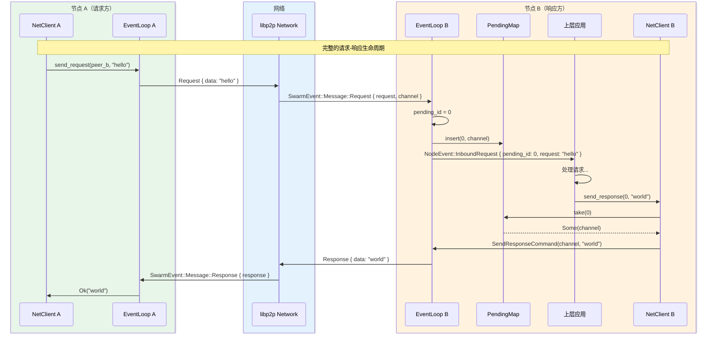

## NodeEvent 的泛型设计

为了让 `InboundRequest` 携带请求内容，`NodeEvent` 被设计为泛型：

```rust
pub enum NodeEvent<Req = ()> {
    Listening { addr: Multiaddr },
    PeerConnected { peer_id: PeerId },
    PeerDisconnected { peer_id: PeerId },
    // ... 其他变体 ...

    /// 收到对端的 request-response 请求
    InboundRequest {
        peer_id: PeerId,
        pending_id: u64,   // 回复时的唯一标识
        request: Req,       // 请求内容
    },
}
```

默认类型参数 `Req = ()` 保证了不使用 request-response 时的向后兼容：

```rust
// 不关心请求内容时
let event: NodeEvent = receiver.recv().await;

// 使用自定义请求类型时
let event: NodeEvent<MyRequest> = receiver.recv().await;
```

## 模块组织

整个 request-response 相关代码分布在以下模块中：

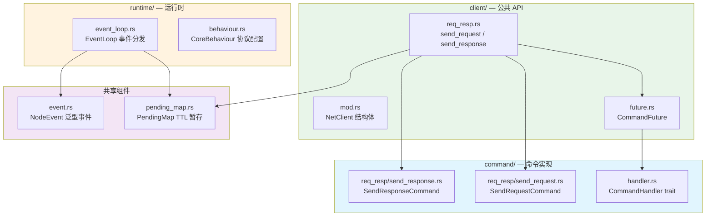

依赖方向始终保持单向：`client → command`，`client → runtime`（仅类型），`command` 和 `runtime` 互不依赖 `client`。

## 错误处理

### 出站请求失败

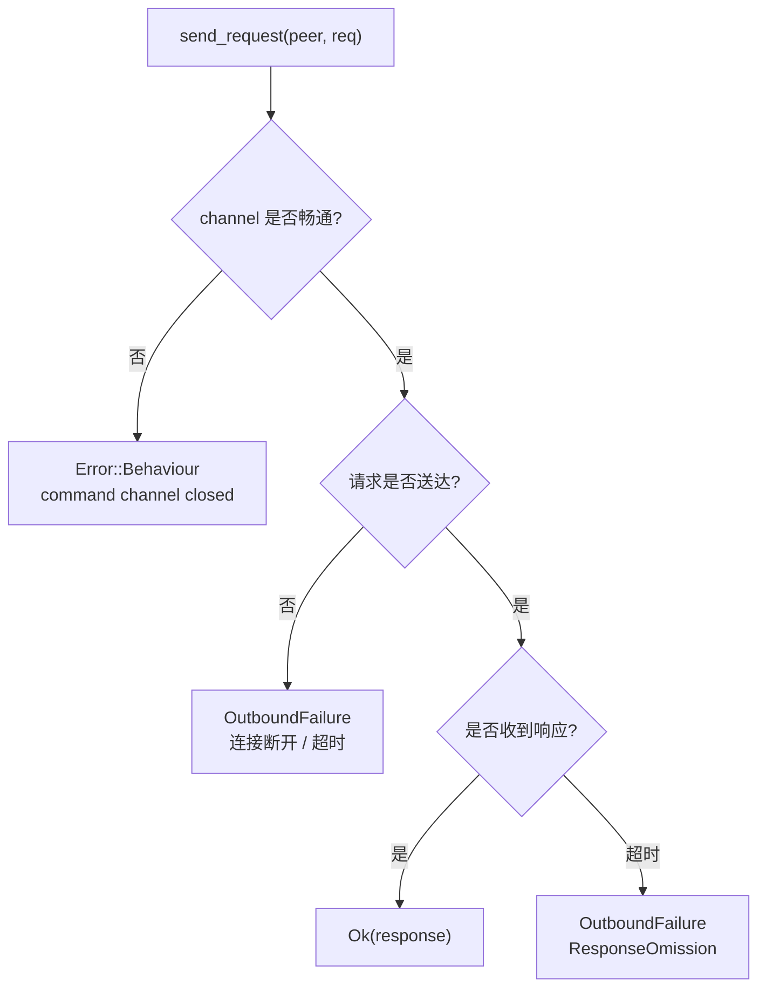

### 入站回复失败

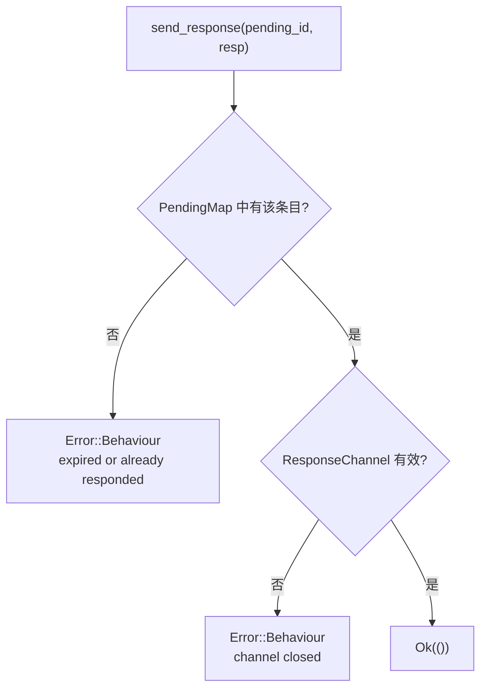

常见的入站回复失败场景：

| 场景 | 原因 | 错误信息 |
|------|------|----------|
| 超过 TTL | PendingMap 自动清理了 | `No pending channel for pending_id=N (expired or already responded)` |
| 重复回复 | `take` 已消费过 | 同上 |
| 对端断开 | ResponseChannel 内部 sender 已关闭 | `Failed to send response: channel closed` |

## 总结

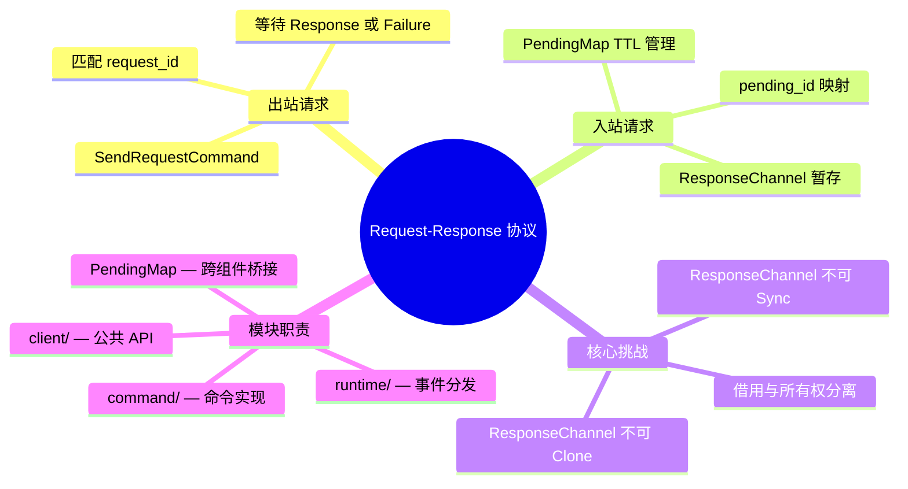

整个设计的核心思想：

1. **所有权转移链**：`SwarmEvent` → `EventLoop.insert()` → `PendingMap` → `NetClient.take()` → `SendResponseCommand`
2. **一次性语义**：`ResponseChannel` 和 `pending_id` 都是一次性消费，确保每个请求只被回复一次
3. **TTL 兜底**：即使上层忘记回复，PendingMap 的自动清理也能防止内存泄漏
4. **复用命令模式**：入站回复不需要新的通信机制，直接复用已有的 `SendResponseCommand` + `CommandFuture`

---

*本文档属于 swarm-p2p 项目，用于解释 request-response 协议的双向通信实现。*
