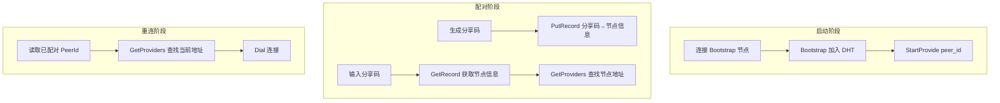
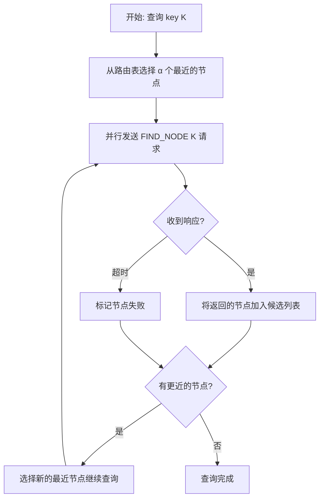
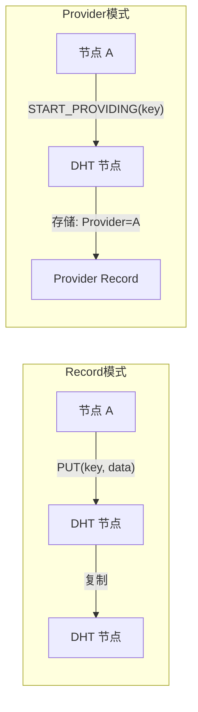
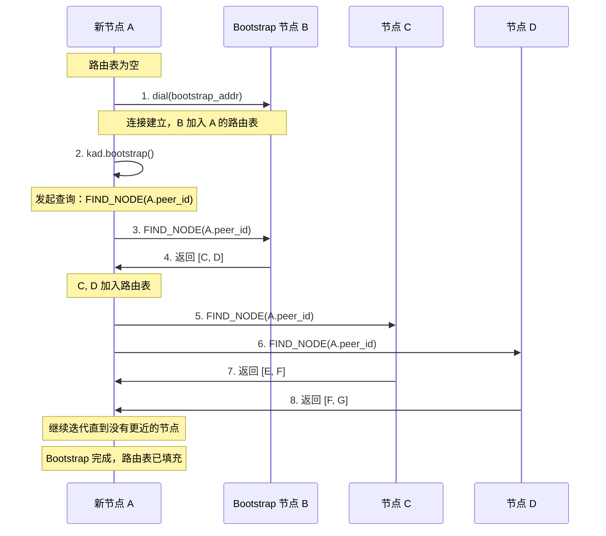
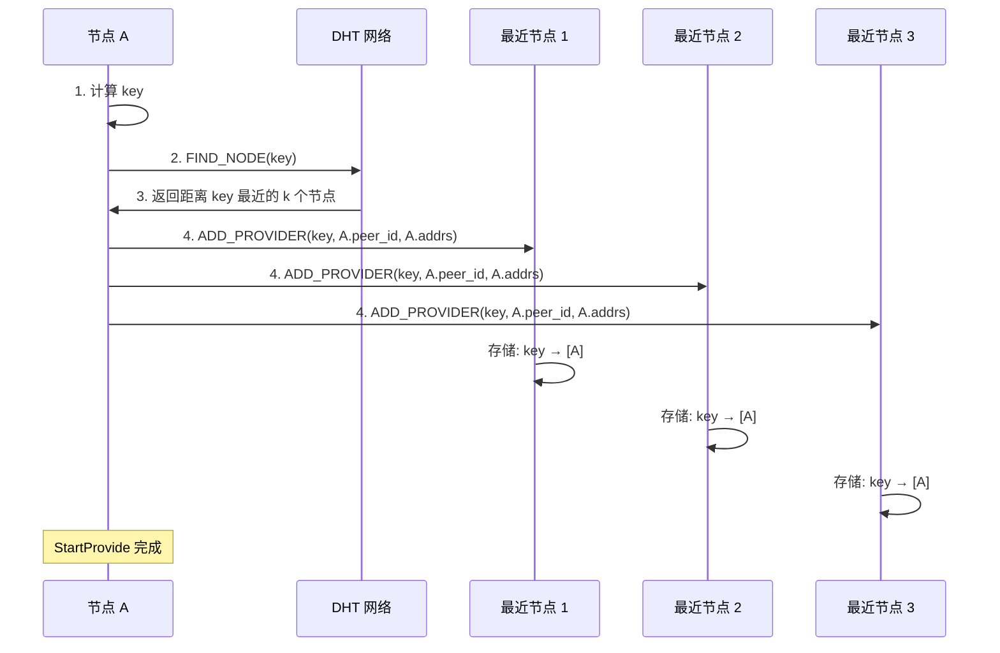
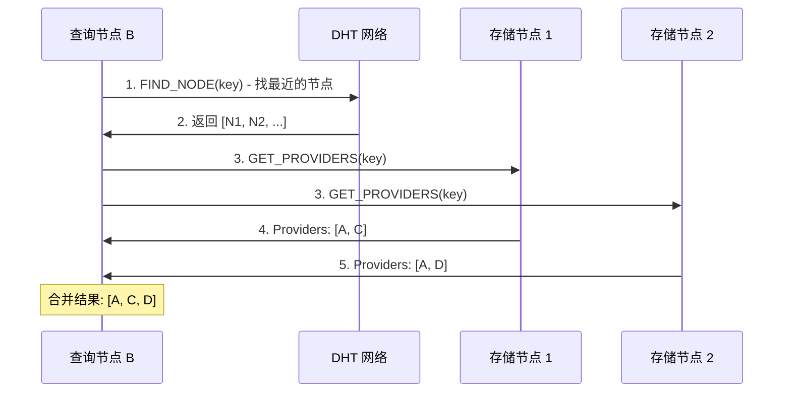
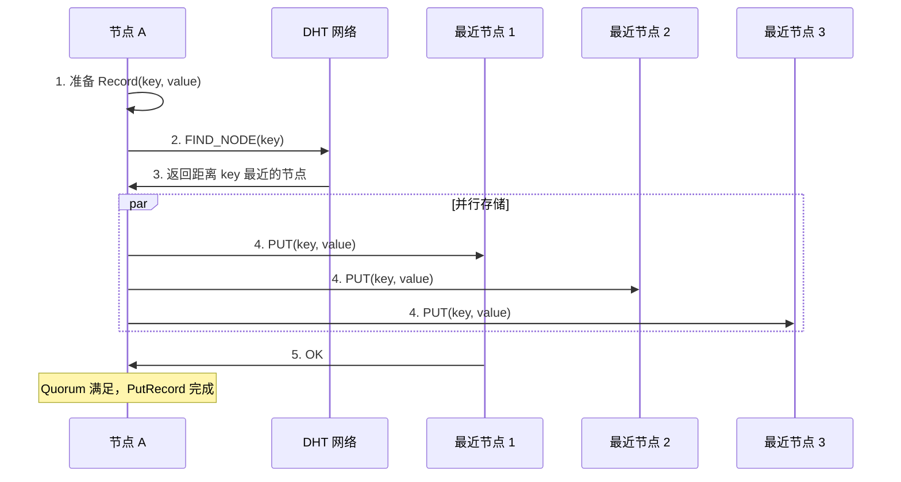
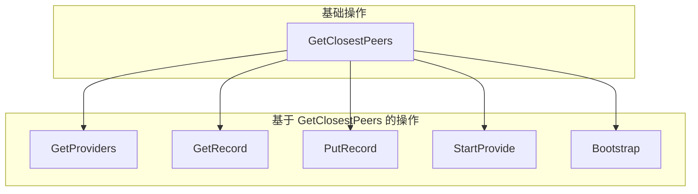

# Kademlia DHT 命令

本文档介绍 swarm-p2p 中 Kademlia DHT 相关命令的原理和实现。

## 概述

Kademlia 是一种分布式哈希表（DHT）协议，用于在 P2P 网络中存储和查找数据。核心特点：

- **去中心化**：没有中心服务器，所有节点平等
- **自组织**：节点自动发现和维护网络拓扑
- **高效查询**：O(log n) 复杂度定位任意节点

### 命令总览

```text
libs/core/src/command/kad/
├── bootstrap.rs         # 加入 DHT 网络
├── start_provide.rs     # 宣布自己是某 key 的 Provider
├── stop_provide.rs      # 停止 Provide
├── get_providers.rs     # 查询某 key 的 Providers
├── get_closest_peers.rs # 查询距离某 key 最近的节点
├── get_record.rs        # 获取 DHT 中的 Record
├── put_record.rs        # 存储 Record 到 DHT
└── remove_record.rs     # 从本地删除 Record
```

### 在 SwarmDrop 中的使用场景



## 1. Kademlia 基础

### XOR 距离

Kademlia 用 **XOR (异或)** 运算定义节点间的"距离"：

```
distance(A, B) = A XOR B
```

| 特性 | 公式 | 意义 |
|------|------|------|
| 自反性 | `d(A, A) = 0` | 自己和自己距离为 0 |
| 对称性 | `d(A, B) = d(B, A)` | A 到 B 的距离 = B 到 A 的距离 |
| 三角不等式 | `d(A, B) + d(B, C) ≥ d(A, C)` | 满足度量空间要求 |
| 单向性 | 对于任意 A 和距离 d，只存在唯一的 B 使得 `d(A, B) = d` | 保证查询收敛 |

**关键洞察**：XOR 结果的最高位 1 的位置，表示两个 ID 第一个不同的 bit 位置。

### K-Bucket 路由表

每个节点维护一个路由表，按**距离范围**划分为 256 个 bucket：

```
节点 A 的路由表:
┌─────────────────────────────────────────────────────────┐
│ Bucket 0: 距离 [2^0, 2^1)   │ 最多 k 个节点 (k=20)     │
│ Bucket 1: 距离 [2^1, 2^2)   │ 最多 k 个节点              │
│ ...                         │                           │
│ Bucket 255: 距离 [2^255, 2^256) │ 最多 k 个节点          │
└─────────────────────────────────────────────────────────┘
```

设计理念：**近处多，远处少**——靠近自己的节点了解得更详细，同时覆盖全网。

### 迭代查询

所有 DHT 查询都遵循迭代查询模式：



| 参数 | 默认值 | 含义 |
|------|--------|------|
| α (alpha) | 3 | 并行查询数 |
| k | 20 | 每个 bucket 最大节点数 |

查询复杂度为 O(log n)，每次迭代至少将距离缩短一半。

### Provider vs Record

| 概念 | 用途 | 存储内容 | 适用场景 |
|------|------|----------|----------|
| **Provider** | "我有这个内容" | 只存 PeerId | 大文件、在线状态 |
| **Record** | 键值对数据 | 实际数据 (< 64KB) | 小数据、配置、元信息 |



## 2. Bootstrap — 加入 DHT 网络

### 问题

新节点启动时路由表为空，无法参与 DHT 查询。需要连接至少一个已知的 Bootstrap 节点来填充路由表。

### 工作流程



Bootstrap 的核心操作是 `FIND_NODE(self.peer_id)`——查询自己，以此找到距离自己最近的节点，填充对应的 k-bucket。

### 实现

```rust
pub struct BootstrapCommand {
    query_id: Option<QueryId>,
    stats: Option<kad::QueryStats>,
}

#[async_trait]
impl<Req: CborMessage, Resp: CborMessage> CommandHandler<Req, Resp> for BootstrapCommand {
    type Result = BootstrapResult;

    async fn run(&mut self, swarm: &mut CoreSwarm<Req, Resp>, handle: &ResultHandle<Self::Result>) {
        match swarm.behaviour_mut().kad.bootstrap() {
            Ok(query_id) => {
                self.query_id = Some(query_id);
            }
            Err(e) => {
                // NoKnownPeers: 路由表为空，需要先 dial 至少一个 bootstrap 节点
                handle.finish(Err(Error::Behaviour(format!("Bootstrap failed: no known peers"))));
            }
        }
    }

    async fn on_event(
        &mut self,
        event: SwarmEvent<CoreBehaviourEvent<Req, Resp>>,
        handle: &ResultHandle<Self::Result>,
    ) -> OnEventResult<Req, Resp> {
        match &event {
            SwarmEvent::Behaviour(CoreBehaviourEvent::Kad(
                kad::Event::OutboundQueryProgressed {
                    id,
                    result: kad::QueryResult::Bootstrap(res),
                    stats,
                    step,
                },
            )) if self.query_id == Some(*id) => {
                self.stats = Some(match self.stats.take() {
                    Some(s) => s.merge(stats.clone()),
                    None => stats.clone(),
                });

                match res {
                    Ok(kad::BootstrapOk { peer, num_remaining }) => {
                        info!("Bootstrap progress: peer {:?}, {} remaining", peer, num_remaining);
                    }
                    Err(e) => {
                        handle.finish(Err(Error::Behaviour(format!("Bootstrap error: {:?}", e))));
                        return (false, None); // 消费事件，命令完成
                    }
                }

                if !step.last {
                    return (true, None); // 消费事件，继续等待
                }

                // 查询完成
                let stats_info = QueryStatsInfo::from(self.stats.as_ref().unwrap());
                let num_remaining = match res {
                    Ok(kad::BootstrapOk { num_remaining, .. }) => *num_remaining,
                    Err(_) => 0,
                };
                handle.finish(Ok(BootstrapResult { num_remaining, stats: stats_info }));
                (false, None)
            }
            _ => (true, Some(event)), // 不匹配，传递给下一个命令
        }
    }
}
```

### 使用方式

```rust
// 1. 先连接 bootstrap 节点
for addr in BOOTSTRAP_NODES {
    net_client.dial(addr).await?;
}

// 2. 执行 bootstrap
let result = net_client.bootstrap().await?;
println!("Bootstrap 完成，剩余 {} 个 bucket 待刷新", result.num_remaining);

// 3. 现在可以使用 DHT 了
```

### 最佳实践

- **多个 Bootstrap 节点**：提高可靠性，至少配置 2-3 个
- **定期 Bootstrap**：每 5 分钟刷新一次路由表
- **网络变化时重新 Bootstrap**：WiFi → 4G 切换等场景

## 3. Provider 命令

### StartProvide — 宣布自己是 Provider

向 DHT 宣布自己拥有某个资源。Provider 信息存储在距离 key 最近的 k 个节点上。



**实现：**

```rust
pub struct StartProvideCommand {
    key: RecordKey,
    query_id: Option<kad::QueryId>,
    stats: Option<kad::QueryStats>,
}

#[async_trait]
impl<Req: CborMessage, Resp: CborMessage> CommandHandler<Req, Resp> for StartProvideCommand {
    type Result = QueryStatsInfo;

    async fn run(&mut self, swarm: &mut CoreSwarm<Req, Resp>, handle: &ResultHandle<Self::Result>) {
        match swarm.behaviour_mut().kad.start_providing(self.key.clone()) {
            Ok(query_id) => { self.query_id = Some(query_id); }
            Err(e) => { handle.finish(Err(e.into())); }
        }
    }

    async fn on_event(
        &mut self,
        event: SwarmEvent<CoreBehaviourEvent<Req, Resp>>,
        handle: &ResultHandle<Self::Result>,
    ) -> OnEventResult<Req, Resp> {
        match &event {
            SwarmEvent::Behaviour(CoreBehaviourEvent::Kad(
                kad::Event::OutboundQueryProgressed {
                    id,
                    result: kad::QueryResult::StartProviding(res),
                    stats, step,
                },
            )) if self.query_id == Some(*id) => {
                self.stats = Some(match self.stats.take() {
                    Some(s) => s.merge(stats.clone()),
                    None => stats.clone(),
                });

                if !step.last {
                    return (true, None); // 消费，继续等待
                }

                let stats_info = QueryStatsInfo::from(self.stats.as_ref().unwrap());
                match res {
                    Ok(_) => handle.finish(Ok(stats_info)),
                    Err(e) => handle.finish(Err(Error::KadProvide(format!("{:?}", e)))),
                }
                (false, None)
            }
            _ => (true, Some(event)),
        }
    }
}
```

Provider Record 有 TTL（默认 24 小时），libp2p-kad 会自动定期刷新，但节点离线后会逐渐过期。

### StopProvide — 停止 Provide

```rust
pub struct StopProvideCommand {
    key: RecordKey,
}

impl<Req: CborMessage, Resp: CborMessage> CommandHandler<Req, Resp> for StopProvideCommand {
    type Result = ();

    async fn run(&mut self, swarm: &mut CoreSwarm<Req, Resp>, handle: &ResultHandle<Self::Result>) {
        swarm.behaviour_mut().kad.stop_providing(&self.key);
        handle.finish(Ok(()));  // 同步完成，无需等待事件
    }
}
```

`stop_providing` 只停止本地的 provide 行为和定期刷新。已发布到 DHT 的 provider 记录会逐渐过期后消失。

### GetProviders — 查找 Providers

查询某个 key 的所有 Provider。可能产生多个进度事件，需要累积收集。



**实现：**

```rust
pub struct GetProvidersCommand {
    key: RecordKey,
    query_id: Option<kad::QueryId>,
    providers: Vec<PeerId>,     // 累积收集
    stats: Option<kad::QueryStats>,
}

#[async_trait]
impl<Req: CborMessage, Resp: CborMessage> CommandHandler<Req, Resp> for GetProvidersCommand {
    type Result = GetProvidersResult;

    async fn run(&mut self, swarm: &mut CoreSwarm<Req, Resp>, _handle: &ResultHandle<Self::Result>) {
        let query_id = swarm.behaviour_mut().kad.get_providers(self.key.clone());
        self.query_id = Some(query_id);
    }

    async fn on_event(
        &mut self,
        event: SwarmEvent<CoreBehaviourEvent<Req, Resp>>,
        handle: &ResultHandle<Self::Result>,
    ) -> OnEventResult<Req, Resp> {
        match &event {
            SwarmEvent::Behaviour(CoreBehaviourEvent::Kad(
                kad::Event::OutboundQueryProgressed {
                    id,
                    result: kad::QueryResult::GetProviders(res),
                    stats, step,
                },
            )) if self.query_id == Some(*id) => {
                self.stats = Some(match self.stats.take() {
                    Some(s) => s.merge(stats.clone()),
                    None => stats.clone(),
                });

                match res {
                    Ok(kad::GetProvidersOk::FoundProviders { providers, .. }) => {
                        self.providers.extend(providers.iter().cloned());
                    }
                    Ok(kad::GetProvidersOk::FinishedWithNoAdditionalRecord { .. }) => {
                        // 查询结束，没有更多 provider
                    }
                    Err(e) => {
                        handle.finish(Err(Error::KadGetProviders(format!("{:?}", e))));
                        return (false, None);
                    }
                }

                if !step.last {
                    return (true, None);
                }

                let stats_info = QueryStatsInfo::from(self.stats.as_ref().unwrap());
                handle.finish(Ok(GetProvidersResult {
                    providers: std::mem::take(&mut self.providers),
                    stats: stats_info,
                }));
                (false, None)
            }
            _ => (true, Some(event)),
        }
    }
}
```

## 4. Record 命令

### PutRecord — 存储数据到 DHT

将键值对复制到距离 key 最近的多个节点。



**Quorum（仲裁）：**

| Quorum | 含义 |
|--------|------|
| `One` | 只需 1 个节点确认 |
| `Majority` | 需要大多数节点确认 |
| `All` | 需要所有目标节点确认 |
| `N(n)` | 需要 n 个节点确认 |

**实现：**

```rust
pub struct PutRecordCommand {
    record: Record,
    query_id: Option<kad::QueryId>,
    stats: Option<kad::QueryStats>,
}

#[async_trait]
impl<Req: CborMessage, Resp: CborMessage> CommandHandler<Req, Resp> for PutRecordCommand {
    type Result = QueryStatsInfo;

    async fn run(&mut self, swarm: &mut CoreSwarm<Req, Resp>, handle: &ResultHandle<Self::Result>) {
        match swarm.behaviour_mut().kad.put_record(self.record.clone(), kad::Quorum::One) {
            Ok(query_id) => { self.query_id = Some(query_id); }
            Err(e) => { handle.finish(Err(e.into())); }
        }
    }

    async fn on_event(
        &mut self,
        event: SwarmEvent<CoreBehaviourEvent<Req, Resp>>,
        handle: &ResultHandle<Self::Result>,
    ) -> OnEventResult<Req, Resp> {
        match &event {
            SwarmEvent::Behaviour(CoreBehaviourEvent::Kad(
                kad::Event::OutboundQueryProgressed {
                    id,
                    result: kad::QueryResult::PutRecord(res),
                    stats, step,
                },
            )) if self.query_id == Some(*id) => {
                self.stats = Some(match self.stats.take() {
                    Some(s) => s.merge(stats.clone()),
                    None => stats.clone(),
                });

                if !step.last {
                    return (true, None);
                }

                let stats_info = QueryStatsInfo::from(self.stats.as_ref().unwrap());
                match res {
                    Ok(_) => handle.finish(Ok(stats_info)),
                    Err(e) => handle.finish(Err(Error::KadPutRecord(format!("{:?}", e)))),
                }
                (false, None)
            }
            _ => (true, Some(event)),
        }
    }
}
```

### GetRecord — 获取 DHT 数据

从 DHT 获取 key 对应的 Record。可能从多个节点收到记录，取第一个。

**实现：**

```rust
pub struct GetRecordCommand {
    key: RecordKey,
    query_id: Option<kad::QueryId>,
    record: Option<Record>,     // 保存第一个找到的记录
    stats: Option<kad::QueryStats>,
}

#[async_trait]
impl<Req: CborMessage, Resp: CborMessage> CommandHandler<Req, Resp> for GetRecordCommand {
    type Result = GetRecordResult;

    async fn run(&mut self, swarm: &mut CoreSwarm<Req, Resp>, _handle: &ResultHandle<Self::Result>) {
        let query_id = swarm.behaviour_mut().kad.get_record(self.key.clone());
        self.query_id = Some(query_id);
    }

    async fn on_event(
        &mut self,
        event: SwarmEvent<CoreBehaviourEvent<Req, Resp>>,
        handle: &ResultHandle<Self::Result>,
    ) -> OnEventResult<Req, Resp> {
        match &event {
            SwarmEvent::Behaviour(CoreBehaviourEvent::Kad(
                kad::Event::OutboundQueryProgressed {
                    id,
                    result: kad::QueryResult::GetRecord(res),
                    stats, step,
                },
            )) if self.query_id == Some(*id) => {
                self.stats = Some(match self.stats.take() {
                    Some(s) => s.merge(stats.clone()),
                    None => stats.clone(),
                });

                match res {
                    Ok(ok) => {
                        if self.record.is_none() {
                            if let kad::GetRecordOk::FoundRecord(peer_record) = ok {
                                self.record = Some(peer_record.record.clone());
                            }
                        }
                    }
                    Err(e) => {
                        if self.record.is_none() && step.last {
                            handle.finish(Err(Error::KadGetRecord(format!("{:?}", e))));
                            return (false, None);
                        }
                    }
                }

                if !step.last {
                    return (true, None);
                }

                let stats_info = QueryStatsInfo::from(self.stats.as_ref().unwrap());
                match self.record.take() {
                    Some(record) => handle.finish(Ok(GetRecordResult { record, stats: stats_info })),
                    None => handle.finish(Err(Error::KadGetRecord("Record not found".to_string()))),
                }
                (false, None)
            }
            _ => (true, Some(event)),
        }
    }
}
```

### RemoveRecord — 删除本地记录

```rust
pub struct RemoveRecordCommand {
    key: RecordKey,
}

impl<Req: CborMessage, Resp: CborMessage> CommandHandler<Req, Resp> for RemoveRecordCommand {
    type Result = ();

    async fn run(&mut self, swarm: &mut CoreSwarm<Req, Resp>, handle: &ResultHandle<Self::Result>) {
        swarm.behaviour_mut().kad.remove_record(&self.key);
        handle.finish(Ok(()));  // 同步完成
    }
}
```

`remove_record` 只删除**本地**的记录副本，不会从其他节点删除。DHT 没有全局删除操作，策略是设置过期时间让记录自然消失。

## 5. GetClosestPeers — 路由查询

查找距离指定 key 最近的 k 个节点。这是 Kademlia 的核心查询操作，所有其他 DHT 操作都以它为基础。



**实现：**

```rust
pub struct GetClosestPeersCommand {
    key: RecordKey,
    query_id: Option<kad::QueryId>,
    peers: Vec<PeerId>,
    stats: Option<kad::QueryStats>,
}

#[async_trait]
impl<Req: CborMessage, Resp: CborMessage> CommandHandler<Req, Resp> for GetClosestPeersCommand {
    type Result = GetClosestPeersResult;

    async fn run(&mut self, swarm: &mut CoreSwarm<Req, Resp>, _handle: &ResultHandle<Self::Result>) {
        let query_id = swarm.behaviour_mut().kad.get_closest_peers(self.key.to_vec());
        self.query_id = Some(query_id);
    }

    async fn on_event(
        &mut self,
        event: SwarmEvent<CoreBehaviourEvent<Req, Resp>>,
        handle: &ResultHandle<Self::Result>,
    ) -> OnEventResult<Req, Resp> {
        match &event {
            SwarmEvent::Behaviour(CoreBehaviourEvent::Kad(
                kad::Event::OutboundQueryProgressed {
                    id,
                    result: kad::QueryResult::GetClosestPeers(res),
                    stats, step,
                },
            )) if self.query_id == Some(*id) => {
                self.stats = Some(match self.stats.take() {
                    Some(s) => s.merge(stats.clone()),
                    None => stats.clone(),
                });

                match res {
                    Ok(ok) => {
                        // ok.peers 是 Vec<PeerInfo>，提取 PeerId
                        self.peers.extend(ok.peers.iter().map(|p| p.peer_id));
                    }
                    Err(e) => {
                        handle.finish(Err(Error::KadGetClosestPeers(format!("{:?}", e))));
                        return (false, None);
                    }
                }

                if !step.last {
                    return (true, None);
                }

                let stats_info = QueryStatsInfo::from(self.stats.as_ref().unwrap());
                handle.finish(Ok(GetClosestPeersResult {
                    peers: std::mem::take(&mut self.peers),
                    stats: stats_info,
                }));
                (false, None)
            }
            _ => (true, Some(event)),
        }
    }
}
```

## 6. 统一模式

### on_event 事件消费

所有 Kad 命令的 `on_event` 遵循相同的模式：

1. 接收 **owned** `SwarmEvent`，通过 `match &event` 借用匹配
2. 匹配到自己的 `QueryId` 时**消费**事件（返回 `None`）
3. 不匹配时**传递**事件（返回 `Some(event)`）

```rust
async fn on_event(
    &mut self,
    event: SwarmEvent<CoreBehaviourEvent<Req, Resp>>,
    handle: &ResultHandle<Self::Result>,
) -> OnEventResult<Req, Resp> {
    match &event {
        SwarmEvent::Behaviour(CoreBehaviourEvent::Kad(
            kad::Event::OutboundQueryProgressed { id, result, stats, step }
        )) if self.query_id == Some(*id) => {
            // 1. 累积 stats
            // 2. 处理 result
            // 3. 如果 !step.last → (true, None) 消费，继续等待
            // 4. 如果 step.last → handle.finish(...); (false, None) 消费，完成
        }
        _ => (true, Some(event)), // 传递给下一个命令
    }
}
```

返回值 `OnEventResult<Req, Resp>` = `(bool, Option<SwarmEvent>)`：
- 第一个元素：`true` = 保持活跃，`false` = 命令完成
- 第二个元素：`Some(event)` = 传递事件，`None` = 消费事件

### 查询统计

所有查询命令都通过 `QueryStatsInfo` 返回统计信息：

```rust
pub struct QueryStatsInfo {
    pub duration: Option<Duration>,  // 查询耗时
    pub num_requests: u32,           // 发送的请求数
    pub num_successes: u32,          // 成功的请求数
    pub num_failures: u32,           // 失败的请求数
}
```

### 多步查询与 stats 累积

Kad 查询可能产生多个 `OutboundQueryProgressed` 事件（每找到一批节点就触发一次）。通过 `step.last` 判断是否为最后一步，通过 `merge` 累积统计：

```rust
self.stats = Some(match self.stats.take() {
    Some(s) => s.merge(stats.clone()),
    None => stats.clone(),
});
```

## 7. SwarmDrop 应用场景

### 节点上线

```rust
async fn start_network(config: &NetworkConfig) -> Result<NetClient> {
    let net_client = NetClient::new(config)?;

    // 1. 连接 Bootstrap 节点
    for addr in &config.bootstrap_nodes {
        net_client.dial(addr.clone()).await?;
    }

    // 2. 加入 DHT
    net_client.bootstrap().await?;

    // 3. 宣布在线
    let key = RecordKey::new(&net_client.local_peer_id().to_bytes());
    net_client.start_provide(key).await?;

    Ok(net_client)
}
```

### 分享码发布与查找

```rust
// 发送方：生成分享码
async fn generate_share_code(net_client: &NetClient) -> Result<String> {
    let code = generate_random_code();  // "AB12CD"
    let record = ShareCodeRecord {
        peer_id: net_client.local_peer_id(),
        device_name: "My Device".to_string(),
        expires_at: current_timestamp() + 300,  // 5 分钟
    };

    let key = RecordKey::new(&sha256(code.as_bytes()));
    let value = bincode::serialize(&record)?;
    net_client.put_record(key, value).await?;
    Ok(code)
}

// 接收方：查找分享码
async fn lookup_share_code(net_client: &NetClient, code: &str) -> Result<ShareCodeRecord> {
    let key = RecordKey::new(&sha256(code.as_bytes()));
    let result = net_client.get_record(key).await?;
    let record: ShareCodeRecord = bincode::deserialize(&result.record.value)?;
    Ok(record)
}
```

### 收藏设备重连

```rust
async fn reconnect_favorites(net_client: &NetClient, favorites: &[PeerId]) -> Result<()> {
    for peer_id in favorites {
        let key = RecordKey::new(&peer_id.to_bytes());
        let result = net_client.get_providers(key).await?;
        if !result.providers.is_empty() {
            net_client.dial(*peer_id).await?;
        }
    }
    Ok(())
}
```
