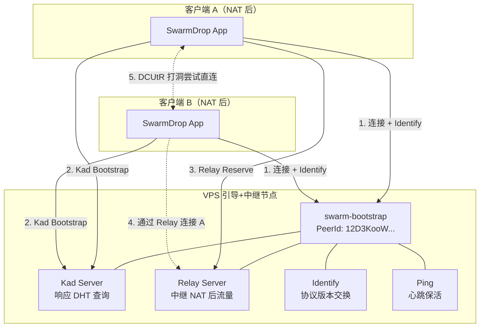
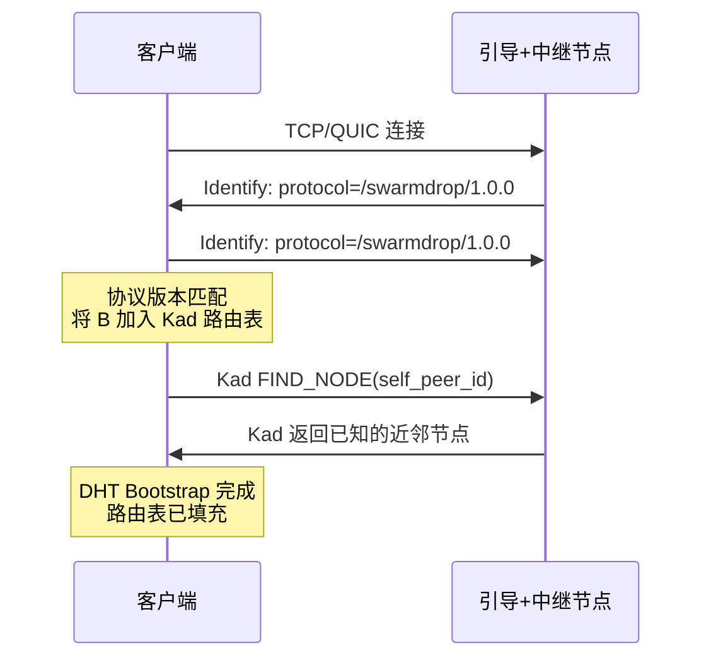
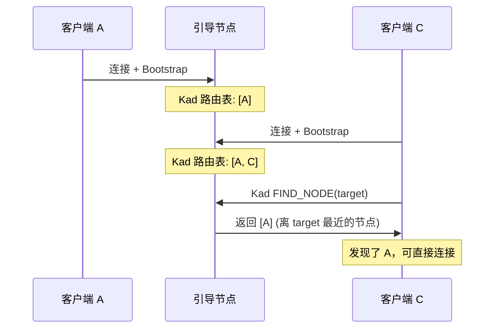
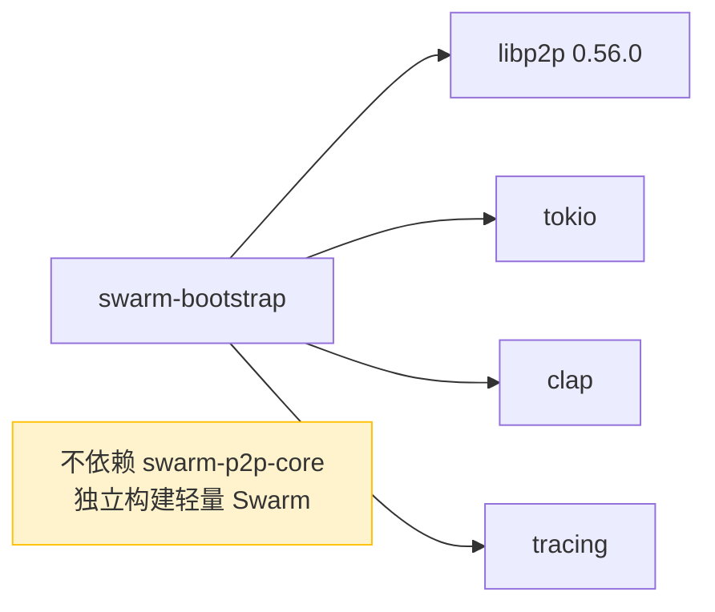

# SwarmDrop 引导+中继节点设计文档

## 1. 背景

SwarmDrop 是去中心化的文件传输工具，使用 libp2p 实现 P2P 网络。客户端之间通过 Kademlia DHT 跨网络发现彼此，通过 Relay 协议在无法直连时中继流量。

**为什么需要自建引导+中继节点：**

- IPFS 公共引导节点对非 IPFS 客户端有过滤/限制，SwarmDrop 客户端连接后 DHT bootstrap 全部失败
- 客户端使用自定义 `protocol_version`（`/swarmdrop/1.0.0`），与 IPFS 生态不兼容
- IPFS 公共节点不提供适用于 SwarmDrop 的 Relay Server 服务
- 需要一个可控的、稳定的网络入口点

## 2. 架构概览



## 3. 协议栈设计

### 3.1 引导节点 vs 客户端协议栈对比

| 协议 | 引导节点 | 客户端 | 说明 |
|------|:--------:|:------:|------|
| **Ping** | ✅ | ✅ | 心跳检测 |
| **Identify** | ✅ | ✅ | 节点信息交换，protocol_version 必须一致 |
| **Kademlia** | ✅ Server | ✅ Auto | 引导节点强制 Server 模式 |
| **Relay** | ✅ Server | ✅ Client | 引导节点作为中继服务器 |
| **mDNS** | ❌ | ✅ | 引导节点在公网 VPS，不需要局域网发现 |
| **AutoNAT** | ❌ | ✅ | 引导节点已知公网可达 |
| **DCUtR** | ❌ | ✅ | 引导节点不需要打洞 |
| **Request-Response** | ❌ | ✅ | 引导节点不参与文件传输 |

### 3.2 传输层

```
TCP + Noise + Yamux     端口 4001/tcp
QUIC (TLS 1.3 内置)     端口 4001/udp
DNS 解析                 支持 /dnsaddr/ 地址
```

- TCP 和 QUIC 使用相同端口号（底层协议不同，不冲突）
- DNS 在 VPS Linux 环境下正常可用

### 3.3 BootstrapBehaviour 定义

```rust
#[derive(NetworkBehaviour)]
pub struct BootstrapBehaviour {
    pub ping: ping::Behaviour,
    pub identify: identify::Behaviour,
    pub kad: kad::Behaviour<kad::store::MemoryStore>,
    pub relay: relay::Behaviour,  // relay server（非 client）
}
```

**关键区别**：使用 `relay::Behaviour`（服务端），而非客户端使用的 `relay::client::Behaviour`。
这影响 SwarmBuilder 的构建路径——引导节点**不调用** `.with_relay_client()`。

## 4. protocol_version 匹配机制

客户端在 `event_loop.rs` 中有如下逻辑：

```rust
// 收到 Identify 事件时
if info.protocol_version == self.protocol_version {
    // 协议版本匹配，将对方加入 Kad 路由表
    for addr in &info.listen_addrs {
        self.swarm.behaviour_mut().kad.add_address(&peer_id, addr.clone());
    }
}
```

**因此引导节点的 Identify `protocol_version` 必须设为 `"/swarmdrop/1.0.0"`**，否则客户端不会将引导节点加入 Kad 路由表，DHT bootstrap 将失败。

## 5. 数据流

### 5.1 客户端连接引导节点



### 5.2 NAT 穿透 (Relay + DCUtR)

```mermaid
sequenceDiagram
    participant A as 客户端 A (NAT 后)
    participant R as 引导+中继节点
    participant B as 客户端 B (NAT 后)

    Note over A: 检测到自己在 NAT 后

    A->>R: Relay RESERVE (预留中继槽位)
    R->>A: Relay RESERVATION OK
    Note over A: 获得中继地址<br/>/ip4/VPS_IP/tcp/4001/p2p/RELAY_ID/p2p-circuit/p2p/A_ID

    A->>R: Kad START_PROVIDE(share_code)
    Note over A: 将中继地址发布到 DHT

    B->>R: Kad GET_PROVIDERS(share_code)
    R->>B: 返回 A 的 Provider 记录（含中继地址）

    B->>R: 通过中继连接 A
    R-->>A: 转发 B 的连接请求
    A-->>B: 建立中继连接

    Note over A,B: DCUtR 自动尝试打洞
    A<-->B: 打洞成功则升级为直连<br/>失败则继续走中继
```

### 5.3 多客户端发现



## 6. 密钥持久化

引导节点的 PeerId 必须在重启后保持不变（客户端硬编码了引导节点的 PeerId）。

| 属性 | 值 |
|------|-----|
| **算法** | Ed25519 |
| **格式** | protobuf 编码 (`Keypair::to_protobuf_encoding`) |
| **存储** | 文件系统，默认 `./identity.key` |
| **权限** | Unix 0600 (仅 owner 可读写) |
| **兼容性** | 与客户端 `identity.rs` 的格式完全一致 |

**流程**：
1. 首次启动：自动生成 Ed25519 密钥对，保存到文件
2. 后续启动：从文件加载密钥，恢复相同 PeerId
3. 文件丢失：重新生成，PeerId 改变，需更新所有客户端配置

## 7. CLI 设计

```
swarm-bootstrap [OPTIONS]

Options:
    --tcp-port <PORT>       TCP 监听端口          [默认: 4001]
    --quic-port <PORT>      QUIC 监听端口         [默认: 4001]
    --key-file <PATH>       密钥文件路径           [默认: identity.key]
    --listen-addr <IP>      监听 IP 地址           [默认: 0.0.0.0]
    --idle-timeout <SECS>   空闲连接超时(秒)       [默认: 120]
    -h, --help              显示帮助
    -V, --version           显示版本
```

**日志控制**：通过 `RUST_LOG` 环境变量，默认 `info` 级别。

## 8. Crate 结构

```
libs/bootstrap/
├── Cargo.toml
├── src/
│   ├── main.rs             # 入口：CLI、密钥管理、Swarm 启动、事件循环
│   └── behaviour.rs        # BootstrapBehaviour 定义
└── swarm-bootstrap.service # systemd 服务配置
```

### 依赖关系



**设计决策**：不依赖 `swarm-p2p-core`。

原因：
- CoreBehaviour 需要 `CborMessage` 泛型约束（Request-Response），引导节点不需要
- CoreBehaviour 包含 mDNS、DCUtR、AutoNAT 等引导节点不需要的协议
- CoreBehaviour 使用 `relay::client`，引导节点需要 `relay::Behaviour`（server）
- 直接依赖 libp2p 更轻量，编译更快

## 9. Kademlia 配置

| 参数 | 引导节点 | 客户端 | 说明 |
|------|----------|--------|------|
| `mode` | `Server`(强制) | `Auto` | 引导节点始终响应 DHT 查询 |
| `query_timeout` | 60s | 60s | 一致 |
| `record_ttl` | 7200s (2h) | 3600s (1h) | 引导节点保留记录更久 |
| `replication_factor` | 20 | 3 | 引导节点存更多副本 |
| `publication_interval` | 3600s | 3600s | 一致 |
| `provider_record_ttl` | 7200s | 3600s | 引导节点保留 Provider 更久 |

## 10. 部署指南

### 10.1 编译

```bash
# 在 libs/ 目录下
cargo build --release -p swarm-bootstrap
```

产物位于 `target/release/swarm-bootstrap`。

### 10.2 VPS 部署

```bash
# 1. 创建专用用户
sudo useradd -r -s /bin/false -d /opt/swarm-bootstrap swarmdrop

# 2. 创建目录
sudo mkdir -p /opt/swarm-bootstrap
sudo chown swarmdrop:swarmdrop /opt/swarm-bootstrap

# 3. 部署二进制
sudo cp target/release/swarm-bootstrap /opt/swarm-bootstrap/
sudo chown swarmdrop:swarmdrop /opt/swarm-bootstrap/swarm-bootstrap

# 4. 安装 systemd 服务
sudo cp libs/bootstrap/swarm-bootstrap.service /etc/systemd/system/
sudo systemctl daemon-reload
sudo systemctl enable swarm-bootstrap
sudo systemctl start swarm-bootstrap

# 5. 查看日志，记录 PeerId
journalctl -u swarm-bootstrap -f
# 找到: "Node PeerId: 12D3KooW..."
```

### 10.3 防火墙

```bash
sudo ufw allow 4001/tcp comment "swarm-bootstrap TCP"
sudo ufw allow 4001/udp comment "swarm-bootstrap QUIC"
```

### 10.4 systemd 服务配置

```ini
[Unit]
Description=SwarmDrop Bootstrap + Relay Node
After=network-online.target
Wants=network-online.target

[Service]
Type=simple
User=swarmdrop
Group=swarmdrop
WorkingDirectory=/opt/swarm-bootstrap
ExecStart=/opt/swarm-bootstrap/swarm-bootstrap \
    --tcp-port 4001 \
    --quic-port 4001 \
    --key-file /opt/swarm-bootstrap/identity.key
Restart=on-failure
RestartSec=5
NoNewPrivileges=yes
ProtectSystem=strict
ProtectHome=yes
ReadWritePaths=/opt/swarm-bootstrap
PrivateTmp=yes
Environment=RUST_LOG=info
StandardOutput=journal
StandardError=journal
SyslogIdentifier=swarm-bootstrap
LimitNOFILE=65536

[Install]
WantedBy=multi-user.target
```

## 11. 客户端接入

部署后，获取 VPS 公网 IP 和 PeerId，更新 `src-tauri/src/commands/mod.rs`：

```rust
// 自有引导+中继节点放在列表头部（优先连接）
#[cfg(not(target_os = "android"))]
const BOOTSTRAP_NODES: &[&str] = &[
    // ==== SwarmDrop 自有引导+中继节点 ====
    "/ip4/<VPS_IP>/tcp/4001/p2p/<PeerId>",
    "/ip4/<VPS_IP>/udp/4001/quic-v1/p2p/<PeerId>",
    // ==== IPFS 公共引导节点（可选，作为补充） ====
    // "/dnsaddr/bootstrap.libp2p.io/p2p/Qm...",
];

// Android 使用同样的 /ip4/ 格式
#[cfg(target_os = "android")]
const BOOTSTRAP_NODES: &[&str] = &[
    "/ip4/<VPS_IP>/tcp/4001/p2p/<PeerId>",
    "/ip4/<VPS_IP>/udp/4001/quic-v1/p2p/<PeerId>",
];
```

自有引导节点同时提供 Relay Server，客户端 `relay::client` 会自动发现并使用，无需额外配置。

## 12. 注意事项

| 事项 | 说明 |
|------|------|
| **libp2p 版本一致** | 引导节点与 swarm-p2p-core 必须使用相同 libp2p 版本 (0.56.0) |
| **protocol_version 一致** | 必须为 `"/swarmdrop/1.0.0"`，否则客户端不加入 Kad |
| **密钥文件安全** | `identity.key` 丢失 = PeerId 改变 = 所有客户端需更新 |
| **单点故障** | 初期只有一个节点，后续应部署多个（不同地域） |
| **内存使用** | MemoryStore 在高负载下内存增长，关注监控 |
| **SIGTERM 处理** | 仅支持 Unix 信号，Windows 测试需条件编译 |
