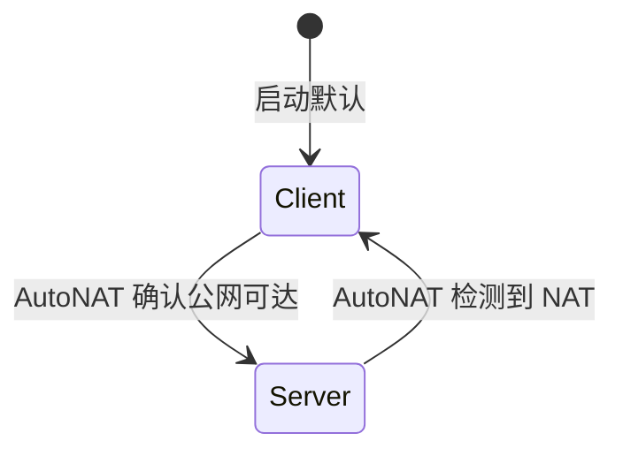

# BUG-003: Kad 默认 Client 模式导致 put_record QuorumFailed

## 现象

`put_record` 返回错误：

```
QuorumFailed { success: [], quorum: 1 }
```

所有需要对端节点响应的 DHT 操作（put_record、start_provide 等）均失败，而纯本地操作正常。

## 根因分析

libp2p 0.56 的 Kademlia 默认采用**自动模式**（`Mode::Client` / `Mode::Server` 由 AutoNAT 判定）。

工作流程：



**Client 模式**下的节点：
- 可以主动发起 DHT 查询（get_record、get_providers 等）
- **不响应**其他节点的 DHT 查询请求
- **不存储**其他节点写入的记录
- **不会被纳入**其他节点的 Kad 路由表

在以下场景中，AutoNAT 无法确认外部可达性，所有节点停留在 Client 模式：
- 测试环境（localhost / 局域网，没有足够的 AutoNAT 服务端）
- AutoNAT 被关闭（`enable_autonat = false`）
- 刚启动还未完成 AutoNAT 探测

当所有节点都是 Client 模式时，`put_record` 找不到任何能存储记录的 Server 节点，quorum 为 0，操作失败。

## 修复

新增 `NodeConfig::kad_server_mode` 配置项：

```rust
// config.rs
pub kad_server_mode: bool,  // 默认 false

// behaviour.rs
if config.kad_server_mode {
    kad.set_mode(Some(kad::Mode::Server));
}
```

- **默认 `false`**：保持自动模式，适用于生产环境中 AutoNAT 正常工作的场景
- **设为 `true`**：强制 Server 模式，适用于：
  - 引导节点（bootstrap node，已知公网可达）
  - 测试环境（localhost，节点间确实互相可达）
  - 关闭了 AutoNAT 的场景

## 为什么不直接默认 Server 模式？

Server 模式的节点会被写入其他节点的 Kad 路由表。如果该节点实际上在 NAT 后面无法被外部直连，其他节点查询 DHT 时会被路由到该节点然后超时，降低整个 DHT 网络的查询成功率。

自动模式通过 AutoNAT 确认可达性后才切换到 Server，保证 DHT 路由表中只有真正可达的节点。

## 涉及文件

- `core/src/config.rs`（新增 `kad_server_mode` 字段和 builder 方法）
- `core/src/runtime/behaviour.rs`（根据配置设置 Kad 模式）
