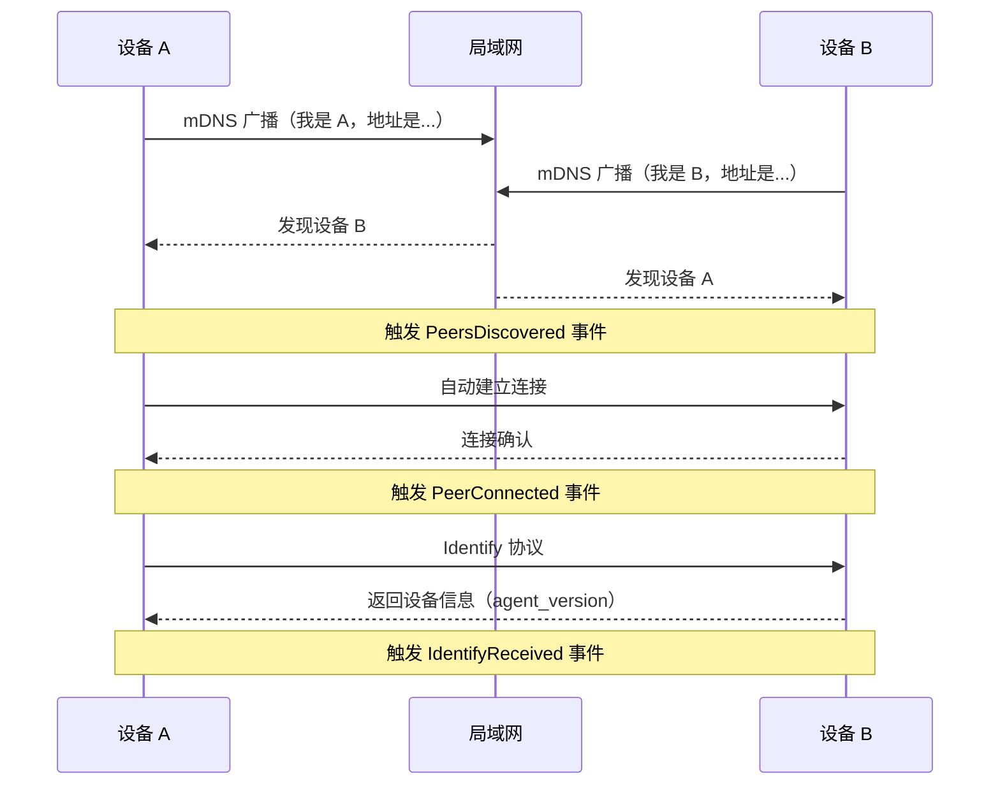
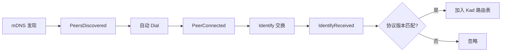
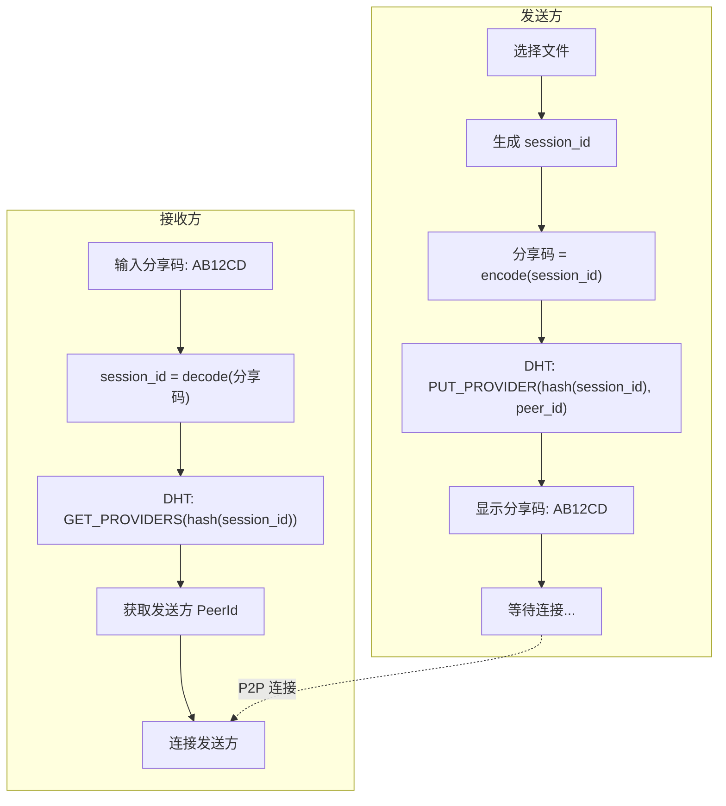
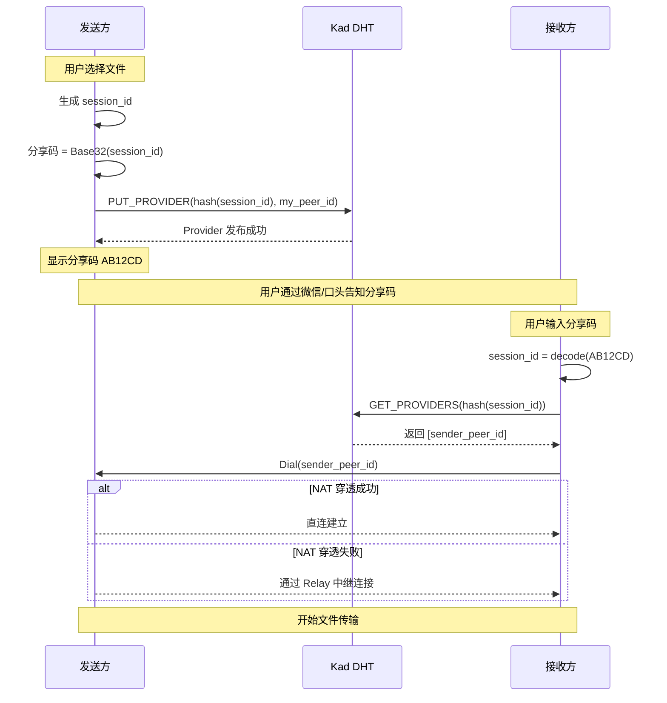
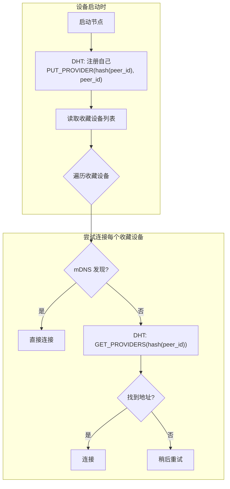
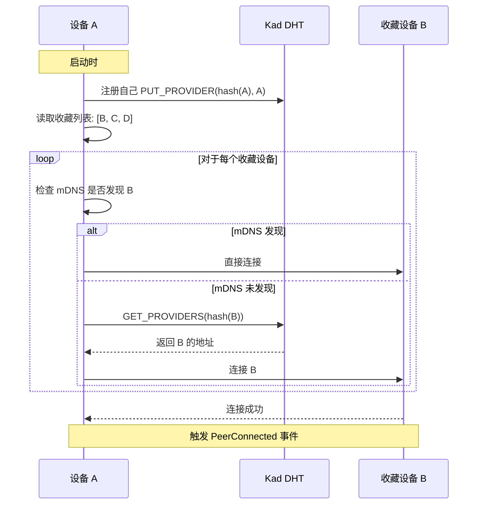
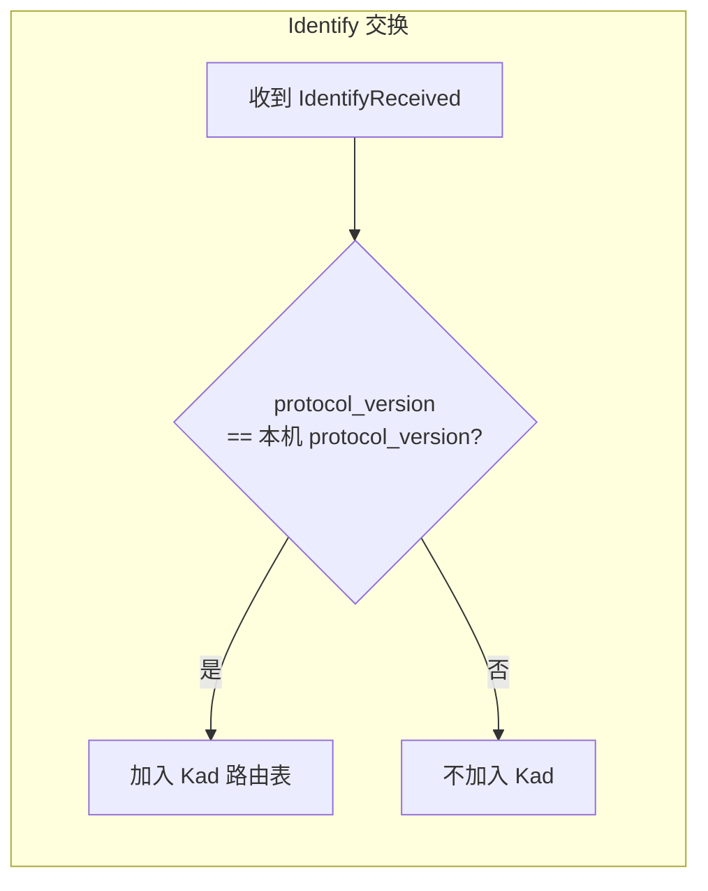
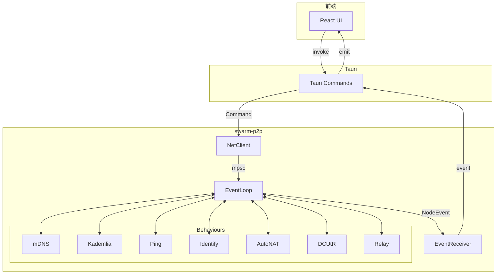

# 设备发现与连接设计

本文档描述 swarm-p2p 的设备发现和连接机制，包括局域网发现、跨网络连接、以及收藏设备自动重连。

## 概述

swarm-p2p 支持两种设备发现方式：

| 场景 | 机制 | 需要分享码 |
|-----|------|-----------|
| 局域网 | mDNS | 否 |
| 跨网络 | Kad DHT + 分享码 | 是 |

## 1. 局域网发现（mDNS）

### 工作流程



### 事件流



### 前端显示

局域网发现的设备显示在"附近设备"列表，可直接点击发送文件，无需分享码。

## 2. 跨网络连接（分享码 + Kad）

### 为什么不用 Kad 发现设备列表？

- DHT 网络可能有成千上万节点
- 大多数节点不是目标设备
- 无法预知连接质量

**因此：Kad 不用于"发现设备列表"，而是用于"通过分享码找到特定设备"。**

### 分享码机制



### 详细时序



### Kad API 使用

**发送方 - 发布 Provider：**

```rust
// 生成分享码
let session_id: [u8; 8] = random();
let share_code = base32_encode(&session_id[..4]);

// 在 DHT 发布
let key = kad::RecordKey::new(&sha256(&session_id));
swarm.behaviour_mut().kad.start_providing(key)?;
```

**接收方 - 查询 Provider：**

```rust
// 解析分享码
let session_id = base32_decode(&share_code);

// 查询 DHT
let key = kad::RecordKey::new(&sha256(&session_id));
swarm.behaviour_mut().kad.get_providers(key);

// 处理查询结果（在事件循环中）
kad::Event::OutboundQueryProgressed {
    result: QueryResult::GetProviders(Ok(GetProvidersOk::FoundProviders { providers, .. })),
    ..
} => {
    for peer_id in providers {
        swarm.dial(peer_id)?;
    }
}
```

## 3. 收藏设备自动重连

### 问题

配对成功后，下次如何自动连接该设备，而不需要每次都输入分享码？

### 解决方案



### 收藏设备数据模型

```rust
struct FavoriteDevice {
    peer_id: PeerId,          // 设备的 PeerId
    name: String,             // 设备名称
    fingerprint: String,      // 设备指纹（用于验证）
    added_at: i64,            // 添加时间
    last_connected: Option<i64>, // 上次连接时间
}
```

### 自动重连时序



### 需要的 Command

| Command | 参数 | 用途 |
|---------|-----|------|
| `RegisterSelf` | - | 启动时在 DHT 注册自己 |
| `FindPeer` | `peer_id: PeerId` | 通过 PeerId 查找设备地址 |
| `StartProviding` | `key: Vec<u8>` | 发布分享码 Provider |
| `GetProviders` | `key: Vec<u8>` | 查询分享码 Provider |

### 需要的 Event

| Event | 字段 | 用途 |
|-------|-----|------|
| `ProviderPublished` | `key` | 分享码发布成功 |
| `ProvidersFound` | `key, providers` | 找到 Provider |
| `PeerFound` | `peer_id, addrs` | 找到收藏设备 |

## 4. 协议版本隔离

### 为什么需要？

swarm-p2p 可能被多个应用使用（如 SwarmDrop、SwarmNote），它们应该有独立的 DHT 网络。

### 实现方式



**配置示例：**

```rust
// SwarmDrop
let config = NodeConfig::new(
    "/swarmdrop/1.0.0",  // protocol_version
    "SwarmDrop/1.0.0 (Windows; Desktop; \"我的电脑\")",  // agent_version
);

// SwarmNote
let config = NodeConfig::new(
    "/swarmnote/1.0.0",  // protocol_version
    "SwarmNote/1.0.0 (macOS; Laptop; \"工作电脑\")",
);
```

这样 SwarmDrop 和 SwarmNote 的 DHT 网络自动隔离。

## 5. 完整架构图



## 6. 事件汇总

| 事件 | 触发条件 | 用途 |
|-----|---------|------|
| `Listening` | 开始监听地址 | 显示本机地址 |
| `PeersDiscovered` | mDNS 发现设备 | 显示附近设备 |
| `PeerConnected` | 与 peer 第一个连接建立 | 更新连接状态 |
| `PeerDisconnected` | 与 peer 最后一个连接关闭 | 更新连接状态 |
| `IdentifyReceived` | 收到对方身份信息 | 显示设备名称/类型 |
| `PingSuccess` | ping 成功 | 显示延迟 |
| `NatStatusChanged` | NAT 状态变化 | 显示网络状态 |

## 7. 待实现功能

- [ ] `RegisterSelf` Command - 启动时注册自己
- [ ] `FindPeer` Command - 查找收藏设备
- [ ] `StartProviding` Command - 发布分享码
- [ ] `GetProviders` Command - 查询分享码
- [ ] `ProviderPublished` Event - 发布成功通知
- [ ] `ProvidersFound` Event - 查询结果通知
- [ ] `PeerFound` Event - 设备查找结果
