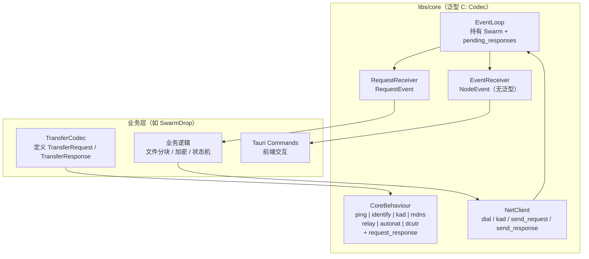
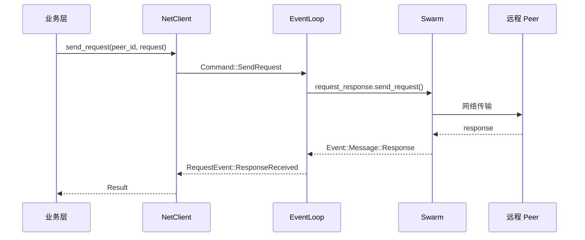
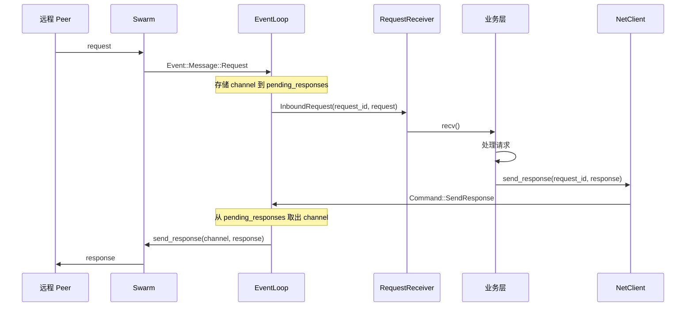

# Request-Response 协议集成设计

> **状态**: Draft
>
> **范围**: `libs/core` (swarm-p2p-core)
>
> **目标**: 在核心网络库中集成 libp2p request-response 协议，为上层业务（文件传输、消息同步等）提供通用的请求-响应通信能力

## 1. 设计原则

`libs/core` 是 swarm-apps 产品族（SwarmDrop、SwarmNote 等）的共享底层网络库，不是通用框架。设计需要满足：

1. **Core 提供完整运行时** — EventLoop、Command 系统、Client 都由 core 拥有，业务层不需要重建基础设施
2. **业务层定义协议消息** — Request/Response 的具体类型由各产品自行定义
3. **NodeEvent 保持干净** — 面向前端的事件不引入泛型，基础网络事件与业务协议事件分离
4. **最小改动原则** — 现有的 Kad、Dial 等命令体系保持不变

## 2. 方案概述

采用 **泛型 Codec + 双通道** 方案：

- `CoreBehaviour<C: Codec>` — 单泛型参数，业务层提供 Codec 实现
- `NodeEvent` — 不变，无泛型，继续通过 `EventReceiver` 发送基础网络事件
- `RequestEvent<C>` — 新增独立通道，专门传递 request-response 事件
- `EventLoop` 持有 `ResponseChannel`，业务层通过 `request_id` 回复

## 3. 架构总览



## 4. 数据流

### 4.1 发送请求（业务层主动发起）



### 4.2 接收请求并回复



## 5. 详细设计

### 5.1 泛型约束

Core 对业务层的 Codec 要求：

```rust
use libp2p::request_response::Codec;

// 业务层的 Codec 需满足：
// 1. Codec trait（libp2p 要求）
// 2. Send + Clone + 'static（异步 + 多线程）
// 3. Request/Response 类型需要 Send + Debug
//
// 业务层示例：
// pub struct TransferCodec;
// impl Codec for TransferCodec {
//     type Protocol = StreamProtocol;
//     type Request = TransferRequest;
//     type Response = TransferResponse;
//     ...
// }
```

### 5.2 CoreBehaviour 变更

文件：`libs/core/src/runtime/behaviour.rs`

```rust
use libp2p::request_response::{self, Codec, ProtocolSupport};

#[derive(NetworkBehaviour)]
pub struct CoreBehaviour<C>
where
    C: Codec + Send + Clone + 'static,
    C::Request: Send,
    C::Response: Send,
{
    pub ping: ping::Behaviour,
    pub identify: identify::Behaviour,
    pub kad: kad::Behaviour<kad::store::MemoryStore>,
    pub mdns: mdns::tokio::Behaviour,
    pub relay_client: relay::client::Behaviour,
    pub autonat: autonat::Behaviour,
    pub dcutr: dcutr::Behaviour,
    pub request_response: request_response::Behaviour<C>,
}
```

`CoreBehaviour::new` 新增参数：

```rust
impl<C> CoreBehaviour<C>
where
    C: Codec + Send + Clone + 'static,
    C::Protocol: Clone,
    C::Request: Send,
    C::Response: Send,
{
    pub fn new(
        keypair: &Keypair,
        relay_client: relay::client::Behaviour,
        config: &NodeConfig,
        // 新增：业务层提供的协议和 codec
        protocol: C::Protocol,
        codec: C,
    ) -> Self {
        // ...existing protocol setup (ping, identify, kad, mdns, autonat, dcutr)...

        // ===== Request-Response =====
        let request_response = request_response::Behaviour::new(
            [(protocol, ProtocolSupport::Full)],
            codec,
        );

        Self {
            ping,
            identify,
            kad,
            mdns,
            relay_client,
            autonat,
            dcutr,
            request_response,
        }
    }
}
```

### 5.3 RequestEvent — 业务协议事件

新增文件：`libs/core/src/request_event.rs`

```rust
use libp2p::request_response::{InboundRequestId, OutboundRequestId, OutboundFailure, InboundFailure};
use libp2p::PeerId;

/// 业务协议事件，通过独立 channel 发送给业务层
///
/// 与 NodeEvent 分离，原因：
/// 1. NodeEvent 需要 Serialize 发给前端，不应引入泛型
/// 2. request-response 事件是纯后端逻辑，不需要经过 Tauri 事件
/// 3. 业务层可以在独立 task 中处理，不阻塞基础网络事件
#[derive(Debug)]
pub enum RequestEvent<Req, Resp> {
    /// 收到来自远程 peer 的请求，需要业务层处理并通过 send_response 回复
    InboundRequest {
        peer_id: PeerId,
        request_id: InboundRequestId,
        request: Req,
    },

    /// 收到对之前发出请求的响应
    ResponseReceived {
        peer_id: PeerId,
        request_id: OutboundRequestId,
        response: Resp,
    },

    /// 发出的请求失败
    OutboundFailure {
        peer_id: PeerId,
        request_id: OutboundRequestId,
        error: OutboundFailure,
    },

    /// 入站请求处理失败（如响应超时未发送）
    InboundFailure {
        peer_id: PeerId,
        request_id: InboundRequestId,
        error: InboundFailure,
    },
}
```

### 5.4 NodeEvent — 不变

`NodeEvent` 保持现状，不引入任何泛型参数。

基础网络事件（连接、发现、NAT 检测等）继续通过 `EventReceiver` 发送给上层（Tauri → 前端）。

### 5.5 Command 扩展

在现有 Command 体系中新增两个命令。

#### SendRequest 命令

```rust
/// 发送请求命令
pub struct SendRequestCommand<C: Codec> {
    peer_id: PeerId,
    request: C::Request,
}

impl<C> CommandHandler for SendRequestCommand<C>
where
    C: Codec + Send + Clone + 'static,
    C::Request: Send,
    C::Response: Send,
{
    type Result = OutboundRequestId;

    async fn run(&mut self, swarm: &mut CoreSwarm<C>, handle: &ResultHandle<Self::Result>) {
        let request_id = swarm
            .behaviour_mut()
            .request_response
            .send_request(&self.peer_id, self.request.take());
        handle.finish(Ok(request_id));
    }

    // 不需要 on_event，发送是立即完成的
    // 响应通过 RequestEvent::ResponseReceived 异步到达
}
```

#### SendResponse 命令

```rust
/// 发送响应命令
///
/// 注意：不使用 CommandHandler trait，因为需要操作 pending_responses
/// 直接在 EventLoop 中作为特殊命令处理
pub enum AppCommand<C: Codec> {
    /// 标准命令（dial, kad 等）
    Standard(Command),
    /// 发送请求
    SendRequest {
        peer_id: PeerId,
        request: C::Request,
        result_tx: ResultHandle<OutboundRequestId>,
    },
    /// 回复请求
    SendResponse {
        request_id: InboundRequestId,
        response: C::Response,
    },
}
```

### 5.6 EventLoop 变更

文件：`libs/core/src/runtime/event_loop.rs`

主要变更：
1. 加泛型参数 `C`
2. 新增 `request_tx` channel 和 `pending_responses` map
3. 处理 `CoreBehaviourEvent::RequestResponse` 事件
4. 处理 `SendResponse` 命令

```rust
use libp2p::request_response::{self, Codec, ResponseChannel, InboundRequestId};
use std::collections::HashMap;

pub struct EventLoop<C>
where
    C: Codec + Send + Clone + 'static,
    C::Request: Send,
    C::Response: Send,
{
    swarm: CoreSwarm<C>,
    command_rx: mpsc::Receiver<AppCommand<C>>,
    event_tx: mpsc::Sender<NodeEvent>,
    request_tx: mpsc::Sender<RequestEvent<C::Request, C::Response>>,
    active_commands: Vec<Command>,
    protocol_version: String,
    /// 暂存入站请求的 ResponseChannel
    /// EventLoop 持有 channel，业务层只拿到 request_id
    pending_responses: HashMap<InboundRequestId, ResponseChannel<C::Response>>,
}
```

事件处理新增分支：

```rust
// 在 convert_to_node_event / handle_swarm_event 中
SwarmEvent::Behaviour(CoreBehaviourEvent::RequestResponse(event)) => {
    match event {
        request_response::Event::Message { peer, message } => {
            match message {
                request_response::Message::Request { request_id, request, channel } => {
                    // 存储 channel，等业务层回复
                    self.pending_responses.insert(request_id, channel);
                    // 转发给业务层
                    let _ = self.request_tx.send(RequestEvent::InboundRequest {
                        peer_id: peer,
                        request_id,
                        request,
                    }).await;
                }
                request_response::Message::Response { request_id, response } => {
                    let _ = self.request_tx.send(RequestEvent::ResponseReceived {
                        peer_id: peer,
                        request_id,
                        response,
                    }).await;
                }
            }
        }
        request_response::Event::OutboundFailure { peer, request_id, error } => {
            let _ = self.request_tx.send(RequestEvent::OutboundFailure {
                peer_id: peer,
                request_id,
                error,
            }).await;
        }
        request_response::Event::InboundFailure { peer, request_id, error } => {
            let _ = self.request_tx.send(RequestEvent::InboundFailure {
                peer_id: peer,
                request_id,
                error,
            }).await;
        }
        request_response::Event::ResponseSent { .. } => {
            // 可选：记录日志
        }
    }
}
```

命令处理新增分支：

```rust
// handle_command 中
AppCommand::SendResponse { request_id, response } => {
    if let Some(channel) = self.pending_responses.remove(&request_id) {
        if self.swarm.behaviour_mut().request_response
            .send_response(channel, response)
            .is_err()
        {
            warn!("Failed to send response for request {:?}: connection closed", request_id);
        }
    } else {
        warn!("No pending response channel for request {:?}", request_id);
    }
}
```

### 5.7 NetClient 变更

文件：`libs/core/src/runtime/client.rs`

```rust
use libp2p::request_response::{Codec, OutboundRequestId, InboundRequestId};

/// 网络客户端
#[derive(Clone)]
pub struct NetClient<C: Codec> {
    command_tx: mpsc::Sender<AppCommand<C>>,
}

impl<C> NetClient<C>
where
    C: Codec + Send + Clone + 'static,
    C::Request: Send,
    C::Response: Send,
{
    /// 连接到指定 peer（不变）
    pub async fn dial(&self, peer_id: PeerId) -> Result<()> { ... }

    // Kad 命令（不变）...

    /// 向 peer 发送请求
    pub async fn send_request(
        &self,
        peer_id: PeerId,
        request: C::Request,
    ) -> Result<OutboundRequestId> {
        let handle = ResultHandle::new();
        self.command_tx.send(AppCommand::SendRequest {
            peer_id,
            request,
            result_tx: handle.clone(),
        }).await.map_err(|_| Error::Behaviour("command channel closed".into()))?;
        // 立即返回 request_id，响应通过 RequestReceiver 异步到达
        handle.await
    }

    /// 回复一个入站请求
    pub async fn send_response(
        &self,
        request_id: InboundRequestId,
        response: C::Response,
    ) -> Result<()> {
        self.command_tx.send(AppCommand::SendResponse {
            request_id,
            response,
        }).await.map_err(|_| Error::Behaviour("command channel closed".into()))
    }
}
```

### 5.8 RequestReceiver

新增独立的接收器：

```rust
/// 业务协议事件接收器
///
/// 与 EventReceiver 独立，在不同的 task 中处理
pub struct RequestReceiver<Req, Resp> {
    rx: mpsc::Receiver<RequestEvent<Req, Resp>>,
}

impl<Req, Resp> RequestReceiver<Req, Resp> {
    pub(crate) fn new(rx: mpsc::Receiver<RequestEvent<Req, Resp>>) -> Self {
        Self { rx }
    }

    pub async fn recv(&mut self) -> Option<RequestEvent<Req, Resp>> {
        self.rx.recv().await
    }
}
```

### 5.9 start() 函数变更

文件：`libs/core/src/runtime/node.rs`

```rust
pub fn start<C>(
    keypair: libp2p::identity::Keypair,
    config: NodeConfig,
    protocol: C::Protocol,
    codec: C,
) -> Result<(NetClient<C>, EventReceiver, RequestReceiver<C::Request, C::Response>)>
where
    C: Codec + Send + Clone + 'static,
    C::Protocol: Clone,
    C::Request: Send + std::fmt::Debug,
    C::Response: Send + std::fmt::Debug,
{
    let swarm = SwarmBuilder::with_existing_identity(keypair)
        .with_tokio()
        .with_tcp(tcp::Config::default(), noise::Config::new, yamux::Config::default)?
        .with_quic()
        .with_dns()?
        .with_relay_client(noise::Config::new, yamux::Config::default)?
        .with_behaviour(|key, relay_client| {
            CoreBehaviour::new(key, relay_client, &config, protocol, codec)
        })
        .unwrap()
        .with_swarm_config(|cfg| cfg.with_idle_connection_timeout(config.idle_connection_timeout))
        .build();

    let (command_tx, command_rx) = mpsc::channel(COMMAND_CHANNEL_SIZE);
    let (event_tx, event_rx) = mpsc::channel(EVENT_CHANNEL_SIZE);
    let (request_tx, request_rx) = mpsc::channel(REQUEST_CHANNEL_SIZE);

    let mut event_loop = EventLoop::new(
        swarm, command_rx, event_tx, request_tx, config.protocol_version.clone(),
    );
    event_loop.start_listen(&config.listen_addrs)?;
    tokio::spawn(event_loop.run());

    Ok((
        NetClient::new(command_tx),
        EventReceiver::new(event_rx),
        RequestReceiver::new(request_rx),
    ))
}
```

## 6. 类型别名与公共导出

```rust
// libs/core/src/lib.rs
pub use runtime::{EventReceiver, NetClient, RequestReceiver, start};
pub use request_event::RequestEvent;

// 方便业务层使用的类型别名
pub type CoreSwarm<C> = libp2p::Swarm<runtime::CoreBehaviour<C>>;
```

## 7. 业务层使用示例

### 7.1 定义 TransferCodec（SwarmDrop）

```rust
// src-tauri/src/transfer/codec.rs
use std::io;
use async_trait::async_trait;
use futures::prelude::*;
use libp2p::{request_response::Codec, StreamProtocol};
use serde::{Serialize, Deserialize};

#[derive(Debug, Serialize, Deserialize)]
pub enum TransferRequest {
    FileListRequest { session_id: [u8; 8] },
    ChunkRequest { session_id: [u8; 8], file_id: u32, chunk_index: u32 },
    TransferComplete { session_id: [u8; 8], file_id: u32, checksum: [u8; 32] },
    CancelTransfer { session_id: [u8; 8] },
}

#[derive(Debug, Serialize, Deserialize)]
pub enum TransferResponse {
    FileList { files: Vec<FileInfo>, total_size: u64 },
    Chunk { file_id: u32, chunk_index: u32, data: Vec<u8>, is_last: bool },
    Ack { success: bool, message: Option<String> },
    Error { code: u32, message: String },
}

/// 传输协议 Codec
///
/// 使用 CBOR 序列化，采用 read_to_end 模式（request-response 每对消息
/// 使用独立 substream，写完关闭 substream，对端读到 EOF 即知消息结束）
#[derive(Clone)]
pub struct TransferCodec {
    /// 请求最大大小（默认 1 MiB，控制消息不会太大）
    request_size_maximum: u64,
    /// 响应最大大小（默认 1 MiB，包含 chunk 数据）
    response_size_maximum: u64,
}

impl Default for TransferCodec {
    fn default() -> Self {
        Self {
            request_size_maximum: 1024 * 1024,       // 1 MiB
            response_size_maximum: 1024 * 1024,       // 1 MiB（含 64KB chunk + 元数据）
        }
    }
}

#[async_trait]
impl Codec for TransferCodec {
    type Protocol = StreamProtocol;
    type Request = TransferRequest;
    type Response = TransferResponse;

    async fn read_request<T>(&mut self, _: &Self::Protocol, io: &mut T) -> io::Result<Self::Request>
    where T: AsyncRead + Unpin + Send
    {
        let mut vec = Vec::new();
        io.take(self.request_size_maximum).read_to_end(&mut vec).await?;
        cbor4ii::serde::from_slice(&vec)
            .map_err(|e| io::Error::new(io::ErrorKind::InvalidData, e))
    }

    async fn read_response<T>(&mut self, _: &Self::Protocol, io: &mut T) -> io::Result<Self::Response>
    where T: AsyncRead + Unpin + Send
    {
        let mut vec = Vec::new();
        io.take(self.response_size_maximum).read_to_end(&mut vec).await?;
        cbor4ii::serde::from_slice(&vec)
            .map_err(|e| io::Error::new(io::ErrorKind::InvalidData, e))
    }

    async fn write_request<T>(&mut self, _: &Self::Protocol, io: &mut T, req: Self::Request) -> io::Result<()>
    where T: AsyncWrite + Unpin + Send
    {
        let data = cbor4ii::serde::to_vec(Vec::new(), &req)
            .map_err(|e| io::Error::new(io::ErrorKind::InvalidData, e))?;
        io.write_all(&data).await
    }

    async fn write_response<T>(&mut self, _: &Self::Protocol, io: &mut T, resp: Self::Response) -> io::Result<()>
    where T: AsyncWrite + Unpin + Send
    {
        let data = cbor4ii::serde::to_vec(Vec::new(), &resp)
            .map_err(|e| io::Error::new(io::ErrorKind::InvalidData, e))?;
        io.write_all(&data).await
    }
}
```

### 7.2 启动并使用

```rust
// src-tauri/src/commands/mod.rs
use swarm_p2p_core::{start, NodeConfig, NetClient, EventReceiver, RequestReceiver};
use crate::transfer::codec::{TransferCodec, TransferRequest, TransferResponse};

pub async fn init_network(keypair: Keypair, config: NodeConfig) {
    let (client, events, requests) = start(
        keypair,
        config,
        StreamProtocol::new("/swarmdrop/transfer/1.0.0"),
        TransferCodec,
    ).unwrap();

    // 基础网络事件 → 发给前端
    tokio::spawn(async move {
        let mut events = events;
        while let Some(event) = events.recv().await {
            // emit to Tauri frontend
            app_handle.emit("network-event", &event).unwrap();
        }
    });

    // 业务协议事件 → 后端处理
    tokio::spawn(async move {
        let mut requests = requests;
        let client = client.clone();
        while let Some(event) = requests.recv().await {
            match event {
                RequestEvent::InboundRequest { peer_id, request_id, request } => {
                    match request {
                        TransferRequest::ChunkRequest { file_id, chunk_index, .. } => {
                            let data = read_chunk(file_id, chunk_index).await;
                            client.send_response(request_id, TransferResponse::Chunk {
                                file_id, chunk_index, data, is_last: false,
                            }).await.unwrap();
                        }
                        // ...
                    }
                }
                RequestEvent::ResponseReceived { response, .. } => {
                    // 处理收到的响应
                }
                _ => {}
            }
        }
    });
}
```

### 7.3 SwarmNote 使用同一个 core

```rust
// swarmnote 定义自己的协议
#[derive(Clone)]
pub struct SyncCodec;

impl Codec for SyncCodec {
    type Protocol = StreamProtocol;
    type Request = SyncRequest;   // CRDT 同步请求
    type Response = SyncResponse; // CRDT 同步响应
    // ...
}

// 同样的 start 调用，不同的 Codec
let (client, events, requests) = swarm_p2p_core::start(
    keypair,
    config,
    StreamProtocol::new("/swarmnote/sync/1.0.0"),
    SyncCodec,
).unwrap();
```

## 8. 改动清单

| 文件 | 改动类型 | 说明 |
|------|---------|------|
| `runtime/behaviour.rs` | **修改** | CoreBehaviour 加泛型 `<C: Codec>`，新增 `request_response` 字段 |
| `runtime/event_loop.rs` | **修改** | 加泛型，新增 `request_tx`、`pending_responses`，处理 RR 事件 |
| `runtime/client.rs` | **修改** | NetClient 加泛型，新增 `send_request`、`send_response` |
| `runtime/node.rs` | **修改** | start 加泛型，新增参数 `protocol` + `codec`，返回 `RequestReceiver` |
| `runtime/mod.rs` | **修改** | 更新导出 |
| `request_event.rs` | **新增** | `RequestEvent` 枚举定义 |
| `command/mod.rs` | **修改** | 新增 `AppCommand` 枚举（或扩展现有 Command） |
| `command/handler.rs` | **修改** | `CoreSwarm` 类型别名加泛型 |
| `command/dial.rs` | **微调** | 跟随 CoreSwarm 泛型变更 |
| `command/kad/*.rs` | **微调** | 跟随 CoreSwarm 泛型变更 |
| `event.rs` | **不变** | NodeEvent 无泛型，不改动 |
| `config.rs` | **不变** | |
| `error.rs` | **微调** | 可选新增 `RequestResponse(String)` 变体 |
| `lib.rs` | **修改** | 新增 `request_event` 模块，更新导出 |

## 9. 泛型传播范围

```
CoreBehaviour<C>
  └→ CoreSwarm<C>           // type alias
      └→ EventLoop<C>       // struct
          └→ (内部使用，不对外暴露)
  └→ NetClient<C>           // struct, 对外暴露
  └→ RequestReceiver<C>     // struct, 对外暴露
  └→ start::<C>()           // function, 对外暴露

不受影响：
  ├─ NodeEvent              // 无泛型
  ├─ EventReceiver          // 无泛型
  ├─ NodeConfig             // 无泛型
  └─ Error                  // 无泛型
```

对业务层来说，只需要在 `start()` 调用处指定一次 Codec 类型，后续通过 `NetClient<TransferCodec>` 和 `RequestReceiver<...>` 使用。

## 10. Codec 实现方案分析

### 10.1 libp2p request-response 的消息边界机制

libp2p 的 request-response 协议为**每个请求-响应对**开一个独立 substream。写完后关闭 substream，对端读到 EOF 即知消息结束。因此内置的 json/cbor Codec 实现都非常简单：

```rust
// libp2p 官方 cbor::Codec 的完整 read_request 实现
async fn read_request<T>(&mut self, _: &Self::Protocol, io: &mut T) -> io::Result<Req>
where T: AsyncRead + Unpin + Send,
{
    let mut vec = Vec::new();
    io.take(self.request_size_maximum).read_to_end(&mut vec).await?;
    cbor4ii::serde::from_slice(vec.as_slice()).map_err(decode_into_io_error)
}

// write_request
async fn write_request<T>(&mut self, _: &Self::Protocol, io: &mut T, req: Req) -> io::Result<()>
where T: AsyncWrite + Unpin + Send,
{
    let data: Vec<u8> = cbor4ii::serde::to_vec(Vec::new(), &req).map_err(encode_into_io_error)?;
    io.write_all(data.as_ref()).await?;
    Ok(())
}
```

**不需要长度前缀**，`read_to_end` + `write_all` 即可。

### 10.2 asynchronous-codec + unsigned-varint 是什么

这两个 crate 是 libp2p 生态中用于**流式协议**的帧编解码方案：

- **`asynchronous-codec`**：提供 `Encoder` / `Decoder` trait + `Framed` 包装器，把 `AsyncRead + AsyncWrite` 变成 `Stream<Item=Frame> + Sink<Frame>`。适用于一条 substream 上收发多个帧的场景（如 Kademlia、Gossipsub）。
- **`unsigned-varint`**：变长整数编码，libp2p 中主要用于帧的长度前缀 `[varint_len][payload]`。提供了 `aio` 模块（异步读 varint）和 `codec` 模块（实现 `asynchronous-codec::Encoder/Decoder`）。

### 10.3 对比

| | libp2p Codec trait | asynchronous-codec + unsigned-varint |
| - | --- | --- |
| **适用场景** | request-response（一个 substream 一条消息） | 流式协议（一个 substream 多条消息） |
| **消息边界** | substream 关闭 = 消息结束（EOF） | varint 长度前缀标记每帧边界 |
| **消息模型** | 一问一答，每次新开 substream | 持续双向通信，复用同一 substream |
| **libp2p 使用者** | request-response | Kademlia、Gossipsub、Identify |
| **每条消息开销** | substream 协商（multistream-select） | 几字节 varint 前缀 |
| **实现复杂度** | 低（4 个 async 方法） | 中（Encoder + Decoder + Framed 组装） |

### 10.4 对文件传输的影响

当前设计采用 request-response 模型（接收方逐块请求）。每个 chunk 是一次独立的 request-response：

```
chunk 1: [open substream] → [ChunkRequest] → [Chunk response] → [close substream]
chunk 2: [open substream] → [ChunkRequest] → [Chunk response] → [close substream]
...
```

传 1GB 文件（64KB/块）= 16384 次 substream 开关。这在 yamux 多路复用下开销可控——substream 创建是纯内存操作，multistream-select 协商很快。

如果未来性能瓶颈确实出现在 substream 开销上，可以考虑切换到流式协议：

```
[open substream]
  → [varint_len][chunk 1]
  → [varint_len][chunk 2]
  → ...
[close substream]
```

但会失去 request-response 的简洁性（天然流控、每块独立重试、接收方控制节奏）。

### 10.5 决策

**当前阶段**：使用 libp2p Codec trait，采用 `read_to_end` + serde 序列化模式。不引入 `asynchronous-codec` 和 `unsigned-varint`。

**序列化格式选择**：

| 格式 | 优点 | 缺点 |
|------|------|------|
| CBOR（`cbor4ii`） | libp2p 官方支持，二进制紧凑，原生字节串支持 | 需要额外依赖 `cbor4ii` |
| bincode | 极致性能，Rust 生态主流 | 非自描述，不跨语言 |
| JSON | 调试友好 | 文本格式，`Vec<u8>` 需 base64 编码，性能差 |

**建议使用 CBOR**：
- libp2p 官方 cbor Codec 代码可直接参考，模式成熟
- CBOR 对 `Vec<u8>` 有原生 byte string 支持（不像 JSON 需要 base64）
- 二进制紧凑，序列化开销小
- 自描述格式，调试时可用工具查看
- 如果未来移动端需要跨语言，CBOR 有广泛的多语言实现

**未来优化路径**：如果传输速率成为瓶颈，可改为流式协议 + `unsigned-varint` 帧分割，但这属于性能优化阶段的工作。

## 11. 待明确事项

1. **pending_responses 超时清理**：ResponseChannel 长时间未回复需要清理，防止内存泄漏。可设置超时（如 30s）自动清除
2. **send_request 的返回语义**：当前设计返回 `OutboundRequestId`，响应异步到达 `RequestReceiver`。是否需要提供同步等待响应的便捷方法（如 `request_and_wait`）？
3. **多协议支持**：当前设计每个 core 实例只支持一个 Codec（一个 request-response 协议）。如果一个 app 需要多个协议，需要讨论扩展方案
