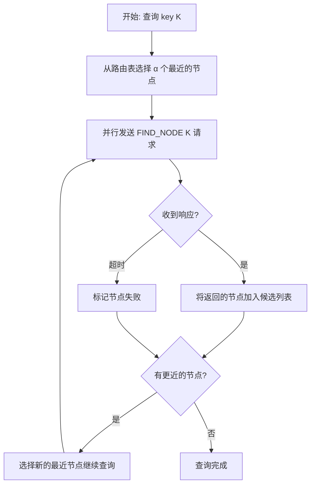

# Kademlia 基础概念

## 什么是 Kademlia？

Kademlia 是一种分布式哈希表（DHT）协议，用于在 P2P 网络中存储和查找数据。它的核心特点是：

- **去中心化**：没有中心服务器，所有节点平等
- **自组织**：节点自动发现和维护网络拓扑
- **高效查询**：O(log n) 复杂度定位任意节点

## 节点标识：PeerId

每个节点有一个唯一的 256-bit 标识符（PeerId）：

```
PeerId 示例:
12D3KooWDpJ7As7BWAwRMfu1VU2WCqNjvq387JEYKDBj4kx6nXTN

二进制表示 (256 bit):
0001 0010 1101 0011 ... (256 位)
```

## XOR 距离

### 为什么用 XOR？

Kademlia 用 **XOR (异或)** 运算定义节点间的"距离"：

```
distance(A, B) = A XOR B
```

XOR 距离的特性使其非常适合 DHT：

| 特性 | 公式 | 意义 |
|------|------|------|
| 自反性 | `d(A, A) = 0` | 自己和自己距离为 0 |
| 对称性 | `d(A, B) = d(B, A)` | A 到 B 的距离 = B 到 A 的距离 |
| 三角不等式 | `d(A, B) + d(B, C) ≥ d(A, C)` | 满足度量空间要求 |
| 单向性 | 对于任意 A 和距离 d，只存在唯一的 B 使得 `d(A, B) = d` | 保证查询收敛 |

### XOR 计算示例

```
节点 A: 0101 (5)
节点 B: 0011 (3)
节点 C: 0110 (6)

d(A, B) = 0101 XOR 0011 = 0110 = 6
d(A, C) = 0101 XOR 0110 = 0011 = 3
d(B, C) = 0011 XOR 0110 = 0101 = 5

结论: C 距离 A 更近 (3 < 6)
```

### 距离的二进制理解

```
A = 0101
B = 0011
    ----
XOR = 0110
      ↑
      最高位的 1 决定"量级"
```

**关键洞察**：XOR 结果的最高位 1 的位置，表示两个 ID 第一个不同的 bit 位置。

```
A = 01010101
B = 01010011
    --------
XOR = 00000110
           ↑
    第 6 位不同，距离在 2^1 ~ 2^2 范围
```

## 路由表：K-Bucket

### 结构

每个节点维护一个路由表，按**距离范围**划分为多个 bucket：

```
节点 A 的路由表:

┌─────────────────────────────────────────────────────────┐
│ Bucket 0: 距离 [2^0, 2^1)   │ 最多 k 个节点              │
│ Bucket 1: 距离 [2^1, 2^2)   │ 最多 k 个节点              │
│ Bucket 2: 距离 [2^2, 2^3)   │ 最多 k 个节点              │
│ ...                         │                           │
│ Bucket 255: 距离 [2^255, 2^256) │ 最多 k 个节点          │
└─────────────────────────────────────────────────────────┘

k 通常 = 20 (libp2p 默认值)
```

### 可视化

```
                    节点 A 的视角
                         A
                        /|\
                       / | \
        Bucket 255   /   |   \   Bucket 0
        (最远)      /    |    \   (最近)
                   /     |     \
                  *      *      *
                 /|\    /|\    /|\
                * * *  * * *  * * *

距离:     很远 ←──────────────────→ 很近
bucket:  255                        0
```

### 为什么这样设计？

1. **近处多，远处少**：靠近自己的节点了解得更详细
2. **覆盖全网**：每个距离范围都有代表节点
3. **查询效率**：每次查询都能缩短一半距离

```
256-bit 空间中:
- Bucket 0: 只有 1 个可能的节点 (和 A 只差最后 1 bit)
- Bucket 1: 最多 2 个可能的节点
- Bucket 2: 最多 4 个可能的节点
- ...
- Bucket 255: 2^255 个可能的节点 (半个网络!)

所以高位 bucket 容易填满，低位 bucket 可能永远空着
```

## 迭代查询

### 原理

Kademlia 使用**迭代查询**来定位节点或数据：



### 参数

| 参数 | 值 | 含义 |
|------|-----|------|
| α (alpha) | 3 | 并行查询数 |
| k | 20 | 每个 bucket 最大节点数 |
| β (beta) | 3 | 查询完成后返回的节点数 |

### 示例

假设要查找 key `K = 1010`:

```
步骤 1: A 的路由表中最近的节点是 B, C, D
        A ──→ B: FIND_NODE(1010)
        A ──→ C: FIND_NODE(1010)
        A ──→ D: FIND_NODE(1010)

步骤 2: B 返回 [E, F]，E 更近
        C 返回 [E, G]
        D 超时

步骤 3: 继续查询 E, F, G
        A ──→ E: FIND_NODE(1010)
        A ──→ F: FIND_NODE(1010)
        A ──→ G: FIND_NODE(1010)

步骤 4: E 返回 [H]，H 是 1010
        找到目标!
```

### 复杂度

- **最坏情况**: O(log n) 次网络往返
- **原因**: 每次迭代至少将距离缩短一半

```
网络规模    最大跳数
100         7
1,000       10
10,000      14
1,000,000   20
```

## DHT 操作类型

### 1. 节点查询 (FIND_NODE)

查找距离某 key 最近的 k 个节点：

```
FIND_NODE(key) → [Node1, Node2, ..., NodeK]
```

### 2. 值查询 (FIND_VALUE)

查找存储在 DHT 中的值：

```
FIND_VALUE(key):
  - 如果本地有值 → 返回值
  - 否则 → 返回最近的 k 个节点
```

### 3. 存储 (STORE)

将键值对存储到 DHT：

```
STORE(key, value):
  1. FIND_NODE(key) 找到最近的节点
  2. 向这些节点发送 STORE 请求
```

## libp2p-kad 特有概念

### Provider 机制

除了存储数据，Kademlia 还支持"提供者"概念：

```
Provider 机制:
"我是 key X 的提供者" (不存储数据本身，只存储提供者身份)

适用场景:
- 大文件: 只宣布"我有这个文件"，不复制文件内容
- 在线状态: 宣布"我在线"，不需要存储数据
```

### Record vs Provider

```
┌─────────────────────────────────────────────────────────┐
│                      Record                             │
│  PUT_RECORD(key, value)                                │
│  - 存储实际数据                                         │
│  - 数据复制到多个节点                                   │
│  - 适合小数据 (< 64KB)                                 │
│                                                         │
│  例: putRecord("share_code_abc", {peer_id, name, ...}) │
└─────────────────────────────────────────────────────────┘

┌─────────────────────────────────────────────────────────┐
│                     Provider                            │
│  START_PROVIDING(key)                                  │
│  - 只存储提供者身份 (PeerId)                            │
│  - 不存储实际数据                                       │
│  - 适合大数据或动态内容                                 │
│                                                         │
│  例: startProvide(my_peer_id) 宣布"我在线"             │
└─────────────────────────────────────────────────────────┘
```

## 下一步

了解了基础概念后，继续阅读：

1. [Bootstrap](./02-bootstrap.md) - 如何加入 DHT 网络
2. [Provider](./03-provider.md) - Provider 机制详解
3. [Record](./04-record.md) - Record 存储详解
4. [Routing](./05-routing.md) - 路由查询详解
