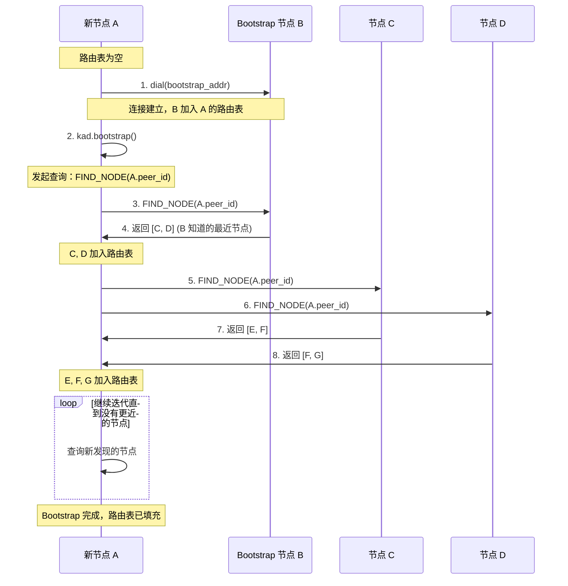
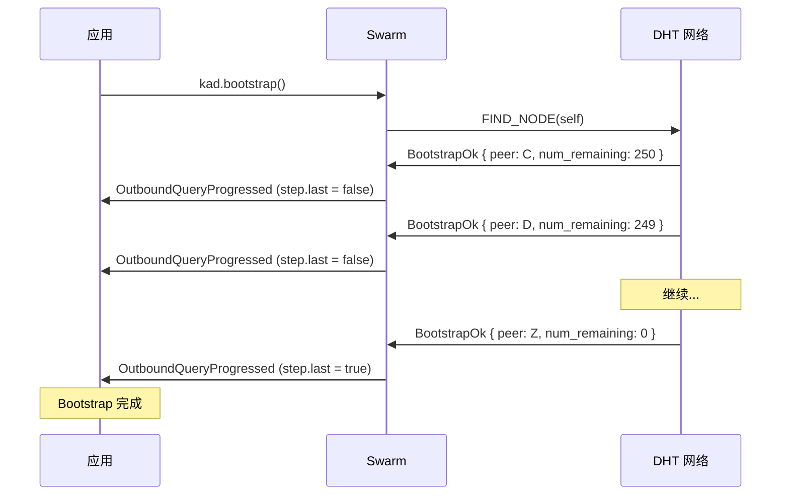

# Bootstrap 命令

## 问题：新节点如何加入 DHT？

当一个新节点启动时，它的路由表是**空的**，不知道网络中有谁：

```
新节点 A 的路由表:

┌─────────────────────────────────┐
│ Bucket 0:   [ 空 ]              │
│ Bucket 1:   [ 空 ]              │
│ Bucket 2:   [ 空 ]              │
│ ...                             │
│ Bucket 255: [ 空 ]              │
└─────────────────────────────────┘

A: "我要加入 DHT，但我不认识任何人..."
```

## 解决方案：Bootstrap 节点

需要**预先配置**至少一个已知节点（Bootstrap 节点）：

```rust
// 硬编码的 bootstrap 节点
const BOOTSTRAP_NODES: &[&str] = &[
    "/dns4/bootstrap1.swarmdrop.io/tcp/4001/p2p/12D3KooW...",
    "/dns4/bootstrap2.swarmdrop.io/tcp/4001/p2p/12D3KooW...",
];
```

Bootstrap 节点的特点：
- 公网可达（有固定 IP 或域名）
- 长期在线
- 已经是 DHT 网络的一部分

## Bootstrap 过程详解

### 整体流程



### 为什么查询自己的 PeerId？

Bootstrap 的核心操作是 `FIND_NODE(self.peer_id)`，查询自己：

```
PeerId 空间 (简化为 4-bit):

0000 ←────────────────────────────────→ 1111
  |                                        |
  |    [C]  [D]  [A]  [E]       [B]       |
  |              ↑                         |
  |       查找距离 A 最近的节点             |
```

**目的**：
1. 找到**距离自己最近**的节点
2. 填充路由表中**对应的 k-bucket**
3. 让自己"融入"网络的正确位置

### K-Bucket 填充过程

```
Bootstrap 前:
┌────────────────────────────────────┐
│ Bucket 0:   [ 空 ]                 │
│ Bucket 1:   [ 空 ]                 │
│ Bucket 2:   [ 空 ]                 │
│ ...                                │
│ Bucket 255: [ B ]  ← 只有 Bootstrap │
└────────────────────────────────────┘

Bootstrap 后:
┌────────────────────────────────────┐
│ Bucket 0:   [ 空 ] (很难找到)       │
│ Bucket 1:   [ C ]                  │
│ Bucket 2:   [ D, E ]               │
│ Bucket 3:   [ F, G, H ]            │
│ ...                                │
│ Bucket 255: [ B, I, J, ... ]       │
└────────────────────────────────────┘
```

## 代码实现

### BootstrapCommand 结构

```rust
pub struct BootstrapCommand {
    query_id: Option<QueryId>,
    stats: Option<kad::QueryStats>,
}

pub struct BootstrapResult {
    /// 剩余待刷新的 bucket 数量
    pub num_remaining: u32,
    /// 查询统计信息
    pub stats: QueryStatsInfo,
}
```

### 使用方式

```rust
// 1. 先连接 bootstrap 节点
for addr in BOOTSTRAP_NODES {
    net_client.dial(addr).await?;
}

// 2. 执行 bootstrap
let result = net_client.bootstrap().await?;
println!("Bootstrap 完成，剩余 {} 个 bucket 待刷新", result.num_remaining);

// 3. 现在可以使用 DHT 了
net_client.start_provide(my_peer_id).await?;
```

### 事件处理

Bootstrap 会产生多个 `OutboundQueryProgressed` 事件：

```rust
kad::Event::OutboundQueryProgressed {
    id,
    result: kad::QueryResult::Bootstrap(res),
    stats,
    step,
}
```

每个事件包含：
- `peer`: 刚刚查询到的节点
- `num_remaining`: 还剩多少 bucket 需要刷新
- `step.last`: 是否是最后一步



## 错误处理

### NoKnownPeers 错误

```rust
match swarm.behaviour_mut().kad.bootstrap() {
    Ok(query_id) => {
        // Bootstrap 开始
    }
    Err(NoKnownPeers) => {
        // 路由表为空，没有任何已知节点
        // 需要先 dial 至少一个 bootstrap 节点
    }
}
```

**原因**：调用 `bootstrap()` 前必须至少连接一个节点

**解决**：
```rust
// 先连接
swarm.dial(bootstrap_addr)?;
// 等待连接建立...
// 再 bootstrap
swarm.behaviour_mut().kad.bootstrap()?;
```

## 最佳实践

### 1. 多个 Bootstrap 节点

```rust
// 使用多个 bootstrap 节点提高可靠性
const BOOTSTRAP_NODES: &[&str] = &[
    "/dns4/boot1.example.com/tcp/4001/p2p/12D3KooW...",
    "/dns4/boot2.example.com/tcp/4001/p2p/12D3KooW...",
    "/ip4/1.2.3.4/tcp/4001/p2p/12D3KooW...",  // IP 作为备选
];

// 并行连接所有 bootstrap 节点
for addr in BOOTSTRAP_NODES {
    tokio::spawn(async move {
        let _ = net_client.dial(addr).await;
    });
}
```

### 2. 定期 Bootstrap

```rust
// 定期刷新路由表
loop {
    tokio::time::sleep(Duration::from_secs(300)).await; // 5 分钟
    if let Err(e) = net_client.bootstrap().await {
        warn!("Bootstrap refresh failed: {:?}", e);
    }
}
```

### 3. 网络变化时 Bootstrap

```rust
// 网络状态变化时重新 bootstrap
fn on_network_change() {
    // WiFi → 4G 切换
    // 重新连接 bootstrap 节点
    // 重新 bootstrap
}
```

## 在 SwarmDrop 中的使用

```rust
/// 网络启动流程
async fn start_network(config: &NetworkConfig) -> Result<NetClient> {
    // 1. 创建 Swarm
    let net_client = NetClient::new(config)?;

    // 2. 连接 Bootstrap 节点
    for addr in &config.bootstrap_nodes {
        match net_client.dial(addr.clone()).await {
            Ok(_) => info!("Connected to bootstrap: {}", addr),
            Err(e) => warn!("Failed to connect bootstrap {}: {:?}", addr, e),
        }
    }

    // 3. Bootstrap 加入 DHT
    match net_client.bootstrap().await {
        Ok(result) => {
            info!(
                "Bootstrap completed: {} buckets remaining, {:?}",
                result.num_remaining, result.stats
            );
        }
        Err(e) => {
            warn!("Bootstrap failed: {:?}", e);
            // 可能是暂时性问题，不要立即失败
        }
    }

    // 4. 宣布自己在线
    let peer_id = net_client.local_peer_id();
    let key = RecordKey::new(&peer_id.to_bytes());
    net_client.start_provide(key).await?;

    Ok(net_client)
}
```

## 常见问题

### Q: Bootstrap 需要多长时间？

取决于网络规模和延迟，通常几秒到几十秒。

### Q: 每次启动都要 Bootstrap 吗？

是的，但如果路由表持久化了，可以更快完成。

### Q: Bootstrap 失败了怎么办？

1. 检查 bootstrap 节点是否可达
2. 检查网络连接
3. 稍后重试

### Q: 可以不用 Bootstrap 节点吗？

在纯局域网场景可以使用 mDNS 发现，无需 bootstrap 节点。
但跨网络场景必须有 bootstrap 节点。
