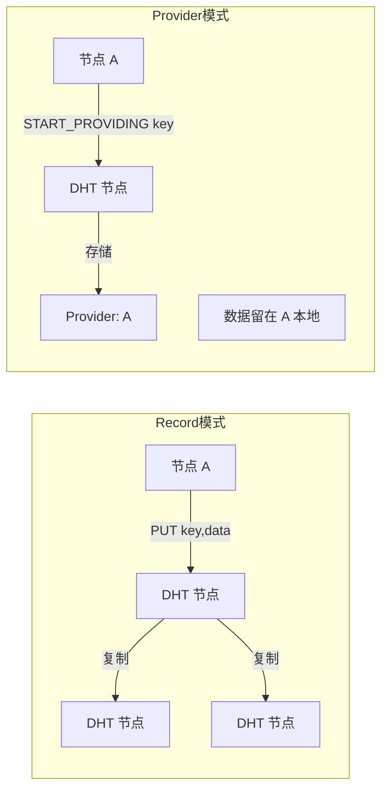
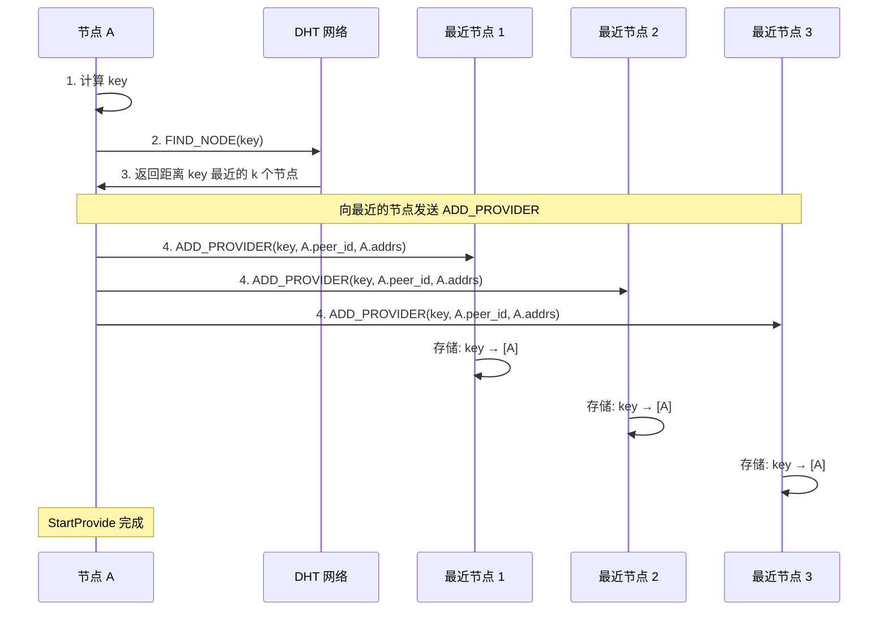
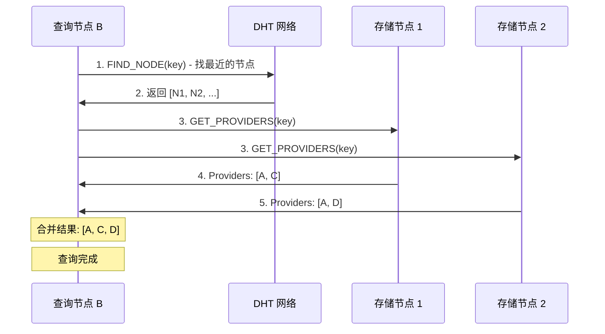

# Provider 机制

## 什么是 Provider？

Provider 机制让节点可以**宣布**自己拥有某个资源，而**不需要**在 DHT 中存储资源本身。

```
传统 DHT:
  PUT(key, large_file_data)  ← 需要复制整个文件到多个节点

Provider 模式:
  START_PROVIDING(key)       ← 只宣布 "我有这个文件"
  实际数据留在本地
```

## Provider vs Record 对比



| 特性 | Record | Provider |
|------|--------|----------|
| 存储内容 | 实际数据 | 只存 PeerId |
| 数据大小限制 | < 64KB | 无限制 |
| 数据可用性 | DHT 复制保证 | 依赖原节点在线 |
| 更新方式 | PUT 新值 | 自动过期后重新 PROVIDE |
| 适用场景 | 小数据、配置 | 大文件、在线状态 |

## 三个相关命令

### 1. StartProvide - 宣布自己是 Provider

```rust
// "我是 key 的提供者"
let key = RecordKey::new(&my_peer_id.to_bytes());
net_client.start_provide(key).await?;
```

### 2. StopProvide - 停止 Provide

```rust
// "我不再提供这个 key 了"
net_client.stop_provide(key).await?;
```

### 3. GetProviders - 查找 Providers

```rust
// "谁在提供这个 key？"
let result = net_client.get_providers(key).await?;
for provider in result.providers {
    println!("Provider: {}", provider);
}
```

---

## StartProvide 详解

### 工作原理



### 关键概念

**1. Provider Record 存储位置**

Provider 信息存储在**距离 key 最近**的 k 个节点上：

```
key = SHA256("peer_id_xxx")

DHT 空间:
0000 ────────────────────────────────── 1111
         │   │ │
         N1  N2 key
              │
         这些节点存储 "A 是 key 的 provider"
```

**2. Provider 信息内容**

每个 Provider Record 包含：
```rust
struct ProviderRecord {
    key: Key,           // 被提供的 key
    provider: PeerId,   // 提供者的 PeerId
    addresses: Vec<Multiaddr>,  // 提供者的地址
    expires: Instant,   // 过期时间
}
```

**3. 自动过期与刷新**

```
Provider Record 有 TTL (通常 24 小时)

时间线:
├─────────────────────────────────────────┤
0h        12h           24h
│          │             │
START    刷新         过期
PROVIDE  PROVIDE      (需要重新 START_PROVIDE)
```

libp2p-kad 会自动定期刷新，但节点离线后会逐渐过期。

### 代码实现

```rust
pub struct StartProvideCommand {
    key: RecordKey,
    query_id: Option<kad::QueryId>,
    stats: Option<kad::QueryStats>,
}

#[async_trait]
impl CommandHandler for StartProvideCommand {
    type Result = QueryStatsInfo;

    async fn run(&mut self, swarm: &mut CoreSwarm, handle: &ResultHandle<Self::Result>) {
        match swarm.behaviour_mut().kad.start_providing(self.key.clone()) {
            Ok(query_id) => self.query_id = Some(query_id),
            Err(e) => handle.finish(Err(e.into())),
        }
    }

    async fn on_event(&mut self, event: &SwarmEvent<CoreBehaviourEvent>, handle: &ResultHandle<Self::Result>) -> bool {
        // 等待 QueryResult::StartProviding
        // 可能有多个 progress 事件
        // step.last == true 时完成
    }
}
```

---

## StopProvide 详解

### 工作原理

```rust
// 从本地停止 providing
swarm.behaviour_mut().kad.stop_providing(&key);
```

**注意**：这只是停止本地的 provide 行为，**不会**立即从 DHT 删除 provider 记录。

```
调用 stop_providing:
1. 停止定期刷新
2. 现有的 provider 记录会逐渐过期
3. 最终从 DHT 消失
```

### 代码实现

```rust
pub struct StopProvideCommand {
    key: RecordKey,
}

#[async_trait]
impl CommandHandler for StopProvideCommand {
    type Result = ();

    async fn run(&mut self, swarm: &mut CoreSwarm, handle: &ResultHandle<Self::Result>) {
        swarm.behaviour_mut().kad.stop_providing(&self.key);
        handle.finish(Ok(()));  // 同步完成，无需等待事件
    }
}
```

---

## GetProviders 详解

### 工作原理



### 事件处理

GetProviders 可能产生多个进度事件：

```rust
kad::QueryResult::GetProviders(result) {
    // 两种情况
    Ok(GetProvidersOk::FoundProviders { key, providers }) => {
        // 找到一批 providers
        // 可能还有更多，继续等待
    }
    Ok(GetProvidersOk::FinishedWithNoAdditionalRecord { closest_peers }) => {
        // 查询完成，没有更多 providers 了
        // closest_peers 是最近的节点（不是 provider）
    }
    Err(e) => {
        // 查询失败
    }
}
```

### 代码实现

```rust
pub struct GetProvidersCommand {
    key: RecordKey,
    query_id: Option<kad::QueryId>,
    providers: Vec<PeerId>,  // 累积收集
    stats: Option<kad::QueryStats>,
}

async fn on_event(&mut self, event: &SwarmEvent<CoreBehaviourEvent>, handle: &ResultHandle<Self::Result>) -> bool {
    match res {
        Ok(GetProvidersOk::FoundProviders { providers, .. }) => {
            // 收集这批 providers
            self.providers.extend(providers.iter().cloned());
        }
        Ok(GetProvidersOk::FinishedWithNoAdditionalRecord { .. }) => {
            // 完成，但可能没找到新的 provider
            // 继续等待 step.last
        }
        Err(e) => {
            handle.finish(Err(...));
            return false;
        }
    }

    if step.last {
        // 查询完成
        handle.finish(Ok(GetProvidersResult {
            providers: std::mem::take(&mut self.providers),
            stats: ...,
        }));
        return false;
    }
    true  // 继续等待
}
```

---

## 在 SwarmDrop 中的应用

### 场景 1: 宣布在线状态

```rust
/// 节点启动时宣布在线
async fn announce_online(net_client: &NetClient) -> Result<()> {
    let peer_id = net_client.local_peer_id();

    // 用自己的 PeerId 作为 key
    let key = RecordKey::new(&peer_id.to_bytes());

    // 宣布: "我 (peer_id) 正在提供 key=peer_id"
    net_client.start_provide(key).await?;

    info!("Announced online: {}", peer_id);
    Ok(())
}
```

### 场景 2: 查找已配对设备

```rust
/// 连接已配对设备
async fn connect_paired_device(net_client: &NetClient, peer_id: PeerId) -> Result<()> {
    // 查找这个 peer_id 的 providers
    let key = RecordKey::new(&peer_id.to_bytes());
    let result = net_client.get_providers(key).await?;

    if result.providers.is_empty() {
        return Err(Error::DeviceOffline);
    }

    // Provider 就是目标设备自己
    // DHT 查询过程中已经获取了地址信息
    net_client.dial(peer_id).await?;

    Ok(())
}
```

### 场景 3: 设备下线

```rust
/// 应用退出时清理
async fn cleanup(net_client: &NetClient) -> Result<()> {
    let peer_id = net_client.local_peer_id();
    let key = RecordKey::new(&peer_id.to_bytes());

    // 停止 provide (provider 记录会逐渐过期)
    net_client.stop_provide(key).await?;

    Ok(())
}
```

---

## 常见问题

### Q: Provider 记录多久过期？

默认 24 小时。libp2p-kad 会自动刷新，但节点离线后会过期。

### Q: 为什么 GetProviders 可能返回空？

1. 目标节点没有 `start_provide`
2. Provider 记录已过期（节点离线太久）
3. 网络分区，无法到达存储节点
4. 还没 bootstrap 或路由表不完整

### Q: Provider 和 Record 可以用同一个 key 吗？

可以，它们是独立的存储。但为了清晰，建议使用不同的 key 前缀。

### Q: start_provide 会立即生效吗？

不是立即生效，需要等查询完成（通常几秒）。其他节点在这之后才能找到你。
