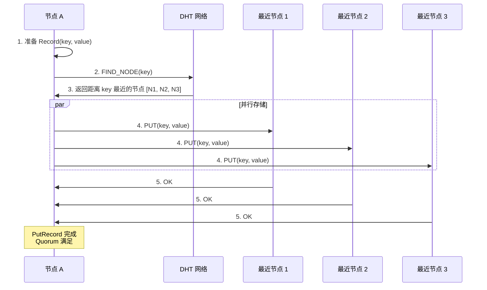
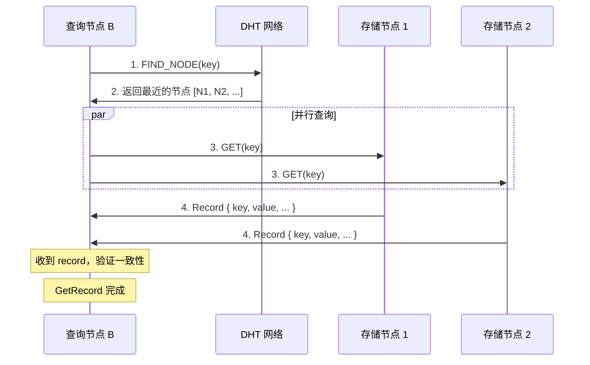

# Record 存储

## 什么是 DHT Record？

Record 是 Kademlia DHT 中的**键值对存储**，数据会被复制到距离 key 最近的多个节点。

```
Record = {
    key: RecordKey,     // 唯一标识
    value: Vec<u8>,     // 任意数据
    publisher: Option<PeerId>,  // 发布者（可选）
    expires: Option<Instant>,   // 过期时间（可选）
}
```

## Record vs Provider

```
Record (本章):
┌─────────────────────────────────────┐
│  PUT("config", {theme: "dark"})     │
│  数据复制到 DHT 节点                 │
│  适合: 小数据、配置、元信息           │
└─────────────────────────────────────┘

Provider (上一章):
┌─────────────────────────────────────┐
│  START_PROVIDING("file_hash")       │
│  只存储 "我有这个文件"               │
│  适合: 大文件、在线状态              │
└─────────────────────────────────────┘
```

## 三个相关命令

### 1. PutRecord - 存储数据

```rust
let key = RecordKey::new(b"share_code_ABC123");
let value = bincode::serialize(&share_code_record)?;
net_client.put_record(key, value).await?;
```

### 2. GetRecord - 获取数据

```rust
let key = RecordKey::new(b"share_code_ABC123");
let result = net_client.get_record(key).await?;
let data: ShareCodeRecord = bincode::deserialize(&result.record.value)?;
```

### 3. RemoveRecord - 删除本地数据

```rust
let key = RecordKey::new(b"share_code_ABC123");
net_client.remove_record(key).await?;
```

---

## PutRecord 详解

### 工作原理



### 存储位置

Record 存储在距离 key **最近的 k 个节点**：

```
DHT 空间 (简化):

0000 ─────────────────────────────── 1111
       │     │ │ │
      N1    N2 N3 key
             └─┴─┴── 这些节点存储 record
```

### Quorum (仲裁)

```rust
// put_record 的第二个参数是 Quorum
swarm.behaviour_mut().kad.put_record(record, kad::Quorum::One)
```

| Quorum | 含义 |
|--------|------|
| `One` | 只需 1 个节点确认 |
| `Majority` | 需要大多数节点确认 |
| `All` | 需要所有目标节点确认 |
| `N(n)` | 需要 n 个节点确认 |

### 代码实现

```rust
pub struct PutRecordCommand {
    record: Record,
    query_id: Option<kad::QueryId>,
    stats: Option<kad::QueryStats>,
}

#[async_trait]
impl CommandHandler for PutRecordCommand {
    type Result = QueryStatsInfo;

    async fn run(&mut self, swarm: &mut CoreSwarm, handle: &ResultHandle<Self::Result>) {
        match swarm.behaviour_mut().kad.put_record(self.record.clone(), kad::Quorum::One) {
            Ok(query_id) => self.query_id = Some(query_id),
            Err(e) => handle.finish(Err(e.into())),
        }
    }

    async fn on_event(&mut self, event: &SwarmEvent<CoreBehaviourEvent>, handle: &ResultHandle<Self::Result>) -> bool {
        // 等待 QueryResult::PutRecord
        // step.last == true 时完成
    }
}
```

---

## GetRecord 详解

### 工作原理



### 事件处理

```rust
kad::QueryResult::GetRecord(result) {
    Ok(GetRecordOk::FoundRecord(peer_record)) => {
        // 找到记录
        // peer_record.record 包含数据
        // peer_record.peer 是提供这条记录的节点
    }
    Ok(GetRecordOk::FinishedWithNoAdditionalRecord) => {
        // 查询完成，没有找到更多记录
    }
    Err(GetRecordError::NotFound { key, closest_peers }) => {
        // 没找到这个 key
    }
    Err(GetRecordError::QuorumFailed { key, records, quorum }) => {
        // 仲裁失败：收到的记录不够或不一致
    }
}
```

### 代码实现

```rust
pub struct GetRecordCommand {
    key: RecordKey,
    query_id: Option<kad::QueryId>,
    record: Option<Record>,  // 保存第一个找到的记录
    stats: Option<kad::QueryStats>,
}

async fn on_event(&mut self, event: &SwarmEvent<CoreBehaviourEvent>, handle: &ResultHandle<Self::Result>) -> bool {
    match res {
        Ok(GetRecordOk::FoundRecord(peer_record)) => {
            // 保存第一个找到的记录
            if self.record.is_none() {
                self.record = Some(peer_record.record.clone());
            }
        }
        Ok(GetRecordOk::FinishedWithNoAdditionalRecord) => {
            // 没有更多记录了
        }
        Err(e) => {
            if self.record.is_none() {
                // 只有在没找到任何记录时才报错
                handle.finish(Err(...));
                return false;
            }
        }
    }

    if step.last {
        match self.record.take() {
            Some(record) => handle.finish(Ok(GetRecordResult { record, stats })),
            None => handle.finish(Err(Error::KadGetRecord("Not found"))),
        }
        return false;
    }
    true
}
```

---

## RemoveRecord 详解

### 工作原理

```rust
// 只删除本地存储的 record
swarm.behaviour_mut().kad.remove_record(&key);
```

**重要**：`remove_record` 只删除**本地**的记录副本，**不会**从其他节点删除。

```
调用 remove_record(key):
1. 从本地存储删除 key 对应的 record
2. 其他节点的副本不受影响
3. 如果是复制到本地的记录，删除后可能会再次复制过来
```

### 如何"真正"删除 DHT 中的数据？

DHT 没有全局删除操作。策略：

1. **设置过期时间**：Record 自然过期
2. **覆盖写入**：PUT 一个空值或特殊标记
3. **停止刷新**：不再 PUT，让记录自然消失

### 代码实现

```rust
pub struct RemoveRecordCommand {
    key: RecordKey,
}

#[async_trait]
impl CommandHandler for RemoveRecordCommand {
    type Result = ();

    async fn run(&mut self, swarm: &mut CoreSwarm, handle: &ResultHandle<Self::Result>) {
        swarm.behaviour_mut().kad.remove_record(&self.key);
        handle.finish(Ok(()));  // 同步完成
    }

    // 不需要 on_event，同步操作
}
```

---

## 在 SwarmDrop 中的应用

### 场景: 分享码存储

```rust
/// 生成配对码时存储到 DHT
async fn generate_pairing_code(net_client: &NetClient) -> Result<String> {
    // 1. 生成 6 位分享码
    let code = generate_random_code();  // "AB12CD"

    // 2. 创建 record 内容
    let record = ShareCodeRecord {
        peer_id: net_client.local_peer_id(),
        device_name: "My Device".to_string(),
        device_type: DeviceType::Desktop,
        created_at: current_timestamp(),
        expires_at: current_timestamp() + 300,  // 5 分钟后过期
    };

    // 3. 计算 DHT key
    let key = RecordKey::new(&sha256(code.as_bytes()));

    // 4. 存储到 DHT
    let value = bincode::serialize(&record)?;
    net_client.put_record(key, value).await?;

    Ok(code)
}

/// 使用分享码查找对方
async fn lookup_pairing_code(net_client: &NetClient, code: &str) -> Result<ShareCodeRecord> {
    // 1. 计算 DHT key
    let key = RecordKey::new(&sha256(code.as_bytes()));

    // 2. 从 DHT 获取
    let result = net_client.get_record(key).await?;

    // 3. 解析数据
    let record: ShareCodeRecord = bincode::deserialize(&result.record.value)?;

    // 4. 检查是否过期
    if record.expires_at < current_timestamp() {
        return Err(Error::CodeExpired);
    }

    Ok(record)
}

/// 取消分享码
async fn cancel_pairing_code(net_client: &NetClient, code: &str) -> Result<()> {
    let key = RecordKey::new(&sha256(code.as_bytes()));

    // 从本地删除（其他节点的副本会逐渐过期）
    net_client.remove_record(key).await?;

    Ok(())
}
```

### 数据结构

```rust
/// 分享码 Record 的内容
#[derive(Serialize, Deserialize)]
pub struct ShareCodeRecord {
    pub peer_id: PeerId,
    pub device_name: String,
    pub device_type: DeviceType,
    pub created_at: u64,
    pub expires_at: u64,
}
```

---

## 数据一致性

### 最终一致性

DHT 是**最终一致**的系统：

```
时间 T0: 节点 A PUT(key, "value1")
         → 复制到 N1, N2, N3

时间 T1: 节点 B PUT(key, "value2")
         → 复制到 N1, N2, N3

时间 T2: N1 有 "value2"
         N2 有 "value2"
         N3 可能还是 "value1" (网络延迟)

时间 T3: 所有节点都有 "value2"
```

### 冲突解决

libp2p-kad 默认使用**最新值覆盖**策略。如果需要自定义：

```rust
// 可以设置 record 的 publisher 和 expires
let record = Record {
    key,
    value,
    publisher: Some(my_peer_id),
    expires: Some(Instant::now() + Duration::from_secs(300)),
};
```

---

## 常见问题

### Q: Record 最大可以存多大？

libp2p 默认限制 64KB。更大的数据应该用 Provider 机制或分片存储。

### Q: Record 会自动过期吗？

取决于配置。可以设置 `expires` 字段，也可以让存储节点定期清理。

### Q: PUT 失败了怎么办？

1. 检查网络连接
2. 检查是否已 bootstrap
3. 重试几次
4. 如果持续失败，可能是网络分区

### Q: GET 返回的数据不一致怎么办？

正常情况下很少发生。如果发生：
1. 检查是否有多个节点同时写入
2. 使用版本号或时间戳解决冲突
3. 重新 PUT 正确的值
