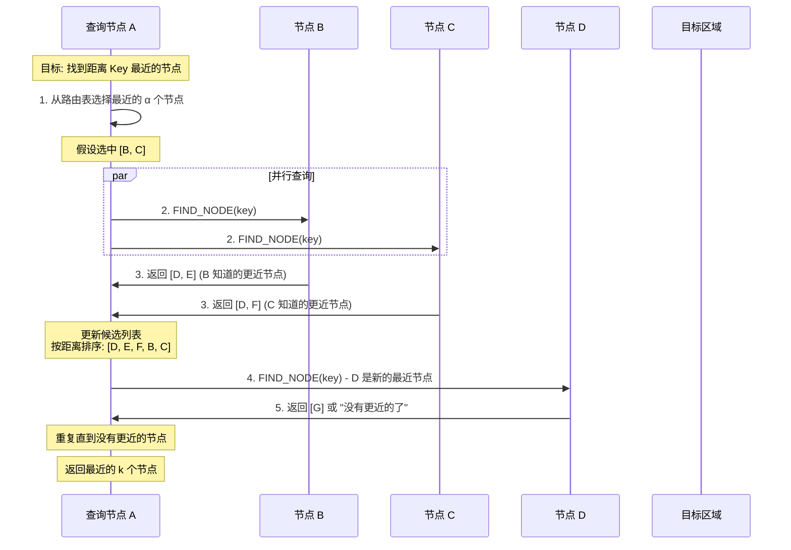
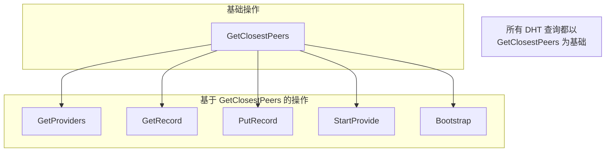

# 路由查询

## GetClosestPeers 命令

`GetClosestPeers` 查找距离指定 key **最近的 k 个节点**。这是 Kademlia 的核心查询操作。

```rust
let key = RecordKey::new(&target_peer_id.to_bytes());
let result = net_client.get_closest_peers(key).await?;

for peer in result.peers {
    println!("Closest peer: {}", peer);
}
```

## 用途

| 场景 | 说明 |
|------|------|
| 节点发现 | 找到网络中的特定节点 |
| 数据定位 | 找到存储某 key 的节点 |
| 路由优化 | 填充路由表的特定区域 |
| 网络探测 | 测量到某个区域的"距离" |

## 工作原理

### 迭代查询过程



### 距离计算示例

```
目标 Key:    1010 1100
节点 A:      0011 0101
节点 B:      1001 1110
节点 C:      1010 1010
节点 D:      1010 1101

距离计算 (XOR):
d(Key, A) = 1010 1100 XOR 0011 0101 = 1001 1001 = 153
d(Key, B) = 1010 1100 XOR 1001 1110 = 0011 0010 = 50
d(Key, C) = 1010 1100 XOR 1010 1010 = 0000 0110 = 6
d(Key, D) = 1010 1100 XOR 1010 1101 = 0000 0001 = 1

排序: D(1) < C(6) < B(50) < A(153)

结论: D 距离 Key 最近
```

## 代码实现

### 结构定义

```rust
pub struct GetClosestPeersCommand {
    key: RecordKey,
    query_id: Option<kad::QueryId>,
    peers: Vec<PeerId>,
    stats: Option<kad::QueryStats>,
}

#[derive(Debug, Clone)]
pub struct GetClosestPeersResult {
    pub peers: Vec<PeerId>,
    pub stats: QueryStatsInfo,
}
```

### 事件处理

```rust
async fn on_event(&mut self, event: &SwarmEvent<CoreBehaviourEvent>, handle: &ResultHandle<Self::Result>) -> bool {
    let SwarmEvent::Behaviour(CoreBehaviourEvent::Kad(kad::Event::OutboundQueryProgressed {
        id,
        result: kad::QueryResult::GetClosestPeers(res),
        stats,
        step,
    })) = event else { return true };

    if self.query_id != Some(*id) { return true; }

    // 累积统计
    self.stats = Some(match self.stats.take() {
        Some(s) => s.merge(stats.clone()),
        None => stats.clone(),
    });

    match res {
        Ok(ok) => {
            // ok.peers 是 Vec<PeerInfo>，需要提取 PeerId
            self.peers.extend(ok.peers.iter().map(|p| p.peer_id));
            info!("Progress: found {} peers", self.peers.len());
        }
        Err(e) => {
            error!("Error: {:?}", e);
            handle.finish(Err(...));
            return false;
        }
    }

    if !step.last { return true; }

    // 查询完成
    handle.finish(Ok(GetClosestPeersResult {
        peers: std::mem::take(&mut self.peers),
        stats: QueryStatsInfo::from(self.stats.as_ref().unwrap()),
    }));

    false
}
```

### PeerInfo 结构

```rust
// libp2p 返回的 PeerInfo
pub struct PeerInfo {
    pub peer_id: PeerId,
    pub addrs: Vec<Multiaddr>,
}
```

注意：`GetClosestPeersOk::peers` 返回的是 `Vec<PeerInfo>`，包含地址信息。

## 与其他查询的关系



**所有 DHT 操作**的第一步都是找到距离 key 最近的节点：

1. **GetProviders**: 先找最近的节点，再查询 provider
2. **GetRecord**: 先找最近的节点，再获取 record
3. **PutRecord**: 先找最近的节点，再存储 record
4. **StartProvide**: 先找最近的节点，再注册 provider
5. **Bootstrap**: `GetClosestPeers(self.peer_id)` 找距离自己最近的节点

## 查询参数

### α (Alpha) - 并行度

```rust
// libp2p 默认 α = 3
// 同时查询 3 个节点
```

增大 α：
- 优点：更快找到目标
- 缺点：更多网络流量

### k - 返回数量

```rust
// 返回最近的 k 个节点
// libp2p 默认 k = 20
```

### 超时

```rust
// 每个节点查询有超时
// 超时后继续查询其他节点
```

## 应用场景

### 场景 1: 检查节点是否在线

```rust
async fn is_peer_online(net_client: &NetClient, peer_id: PeerId) -> bool {
    let key = RecordKey::new(&peer_id.to_bytes());
    let result = net_client.get_closest_peers(key).await;

    match result {
        Ok(r) => {
            // 如果目标节点在最近的 peers 中，说明在线
            r.peers.contains(&peer_id)
        }
        Err(_) => false,
    }
}
```

### 场景 2: 网络健康检查

```rust
async fn check_network_health(net_client: &NetClient) -> NetworkHealth {
    let my_peer_id = net_client.local_peer_id();
    let key = RecordKey::new(&my_peer_id.to_bytes());

    let result = net_client.get_closest_peers(key).await?;

    NetworkHealth {
        connected_peers: result.peers.len(),
        query_latency: result.stats.duration,
        success_rate: result.stats.num_successes as f32 /
                      result.stats.num_requests as f32,
    }
}
```

### 场景 3: 路由表优化

```rust
async fn refresh_routing_table(net_client: &NetClient) {
    // 为每个 bucket 生成随机 key 并查询
    for bucket_index in 0..256 {
        let random_key = generate_key_in_bucket(bucket_index);
        let _ = net_client.get_closest_peers(random_key).await;
        // 查询结果会自动更新路由表
    }
}
```

## 查询统计

```rust
pub struct QueryStatsInfo {
    /// 查询耗时
    pub duration: Option<Duration>,
    /// 发送的请求数
    pub num_requests: u32,
    /// 成功的请求数
    pub num_successes: u32,
    /// 失败的请求数
    pub num_failures: u32,
}
```

```
典型统计示例:
┌─────────────────────────────────┐
│ duration: 1.2s                  │
│ num_requests: 15                │
│ num_successes: 12               │
│ num_failures: 3                 │
│                                 │
│ 说明: 查询了 15 个节点          │
│       12 个响应，3 个超时/失败   │
└─────────────────────────────────┘
```

## 错误处理

### 超时

```rust
Err(GetClosestPeersError::Timeout { key, peers }) => {
    // 查询超时
    // peers 包含已经找到的节点
}
```

### 原因分析

| 错误 | 可能原因 | 解决方案 |
|------|----------|----------|
| 超时 | 网络慢或节点不可达 | 增加超时时间或重试 |
| 空结果 | 路由表为空 | 先 bootstrap |
| 部分成功 | 部分节点离线 | 正常情况，继续使用返回的结果 |

## 性能优化

### 1. 缓存路由信息

```rust
// GetClosestPeers 返回的节点会自动加入路由表
// 后续查询会更快
```

### 2. 预热查询

```rust
// 启动时对常用的 key 预先查询
async fn warmup(net_client: &NetClient, common_keys: &[RecordKey]) {
    for key in common_keys {
        let _ = net_client.get_closest_peers(key.clone()).await;
    }
}
```

### 3. 批量查询

```rust
// 多个查询可以并行执行
let results = futures::future::join_all(vec![
    net_client.get_closest_peers(key1),
    net_client.get_closest_peers(key2),
    net_client.get_closest_peers(key3),
]).await;
```

## 常见问题

### Q: 返回的 peers 一定包含目标节点吗？

不一定。返回的是距离 key **最近**的节点，如果目标节点离线或不在网络中，不会返回它。

### Q: 返回的 peers 数量总是 k 个吗？

不一定。如果网络中的节点少于 k 个，或者部分节点不可达，可能返回更少。

### Q: 查询会改变路由表吗？

会。查询过程中发现的节点会被加入路由表（如果合适的话）。

### Q: 如何判断查询是否"成功"？

- 如果找到了目标节点：成功
- 如果找到了距离最近的节点（不是目标）：也算成功，说明目标不存在或离线
- 如果超时或出错：需要重试
