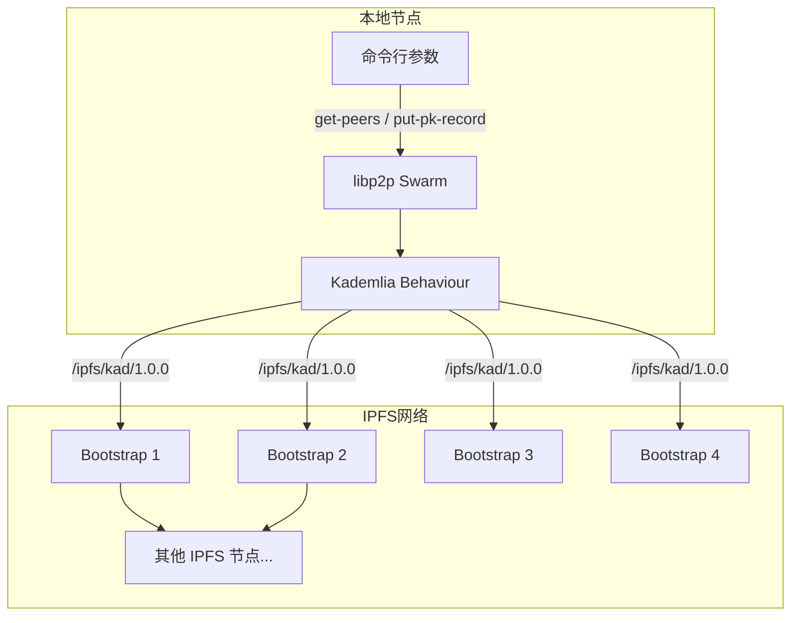
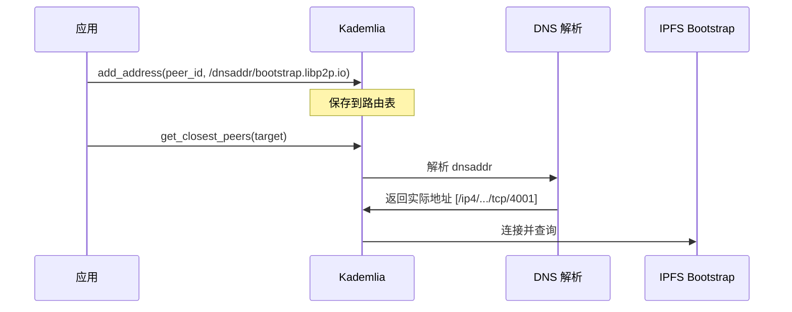
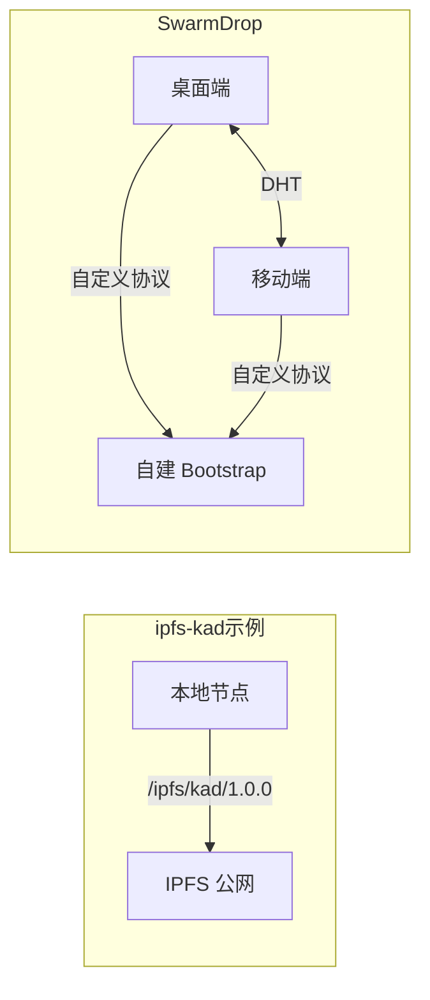
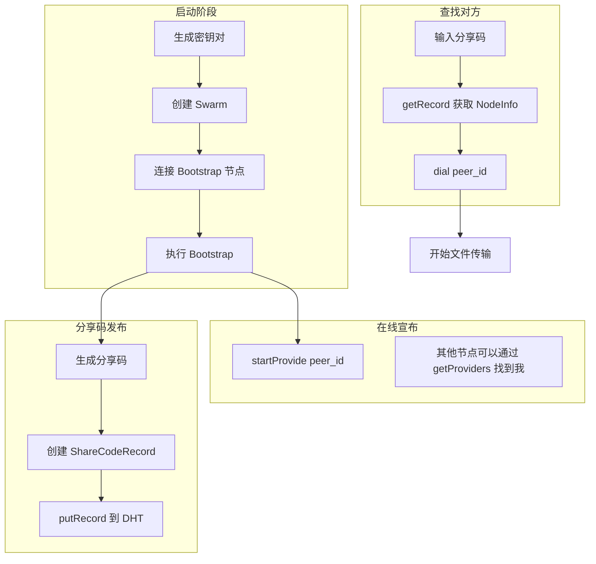

# 官方示例解析：ipfs-kad

## 概述

libp2p 官方提供了一个 [ipfs-kad](https://github.com/libp2p/rust-libp2p/tree/master/examples/ipfs-kad) 示例，展示如何与 IPFS 网络的 Kademlia DHT 进行交互。

这个示例演示了两个核心操作：
1. **GetClosestPeers** - 查找距离某个 PeerId 最近的节点
2. **PutRecord** - 将 PK（公钥）记录插入 DHT

## 示例架构



## 关键代码解析

### 1. 常量定义

```rust
// IPFS 网络的 Bootstrap 节点
const BOOTNODES: [&str; 4] = [
    "QmNnooDu7bfjPFoTZYxMNLWUQJyrVwtbZg5gBMjTezGAJN",
    "QmQCU2EcMqAqQPR2i9bChDtGNJchTbq5TbXJJ16u19uLTa",
    "QmbLHAnMoJPWSCR5Zhtx6BHJX9KiKNN6tpvbUcqanj75Nb",
    "QmcZf59bWwK5XFi76CZX8cbJ4BhTzzA3gU1ZjYZcYW3dwt",
];

// IPFS 使用的 Kademlia 协议标识
const IPFS_PROTO_NAME: StreamProtocol = StreamProtocol::new("/ipfs/kad/1.0.0");
```

**要点：**
- IPFS 网络有固定的 Bootstrap 节点（这些是 PeerId）
- IPFS 的 Kademlia 协议使用 `/ipfs/kad/1.0.0` 作为协议标识
- 我们的项目可以使用自定义的协议标识（如 `/swarmdrop/kad/1.0.0`）

### 2. Swarm 构建

```rust
let mut swarm = libp2p::SwarmBuilder::with_existing_identity(local_key.clone())
    .with_tokio()
    .with_tcp(
        tcp::Config::default(),
        noise::Config::new,
        yamux::Config::default,
    )?
    .with_dns()?  // 重要：支持 DNS 解析
    .with_behaviour(|key| {
        // 创建 Kademlia behaviour
        let mut cfg = kad::Config::new(IPFS_PROTO_NAME);
        cfg.set_query_timeout(Duration::from_secs(5 * 60));  // 5 分钟超时
        let store = kad::store::MemoryStore::new(key.public().to_peer_id());
        kad::Behaviour::with_config(key.public().to_peer_id(), store, cfg)
    })?
    .build();
```

**要点：**
- 使用 `with_dns()` 来支持 DNS 地址解析（如 `dnsaddr`）
- `kad::Config::new()` 需要传入协议标识
- `set_query_timeout()` 设置查询超时时间
- `MemoryStore` 是内存存储，适合示例和临时场景

### 3. 添加 Bootstrap 节点

```rust
for peer in &BOOTNODES {
    swarm
        .behaviour_mut()
        .add_address(&peer.parse()?, "/dnsaddr/bootstrap.libp2p.io".parse()?);
}
```

**要点：**
- `add_address()` 手动将节点添加到路由表
- 使用 `dnsaddr` 协议，DNS 解析会在 dial 时自动进行
- 这里没有调用 `dial()`，Kademlia 查询时会自动连接



### 4. GetClosestPeers 操作

```rust
CliArgument::GetPeers { peer_id } => {
    let peer_id = peer_id.unwrap_or(PeerId::random());
    println!("Searching for the closest peers to {peer_id}");
    swarm.behaviour_mut().get_closest_peers(peer_id);
}
```

**使用方式：**
```bash
# 查找距离指定 PeerId 最近的节点
cargo run -- get-peers --peer-id 12D3KooW...

# 查找距离随机 PeerId 最近的节点
cargo run -- get-peers
```

**事件处理：**
```rust
SwarmEvent::Behaviour(kad::Event::OutboundQueryProgressed {
    result: kad::QueryResult::GetClosestPeers(Ok(ok)),
    ..
}) => {
    if ok.peers.is_empty() {
        bail!("Query finished with no closest peers.")
    }
    println!("Query finished with closest peers: {:#?}", ok.peers);
    return Ok(());
}

SwarmEvent::Behaviour(kad::Event::OutboundQueryProgressed {
    result: kad::QueryResult::GetClosestPeers(Err(kad::GetClosestPeersError::Timeout { .. })),
    ..
}) => {
    bail!("Query for closest peers timed out")
}
```

### 5. PutRecord 操作（PK 记录）

```rust
CliArgument::PutPkRecord {} => {
    println!("Putting PK record into the DHT");

    // 构建 PK 记录的 key: /pk/<peer_id>
    let mut pk_record_key = vec![];
    pk_record_key.put_slice("/pk/".as_bytes());
    pk_record_key.put_slice(swarm.local_peer_id().to_bytes().as_slice());

    // 创建 Record
    let mut pk_record = kad::Record::new(
        pk_record_key,
        local_key.public().encode_protobuf()  // 公钥编码为 protobuf
    );
    pk_record.publisher = Some(*swarm.local_peer_id());
    pk_record.expires = Some(Instant::now().add(Duration::from_secs(60)));

    // 使用 Quorum::N(3) 发布
    swarm
        .behaviour_mut()
        .put_record(pk_record, kad::Quorum::N(NonZeroUsize::new(3).unwrap()))?;
}
```

**PK 记录结构：**

```
┌─────────────────────────────────────────────────────────┐
│                     PK Record                           │
├─────────────────────────────────────────────────────────┤
│ key:       /pk/<peer_id_bytes>                         │
│ value:     <public_key_protobuf>                       │
│ publisher: Some(peer_id)                               │
│ expires:   Some(now + 60s)                             │
└─────────────────────────────────────────────────────────┘
```

**要点：**
- PK 记录是 IPFS 的标准格式，用于存储节点的公钥
- `Quorum::N(3)` 表示需要 3 个节点确认存储成功
- 设置 `expires` 可以让记录自动过期

**事件处理：**
```rust
SwarmEvent::Behaviour(kad::Event::OutboundQueryProgressed {
    result: kad::QueryResult::PutRecord(Ok(_)),
    ..
}) => {
    println!("Successfully inserted the PK record");
    return Ok(());
}

SwarmEvent::Behaviour(kad::Event::OutboundQueryProgressed {
    result: kad::QueryResult::PutRecord(Err(err)),
    ..
}) => {
    bail!(anyhow::Error::new(err).context("Failed to insert the PK record"));
}
```

## 与 SwarmDrop 的对比

### 相同点

| 方面 | ipfs-kad 示例 | SwarmDrop |
|------|--------------|-----------|
| Kademlia 基础 | 使用 `libp2p-kad` | 使用 `libp2p-kad` |
| 传输层 | TCP + Noise + Yamux | TCP + Noise + Yamux |
| Record 存储 | `MemoryStore` | `MemoryStore` |

### 不同点

| 方面 | ipfs-kad 示例 | SwarmDrop |
|------|--------------|-----------|
| 协议标识 | `/ipfs/kad/1.0.0` | 自定义（如 `/swarmdrop/kad/1.0.0`） |
| Bootstrap 节点 | IPFS 官方节点 | 自建 Bootstrap 节点 |
| 网络 | 加入 IPFS 公网 | 独立私有网络 |
| DNS 支持 | 使用 `dnsaddr` | 可选 |
| Provider 机制 | 未演示 | 使用（宣布在线状态） |

### 架构差异



## 学习要点

### 1. 协议隔离

```rust
// IPFS 使用
const IPFS_PROTO_NAME: StreamProtocol = StreamProtocol::new("/ipfs/kad/1.0.0");

// SwarmDrop 应使用独立的协议名
const SWARMDROP_PROTO_NAME: StreamProtocol = StreamProtocol::new("/swarmdrop/kad/1.0.0");
```

使用不同的协议名可以确保我们的网络与 IPFS 公网隔离。

### 2. DNS 地址解析

示例使用 `with_dns()` 和 `dnsaddr` 地址：

```rust
// dnsaddr 是一种特殊的多地址格式
// DNS TXT 记录包含实际的 multiaddr
"/dnsaddr/bootstrap.libp2p.io"

// 解析后可能变成
"/ip4/147.75.109.213/tcp/4001/p2p/QmNnooDu7bfjPFoTZYxMNLWUQJyrVwtbZg5gBMjTezGAJN"
```

这对于 Bootstrap 节点很有用，可以通过 DNS 更新地址。

### 3. Quorum 选择

```rust
// 示例使用 Quorum::N(3)
kad::Quorum::N(NonZeroUsize::new(3).unwrap())
```

| Quorum | 适用场景 |
|--------|----------|
| `One` | 快速写入，可靠性要求低 |
| `Majority` | 平衡速度和可靠性 |
| `N(n)` | 精确控制，如示例中的 3 |
| `All` | 最高可靠性，但最慢 |

### 4. Record 过期时间

```rust
pk_record.expires = Some(Instant::now().add(Duration::from_secs(60)));
```

设置合理的过期时间：
- 短期数据（如分享码）：几分钟
- 中期数据（如 PK 记录）：几小时到几天
- 长期数据：不设置过期，定期刷新

## 运行示例

### 前置条件

```bash
# 克隆 libp2p 仓库
git clone https://github.com/libp2p/rust-libp2p.git
cd rust-libp2p/examples/ipfs-kad
```

### 运行 GetClosestPeers

```bash
# 查找随机 PeerId 的最近节点
cargo run -- get-peers

# 输出示例
Searching for the closest peers to 12D3KooWRandom...
Query finished with closest peers: [
    PeerInfo { peer_id: 12D3KooW..., addrs: [...] },
    PeerInfo { peer_id: 12D3KooW..., addrs: [...] },
    ...
]
```

### 运行 PutPkRecord

```bash
cargo run -- put-pk-record

# 输出示例
Putting PK record into the DHT
Successfully inserted the PK record
```

## 应用到 SwarmDrop

基于这个示例，SwarmDrop 的实现策略：



## 总结

ipfs-kad 示例展示了：

1. **最小化 Kademlia 使用**：只需要几十行代码就能连接到 DHT
2. **Bootstrap 机制**：通过 `add_address()` 添加已知节点
3. **查询操作**：`get_closest_peers()` 是最基础的 DHT 操作
4. **存储操作**：`put_record()` 可以存储任意键值对
5. **事件驱动**：所有操作都通过 `OutboundQueryProgressed` 事件返回结果

SwarmDrop 在此基础上扩展：
- 使用 Provider 机制宣布在线状态
- 使用 Record 存储分享码信息
- 结合 mDNS 实现局域网发现
- 添加 Relay 和 DCUtR 支持 NAT 穿透
