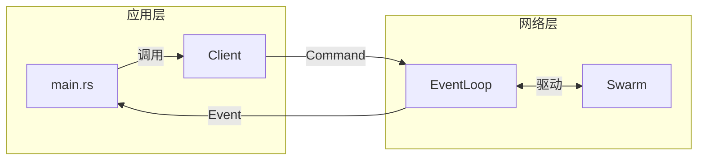
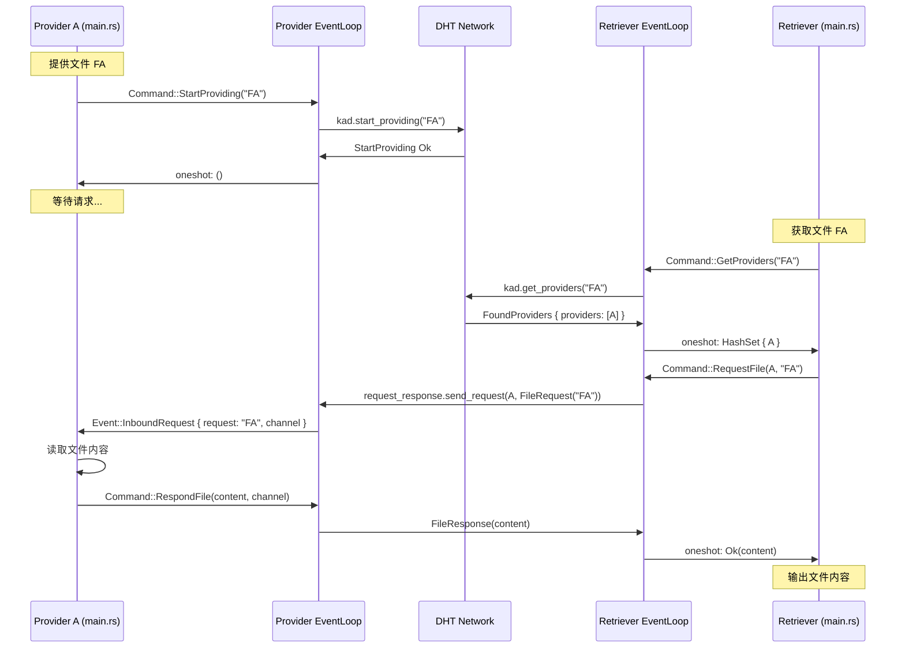
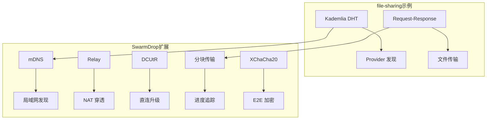

# 官方示例解析：file-sharing

## 概述

[file-sharing](https://github.com/libp2p/rust-libp2p/tree/master/examples/file-sharing) 是 libp2p 官方提供的**完整文件分享示例**，展示了如何结合 **Kademlia DHT** 和 **Request-Response** 协议实现文件发现和传输。

这个示例对 SwarmDrop 非常有参考价值，因为它展示了：
1. DHT 用于**发现**（谁有这个文件）
2. Request-Response 用于**传输**（获取文件内容）

## 架构概览

```mermaid
flowchart TB
    subgraph 文件提供方
        P1[Provider Node A]
        P2[Provider Node B]
    end

    subgraph DHT网络
        DHT[Kademlia DHT]
    end

    subgraph 文件获取方
        R[Retriever Node C]
    end

    P1 -->|startProviding FA| DHT
    P2 -->|startProviding FB| DHT

    R -->|getProviders FA| DHT
    DHT -->|providers: [A]| R
    R -->|request_file FA| P1
    P1 -->|response: file_content| R
```

## 核心组件

### 1. NetworkBehaviour 组合

```rust
#[derive(NetworkBehaviour)]
struct Behaviour {
    // DHT: 用于发现文件提供者
    kademlia: kad::Behaviour<kad::store::MemoryStore>,
    // Request-Response: 用于请求和传输文件
    request_response: request_response::cbor::Behaviour<FileRequest, FileResponse>,
}
```

**关键点：**
- 使用 `#[derive(NetworkBehaviour)]` 组合多个协议
- `kademlia` 负责存储和查询 Provider 信息
- `request_response` 负责实际的文件请求和传输
- 使用 CBOR 作为序列化格式

### 2. 消息定义

```rust
// 文件请求: 包含文件名
#[derive(Debug, Clone, PartialEq, Eq, Serialize, Deserialize)]
struct FileRequest(String);

// 文件响应: 包含文件内容
#[derive(Debug, Clone, PartialEq, Eq, Serialize, Deserialize)]
pub(crate) struct FileResponse(Vec<u8>);
```

### 3. Client-EventLoop 模式

这是示例中最重要的架构模式：



## 详细代码解析

### 1. 初始化网络

```rust
pub(crate) async fn new(
    secret_key_seed: Option<u8>,
) -> Result<(Client, impl Stream<Item = Event>, EventLoop), Box<dyn Error>> {
    // 1. 创建密钥对
    let id_keys = match secret_key_seed {
        Some(seed) => {
            let mut bytes = [0u8; 32];
            bytes[0] = seed;
            identity::Keypair::ed25519_from_bytes(bytes).unwrap()
        }
        None => identity::Keypair::generate_ed25519(),
    };

    // 2. 构建 Swarm
    let mut swarm = libp2p::SwarmBuilder::with_existing_identity(id_keys)
        .with_tokio()
        .with_tcp(
            tcp::Config::default(),
            noise::Config::new,
            yamux::Config::default,
        )?
        .with_behaviour(|key| Behaviour {
            kademlia: kad::Behaviour::new(
                peer_id,
                kad::store::MemoryStore::new(key.public().to_peer_id()),
            ),
            request_response: request_response::cbor::Behaviour::new(
                [(
                    StreamProtocol::new("/file-exchange/1"),  // 自定义协议名
                    ProtocolSupport::Full,  // 支持请求和响应
                )],
                request_response::Config::default(),
            ),
        })?
        .with_swarm_config(|c| c.with_idle_connection_timeout(Duration::from_secs(60)))
        .build();

    // 3. 设置 Kademlia 模式为 Server
    swarm
        .behaviour_mut()
        .kademlia
        .set_mode(Some(kad::Mode::Server));

    // 4. 创建通信通道
    let (command_sender, command_receiver) = mpsc::channel(0);
    let (event_sender, event_receiver) = mpsc::channel(0);

    Ok((
        Client { sender: command_sender },
        event_receiver,
        EventLoop::new(swarm, command_receiver, event_sender),
    ))
}
```

**要点：**
- `ProtocolSupport::Full` = 同时支持发送请求和接收请求
- `with_idle_connection_timeout(60s)` = 空闲连接 60 秒后断开
- `kad::Mode::Server` = 主动响应 DHT 查询

### 2. Client API

```rust
#[derive(Clone)]  // 可 Clone，方便多处使用
pub(crate) struct Client {
    sender: mpsc::Sender<Command>,
}

impl Client {
    /// 开始监听
    pub(crate) async fn start_listening(&mut self, addr: Multiaddr) -> Result<...> {
        let (sender, receiver) = oneshot::channel();
        self.sender.send(Command::StartListening { addr, sender }).await...;
        receiver.await...
    }

    /// 连接到节点
    pub(crate) async fn dial(&mut self, peer_id: PeerId, peer_addr: Multiaddr) -> Result<...>

    /// 宣布自己是文件提供者
    pub(crate) async fn start_providing(&mut self, file_name: String)

    /// 查找文件提供者
    pub(crate) async fn get_providers(&mut self, file_name: String) -> HashSet<PeerId>

    /// 请求文件
    pub(crate) async fn request_file(&mut self, peer: PeerId, file_name: String) -> Result<Vec<u8>>

    /// 响应文件请求
    pub(crate) async fn respond_file(&mut self, file: Vec<u8>, channel: ResponseChannel<FileResponse>)
}
```

### 3. Command 枚举

```rust
enum Command {
    StartListening {
        addr: Multiaddr,
        sender: oneshot::Sender<Result<(), Box<dyn Error + Send>>>,
    },
    Dial {
        peer_id: PeerId,
        peer_addr: Multiaddr,
        sender: oneshot::Sender<Result<(), Box<dyn Error + Send>>>,
    },
    StartProviding {
        file_name: String,
        sender: oneshot::Sender<()>,
    },
    GetProviders {
        file_name: String,
        sender: oneshot::Sender<HashSet<PeerId>>,
    },
    RequestFile {
        file_name: String,
        peer: PeerId,
        sender: oneshot::Sender<Result<Vec<u8>, Box<dyn Error + Send>>>,
    },
    RespondFile {
        file: Vec<u8>,
        channel: ResponseChannel<FileResponse>,
    },
}
```

### 4. EventLoop 事件处理

```rust
impl EventLoop {
    pub(crate) async fn run(mut self) {
        loop {
            tokio::select! {
                // 处理 Swarm 事件
                event = self.swarm.select_next_some() => self.handle_event(event).await,
                // 处理来自 Client 的命令
                command = self.command_receiver.next() => match command {
                    Some(c) => self.handle_command(c).await,
                    None => return,  // Channel 关闭，退出
                },
            }
        }
    }
}
```

### 5. Kademlia 事件处理

```rust
async fn handle_event(&mut self, event: SwarmEvent<BehaviourEvent>) {
    match event {
        // StartProviding 完成
        SwarmEvent::Behaviour(BehaviourEvent::Kademlia(
            kad::Event::OutboundQueryProgressed {
                id,
                result: kad::QueryResult::StartProviding(_),
                ..
            },
        )) => {
            let sender = self.pending_start_providing.remove(&id).unwrap();
            let _ = sender.send(());
        }

        // GetProviders 找到提供者
        SwarmEvent::Behaviour(BehaviourEvent::Kademlia(
            kad::Event::OutboundQueryProgressed {
                id,
                result: kad::QueryResult::GetProviders(Ok(
                    kad::GetProvidersOk::FoundProviders { providers, .. }
                )),
                ..
            },
        )) => {
            if let Some(sender) = self.pending_get_providers.remove(&id) {
                sender.send(providers).unwrap();

                // 提前结束查询，只需要第一批结果
                self.swarm
                    .behaviour_mut()
                    .kademlia
                    .query_mut(&id)
                    .unwrap()
                    .finish();
            }
        }
        // ... 其他事件
    }
}
```

### 6. Request-Response 事件处理

```rust
// 收到文件请求
SwarmEvent::Behaviour(BehaviourEvent::RequestResponse(
    request_response::Event::Message { message, .. },
)) => match message {
    // 收到请求
    request_response::Message::Request { request, channel, .. } => {
        // 通知应用层处理请求
        self.event_sender
            .send(Event::InboundRequest {
                request: request.0,
                channel,
            })
            .await...;
    }
    // 收到响应
    request_response::Message::Response { request_id, response } => {
        // 通知等待的请求
        let _ = self.pending_request_file
            .remove(&request_id)
            .unwrap()
            .send(Ok(response.0));
    }
},

// 请求失败
SwarmEvent::Behaviour(BehaviourEvent::RequestResponse(
    request_response::Event::OutboundFailure { request_id, error, .. },
)) => {
    let _ = self.pending_request_file
        .remove(&request_id)
        .unwrap()
        .send(Err(Box::new(error)));
}
```

## 主程序流程

### 提供文件

```rust
CliArgument::Provide { path, name } => {
    // 1. 在 DHT 宣布自己是 Provider
    network_client.start_providing(name.clone()).await;

    loop {
        match network_events.next().await {
            // 2. 收到文件请求时，发送文件内容
            Some(network::Event::InboundRequest { request, channel }) => {
                if request == name {
                    network_client
                        .respond_file(std::fs::read(&path)?, channel)
                        .await;
                }
            }
            ...
        }
    }
}
```

### 获取文件

```rust
CliArgument::Get { name } => {
    // 1. 从 DHT 查找 Providers
    let providers = network_client.get_providers(name.clone()).await;
    if providers.is_empty() {
        return Err("Could not find provider");
    }

    // 2. 向所有 Provider 发送请求
    let requests = providers.into_iter().map(|p| {
        let mut network_client = network_client.clone();
        let name = name.clone();
        async move { network_client.request_file(p, name).await }.boxed()
    });

    // 3. 使用 select_ok 获取第一个成功的响应
    let file_content = futures::future::select_ok(requests).await?.0;

    // 4. 输出文件内容
    std::io::stdout().write_all(&file_content)?;
}
```

## 完整数据流



## 与 SwarmDrop 的对比

### 相似之处

| 方面 | file-sharing | SwarmDrop |
|------|-------------|-----------|
| DHT 发现 | `start_providing` / `get_providers` | `start_provide` / `get_providers` |
| 请求协议 | `request_response::cbor` | 自定义 Request-Response |
| Client 模式 | Command + oneshot | Command + ResultHandle |
| EventLoop | `tokio::select!` | `tokio::select!` |

### 差异之处

| 方面 | file-sharing | SwarmDrop |
|------|-------------|-----------|
| 文件发现 | 文件名作为 Key | 分享码作为 Key |
| 在线状态 | 无 | `startProvide(peer_id)` |
| NAT 穿透 | 无 | Relay + DCUtR |
| 加密 | 仅 Noise | Noise + E2E 加密 |
| 传输方式 | 一次性传输整个文件 | 分块传输 + 进度 |

### SwarmDrop 需要扩展的部分



## 学习要点

### 1. Client-EventLoop 分离模式

这是 libp2p 推荐的架构模式：

```
┌─────────────────────────────────────────────────┐
│                  应用层                          │
│  ┌──────────┐                    ┌──────────┐   │
│  │  main()  │                    │  Client  │   │
│  └────┬─────┘                    └────┬─────┘   │
│       │                               │         │
│       │ 调用 API                      │ 发送 Command
│       ▼                               ▼         │
│  ┌──────────────────────────────────────────┐   │
│  │                Event Stream              │   │
│  └──────────────────────────────────────────┘   │
├─────────────────────────────────────────────────┤
│                  网络层                          │
│  ┌──────────────────────────────────────────┐   │
│  │               EventLoop                  │   │
│  │  ┌─────────────────────────────────────┐ │   │
│  │  │              Swarm                  │ │   │
│  │  │  ┌────────────┐  ┌────────────────┐ │ │   │
│  │  │  │ Kademlia   │  │ Request-Response│ │ │   │
│  │  │  └────────────┘  └────────────────┘ │ │   │
│  │  └─────────────────────────────────────┘ │   │
│  └──────────────────────────────────────────┘   │
└─────────────────────────────────────────────────┘
```

### 2. oneshot Channel 模式

```rust
// Client 端
pub async fn some_operation(&mut self) -> Result<Response> {
    let (sender, receiver) = oneshot::channel();  // 创建一次性通道
    self.sender.send(Command::SomeOp { sender }).await?;
    receiver.await?  // 等待结果
}

// EventLoop 端
Command::SomeOp { sender } => {
    // 执行操作
    let result = do_something();
    sender.send(result).unwrap();  // 发送结果
}
```

### 3. Pending Map 模式

```rust
struct EventLoop {
    // 跟踪正在进行的异步操作
    pending_dial: HashMap<PeerId, oneshot::Sender<...>>,
    pending_start_providing: HashMap<QueryId, oneshot::Sender<...>>,
    pending_get_providers: HashMap<QueryId, oneshot::Sender<...>>,
    pending_request_file: HashMap<OutboundRequestId, oneshot::Sender<...>>,
}
```

当 Swarm 事件到达时，通过 ID 找到对应的 sender 并发送结果。

### 4. select_ok 并行请求

```rust
// 向所有 provider 发送请求
let requests = providers.into_iter().map(|p| {
    async move { network_client.request_file(p, name).await }.boxed()
});

// 第一个成功就返回
let file_content = futures::future::select_ok(requests).await?.0;
```

## 应用到 SwarmDrop

基于这个示例，SwarmDrop 的 `NetClient` 可以这样实现：

```rust
// libs/core/src/runtime/client.rs

impl NetClient {
    /// 在 DHT 宣布在线
    pub async fn start_provide(&self, key: RecordKey) -> Result<QueryStatsInfo> {
        let cmd = StartProvideCommand::new(key);
        CommandFuture::new(cmd, self.command_tx.clone()).await
    }

    /// 查找在线节点
    pub async fn get_providers(&self, key: RecordKey) -> Result<GetProvidersResult> {
        let cmd = GetProvidersCommand::new(key);
        CommandFuture::new(cmd, self.command_tx.clone()).await
    }

    /// 发送请求并等待响应 (文件传输用)
    pub async fn send_request(&self, peer_id: PeerId, data: Vec<u8>) -> Result<Vec<u8>> {
        let cmd = SendRequestCommand::new(peer_id, data);
        CommandFuture::new(cmd, self.command_tx.clone()).await
    }
}
```

## 运行示例

### 启动文件提供者

```bash
# 终端 1: 启动 Provider
cargo run -- \
    --listen-address /ip4/127.0.0.1/tcp/40837 \
    --secret-key-seed 1 \
    provide \
    --path ./test.txt \
    --name "my-file"
```

### 启动文件获取者

```bash
# 终端 2: 启动 Retriever
cargo run -- \
    --peer /ip4/127.0.0.1/tcp/40837/p2p/12D3KooWPjceQrSwdWXPyLLeABRXmuqt69Rg3sBYbU1Nft9HyQ6X \
    get \
    --name "my-file"
```

## 总结

file-sharing 示例展示了：

1. **协议组合**：`Kademlia` + `Request-Response` 实现发现和传输
2. **架构模式**：Client-EventLoop 分离，清晰的职责划分
3. **异步通信**：oneshot channel + pending map 跟踪异步操作
4. **容错处理**：`select_ok` 尝试多个 provider

SwarmDrop 在此基础上需要扩展：
- mDNS 局域网发现
- Relay + DCUtR NAT 穿透
- 分块传输和进度追踪
- E2E 加密
- 配对码机制
