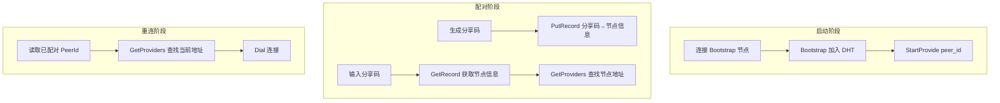
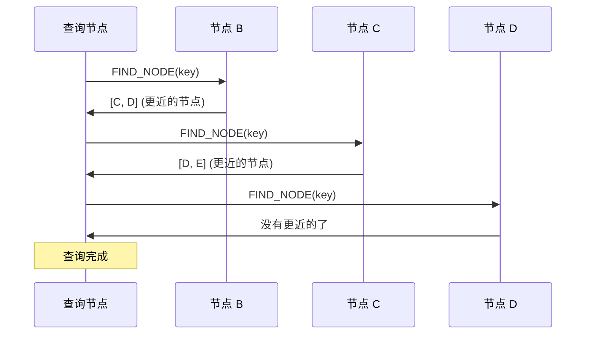

# Kademlia DHT 命令指南

本目录详细介绍 SwarmDrop 中 Kademlia DHT 相关命令的原理和使用方法。

## 目录

| 文档 | 内容 |
|------|------|
| [01-overview.md](./01-overview.md) | Kademlia 基础概念：XOR 距离、路由表、k-bucket |
| [02-bootstrap.md](./02-bootstrap.md) | Bootstrap 命令：加入 DHT 网络 |
| [03-provider.md](./03-provider.md) | Provider 机制：StartProvide、StopProvide、GetProviders |
| [04-record.md](./04-record.md) | Record 存储：PutRecord、GetRecord、RemoveRecord |
| [05-routing.md](./05-routing.md) | 路由查询：GetClosestPeers |
| [06-official-example.md](./06-official-example.md) | 官方示例解析：ipfs-kad |
| [07-file-sharing-example.md](./07-file-sharing-example.md) | 官方示例解析：file-sharing（含文件传输） |

## 命令速查表

```text
libs/core/src/command/kad/
├── bootstrap.rs        # 加入 DHT 网络
├── start_provide.rs    # 宣布自己是某 key 的 Provider
├── stop_provide.rs     # 停止 Provide
├── get_providers.rs    # 查询某 key 的 Providers
├── get_closest_peers.rs # 查询距离某 key 最近的节点
├── get_record.rs       # 获取 DHT 中的 Record
├── put_record.rs       # 存储 Record 到 DHT
└── remove_record.rs    # 从本地删除 Record
```

## 在 SwarmDrop 中的使用场景



## 核心概念预览

### XOR 距离

Kademlia 用 XOR 运算计算节点间的"距离"：

```
distance(A, B) = A XOR B

例如:
A = 0101
B = 0011
A XOR B = 0110 = 6 (距离为 6)
```

### Provider vs Record

| 概念 | 用途 | 存储位置 | 示例 |
|------|------|----------|------|
| **Provider** | "我有这个内容" | 距离 key 最近的节点 | `startProvide(peer_id)` 宣布在线 |
| **Record** | 键值对数据 | 距离 key 最近的节点 | `putRecord(share_code, node_info)` |

### 查询流程

所有 DHT 查询都遵循**迭代查询**模式：


